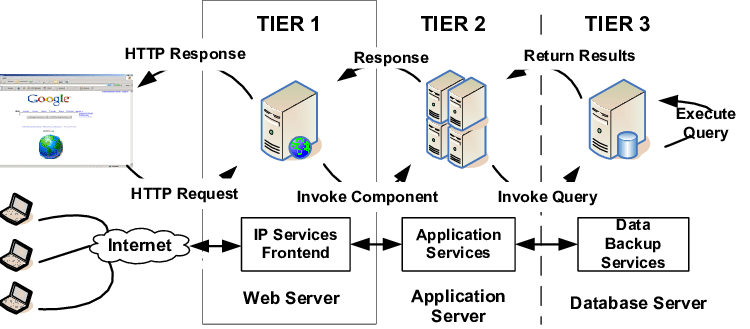
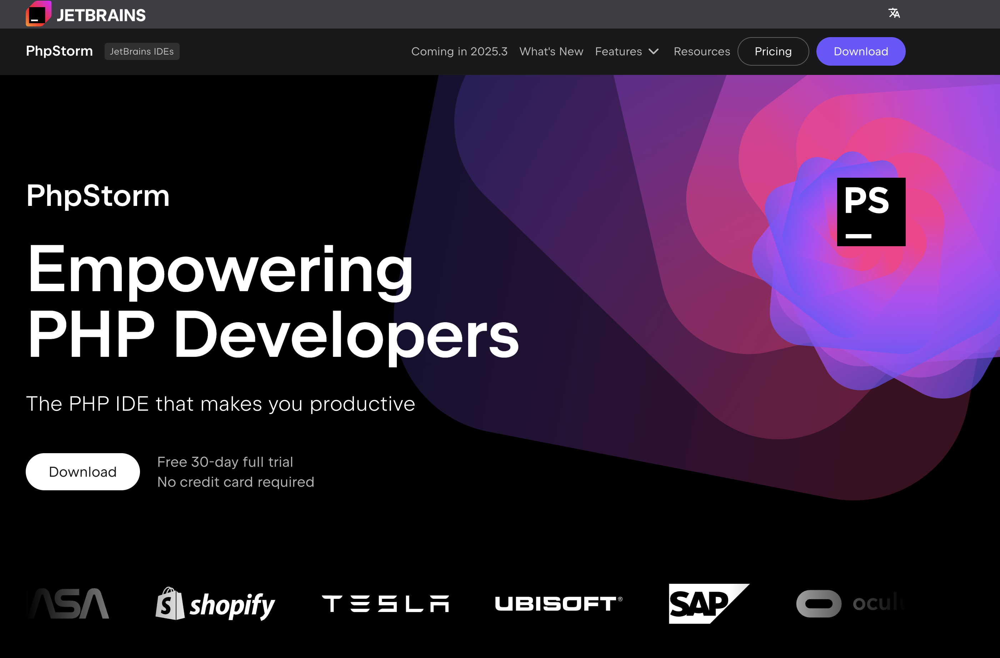
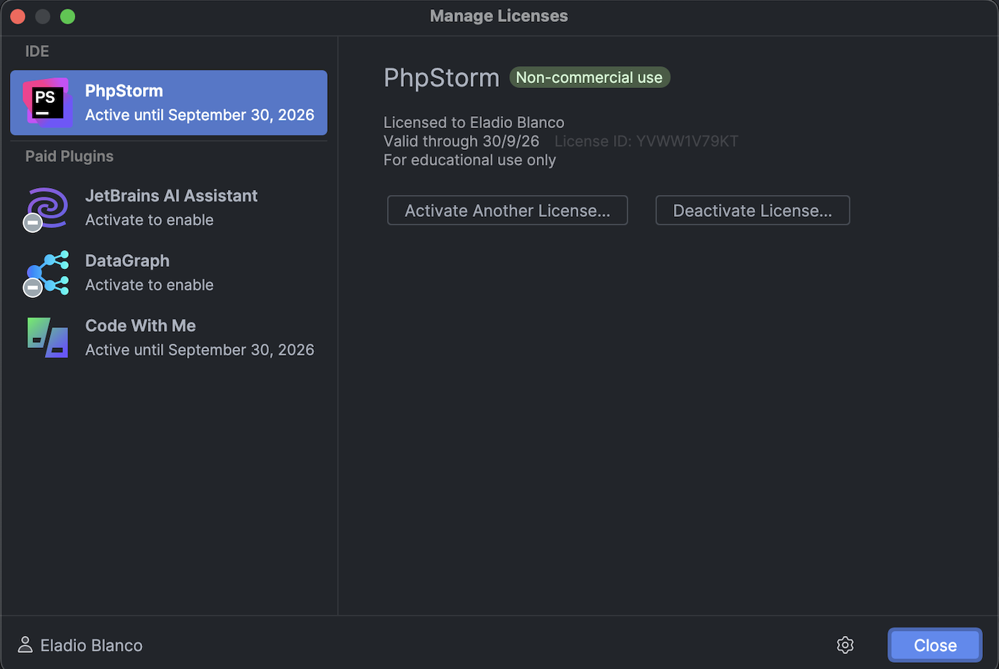
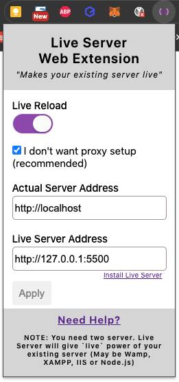

# Arquitecturas Web

??? abstract "Duración y criterios de evaluación"

    Duración estimada: 3 sesiones

    <hr />

    Resultado de aprendizaje:

    1. Selecciona las arquitecturas y tecnologías de programación Web en entorno servidor, analizando sus capacidades y características propias.

    Criterios de evaluación:

    1. Se han caracterizado y diferenciado los modelos de ejecución de código en el servidor y en el cliente Web.
    2. Se han reconocido las ventajas que proporciona la generación dinámica de páginas Web y sus diferencias con la inclusión de sentencias de guiones en el interior de las páginas Web.
    3. Se han identificado los mecanismos de ejecución de código en los servidores Web.
    4. Se han reconocido las funcionalidades que aportan los servidores de aplicaciones y su integración con los servidores Web.
    5. Se han identificado y caracterizado los principales lenguajes y tecnologías relacionados con la programación Web en entorno servidor.
    6. Se han verificado los mecanismos de integración de los lenguajes de marcas con los lenguajes de programación en entorno servidor.
    7. Se han reconocido y evaluado las herramientas de programación en entorno servidor.

Las arquitecturas web definen la forma en que las páginas de un sitio web están estructuradas y enlazadas entre sí. Las aplicaciones web se basan en en modelo cliente-servidor.

## 1.1 Modelo Cliente/Servidor

<figure>
  
  <figcaption>Arquitectura Cliente Servidor</figcaption>
</figure>

Uno o varios cliente acceden a un servidor. La nuevas arquitecturas sustituyen el servidor por un balanceador de carga de manera que N servidores dan respuesta a M clientes.

En las aplicaciones web, el cliente es el navegador web.

El cliente hace la petición (*request* normalmente mediante el protocolo GET mediante el puerto 80/443) y el servidor responde (*response*).

### Página web dinámica

Si la página web únicamente contiene HTML + CSS se considera una página estática. Para generar una página dinámica, donde el contenido cambia, a día de hoy tenemos dos alternativas:

* Utilizar un lenguaje de servidor que genere el contenido, ya sea mediante el acceso a una BD o servicios externos.
* Utilizar servicios REST de terceros invocados desde JS.

<figure>
  
  <figcaption>Página web dinámica</figcaption>
</figure>

Las tecnologías empleadadas (y los perfiles de desarrollo asociados) para la generación de páginas dinámicas son:

| Perfil                    | Herramienta           | Tecnología
| ---                       | ---                   | ---
| *Front-end* / cliente     | Navegador Web         | HTML + CSS + JavaScript
| *Back-end* / servidor     | Servidor Web + BBDD   | PHP, Python, Ruby, Java / JSP, .Net / .asp

!!! tip "Perfil *Full-stack*"
    En las ofertas de trabajo cuando hacen referencia a un *Full-stack developer*, están buscando un perfil que domina tanto el *front-end* como el *back-end*.

### Single Page Application

A día de hoy, gran parte del desarrollo web está transicionando de una arquitectura web cliente-servidor clásica donde el cliente realiza una llamada al backend, por una arquitectura SPA donde el cliente gana mucho mayor peso y sigue una programación reactiva que accede a servicios remotos REST que realizan las operaciones (comunicandose mediante JSON).

<figure>
  
  <figcaption>Arquitectura tradicional vs SPA</figcaption>
</figure>

??? info "Más info sobre las SPA"

    Para profundizar en las aplicaciones SPA, puedes consultar los siguientes recursos:

    - [Aplicaciones SPA vs Aplicaciones MPA](https://youtu.be/2z0FChkphvo){ target="_blank" }
    - [SPA Wikipedia](https://es.wikipedia.org/wiki/Single-page_application)
    - [¿Qué es una SPA en programación?](https://keepcoding.io/blog/que-es-una-spa-en-programacion/)

### Técnicas de renderizado

#### ¿Qué es el renderizado?

Es el proceso de transformar código (HTML, CSS, JavaScript) en una página web visual que podemos ver en nuestro navegador.

#### Tipos de renderizado de sitios web:

Existen diferentes técnicas o enfoques de renderizado, cada uno con sus ventajas y desventajas, dependiendo de las necesidades de la aplicación. Los principales tipos de renderizado son:

??? abstract "Client-Side Rendering (CSR)"

    **¿Cómo funciona?**

    El navegador descarga el HTML básico y el JavaScript necesario. Luego, el código JavaScript se ejecuta en el navegador del usuario para crear la interfaz de usuario completa.

    **Ventajas:**

    - Experiencia de usuario dinámica: Permite crear interfaces altamente interactivas y aplicaciones de una sola página (SPA) con transiciones suaves.
    - Flexibilidad: Fácil de desarrollar y actualizar.
      
    **Desventajas:**

    - Rendimiento inicial: La primera carga puede ser lenta, ya que el navegador tiene que descargar todo el JavaScript y renderizar la página.
    - SEO: Los motores de búsqueda pueden tener dificultades para indexar el contenido, ya que la página no está completamente renderizada en el servidor.

??? abstract "Server-Side Rendering (SSR)"

    **¿Cómo funciona?**
    
    El servidor genera el HTML completo de la página y lo envía al navegador. El navegador solo tiene que renderizar el HTML, lo que es mucho más rápido.

    **Ventajas:**

    - Rendimiento inicial: La página se carga mucho más rápido, mejorando la experiencia del usuario.
    - SEO: Los motores de búsqueda pueden indexar el contenido fácilmente, ya que la página está completamente renderizada en el servidor.

    **Desventajas:**

    - Escalabilidad: Puede ser más costoso en términos de recursos del servidor, especialmente para sitios con mucho tráfico.
    - Complejidad: Requiere una configuración más compleja en el servidor.

??? abstract "Static Site Generation (SSG)"

    **¿Cómo funciona?**

    Las páginas se generan como archivos HTML estáticos en tiempo de construcción y se sirven directamente desde el servidor.

    **Ventajas:**

    - Rendimiento extremo: Las páginas se cargan instantáneamente, ya que no hay necesidad de renderizar nada en el servidor o en el cliente.
    - SEO: Excelente para SEO, ya que las páginas son completamente estáticas.

    **Desventajas:**

    - Menos dinámico: No es ideal para sitios que requieren contenido generado dinámicamente.

??? abstract "Incremental Static Regeneration (ISR)"

    **¿Cómo funciona?**

    Combina lo mejor de SSG y SSR. Genera páginas estáticas en tiempo de construcción, pero puede actualizar partes de ellas dinámicamente en el servidor.

    **Ventajas:**

    - Excelente equilibrio: Ofrece un buen rendimiento y flexibilidad.
    - SEO: Bueno para SEO, ya que la mayoría del contenido es estático.

    **Desventajas:**

    - Complejidad: Requiere una configuración más compleja.

##### ¿Cuándo usar cada uno?
- **CSR**: Ideal para aplicaciones de una sola página (SPA) con mucha interactividad y actualizaciones frecuentes.
- **SSR**: Perfecto para sitios que priorizan el SEO y el rendimiento inicial, como tiendas en línea o blogs.
- **SSG**: Ideal para sitios estáticos o con contenido que cambia con poca frecuencia, como portafolios o sitios de documentación.
- **ISR**: Perfecto para sitios que necesitan una combinación de contenido estático y dinámico, como blogs con comentarios o noticias.

En resumen:

La elección del tipo de renderizado dependerá de las necesidades específicas de tu proyecto. Considera factores como el rendimiento, el SEO, la complejidad y la frecuencia de actualización del contenido.

??? info "Más info sobre los tipos de renderizado"

    Para profundizar en los tipos de renderizado de sitios web, puedes consultar los siguientes recursos:

    - [Next.js: Tipos de Renderizado (CSR, SSR, SSG, ISR)](https://somospnt.com/blog/314-next-js-tipos-de-renderizado-csr-ssr-ssg-isr)
    - [Client Side Rendering vs Server Side Rendering (vídeo)](https://youtu.be/CnavwJZAMw0)
    - [CSR vs SSR (tablero)](https://www.figma.com/board/Og8AlCVH3536kQ8frU6dmD/Next.js-Diagrams-(Community)-CSR-vs-SSR)
    - [Hacer rápida tu web - Tipos de renderizado (vídeo)](https://www.youtube.com/watch?v=VSyhuWSyrQE)

## 1.2 Arquitectura de 3 capas

Hay que distinguir entre capas **físicas** (*tier*) y capas **lógicas** (*layer*).

### Tier

Capa física de una arquitectura. Supone un nuevo elemento hardware separado físicamente. Las capas físicas más alejadas del cliente están más protegidas, tanto por firewalls como por VPN.

Ejemplo de arquitectura en tres capas físicas (*3 tier*):

* Servidor Web
* Servidor de Aplicaciones
* Servidor de base de datos

<figure>
  
  <figcaption>Arquitectura de tres capas físicas</figcaption>
</figure>

!!! warning "Cluster en tiers"
    No confundir las capas con la cantidad de servidores. Actualmente se trabaja con arquitecturas con múltiples servidores en una misma capa física mediante un cluster, para ofrecer [tolerancia a errores](https://es.wikipedia.org/wiki/Dise%C3%B1o_de_tolerancia_a_fallos) y [escalabilidad horizontal](https://www.arsys.es/blog/escalado-horizontal-vs-vertical).

### Layer

{ align=right }

En cambio, las capas lógicas (*layers*) organizan el código respecto a su funcionalidad:

* Presentación
* Negocio / Aplicación / Proceso
* Datos / Persistencia

Como se observa, cada una de las capas se puede implementar con diferentes lenguajes de programación y/o herramientas.

<figure>
  
  <figcaption>Arquitectura de tres capas físicas en tres lógicas</figcaption>
</figure>

## 1.3 MVC

{align=right & width=500}

*Model-View-Controller* o Modelo-Vista-Controlador es un modelo de arquitectura que separa los datos y la lógica de negocio respecto a la interfaz de usuario y el componente encargado de gestionar los eventos y las comunicaciones.

Al separar los componentes en elementos conceptuales permite reutilizar el código y mejorar su organización y mantenimiento. Sus elementos son:

* **Modelo**: representa la información y gestiona todos los accesos a ésta, tanto consultas como actualizaciones provenientes, normalmente, de una base de datos. Se accede via el controlador.
* **Controlador**: Responde a las acciones del usuario, y realiza peticiones al modelo para solicitar información. Tras recibir la respuesta del modelo, le envía los datos a la vista.
* **Vista**: Presenta al usuario de forma visual el modelo y los datos preparados por el controlador. El usuario interactura con la vista y realiza nuevas peticiones al controlador.

Lo estudiaremos en más detalle al profundizar en el uso de los frameworks PHP.

## 1.4 Decisiones de diseño

* ¿Qué tamaño tiene el proyecto?
* ¿Qué lenguajes de programación conozco? ¿Vale la pena el esfuerzo de aprender uno nuevo?
* ¿Voy a usar herramientas de código abierto o herramientas propietarias? ¿Cuál es el coste de utilizar soluciones comerciales?
* ¿Voy a programar la aplicación yo solo o formaré parte de un grupo de programadores?
* ¿Cuento con algún servidor web o gestor de base de datos disponible o puedo decidir libremente utilizar el que crea necesario?
* ¿Qué tipo de licencia voy a aplicar a la aplicación que desarrolle?

## 1.5 Herramientas

### Servidor Web

Software que recibe peticiones HTTP (GET, POST, DELETE, ...) y devuelve el recurso solicitado (HTML, CSS, JS, JSON, imágenes, etc...) normalmente desde el navegador del usuario.

El producto más implantando es Apache Web Server (<https://httpd.apache.org/>), creado en 1995.

* Software libre y multiplataforma
* Sistema de módulos dinámicos → PHP, Python, Perl
* Utiliza el archivo `.htaccess` para su configuración

En la actualidad, *Apache* está perdiendo mercado respecto a Nginx (<https://www.nginx.com>). Se trata de un producto más moderno (2004) y que en determinados escenarios tiene mejor rendimiento que Apache.

* Comparativa servidores web: <https://w3techs.com/technologies/history_overview/web_server/ms/q>

### Servidor de Aplicaciones

* Software que ofrece servicios adicionales a los de un servidor web:
    * Clustering
    * Balanceo de carga
    * Tolerancia a fallos
* *Tomcat* (<http://tomcat.apache.org/>) es el servidor de aplicaciones *open source* y multiplataforma de referencia para una arquitectura Java.
    * Contiende un contenedor Web Java que interpreta *Servlets* y JSP.

!!! info
    Tanto los servidores web como los servidores de aplicaciones se estudian en profundidad en el módulo de *"Despliegue de Aplicaciones Web"*.

### Lenguajes en el servidor

Las aplicaciones que generan las páginas web se programan en alguno de los siguientes lenguajes:

* PHP
* JavaEE: Servlets / JSP
* Python
* ASP.NET → Visual Basic .NET / C#
* Ruby
* ...

#### JavaEE

*Java Enterprise Edition* es la solución Java para el desarrollo de aplicaciones *enterprise*. Ofrece una arquitectura muy completa y compleja, escalable y tolerante a fallos. Planteada para aplicaciones para grandes sistemas.


#### Node.js

* Entorno de ejecución de JavaScript en el servidor
* Basado en el motor V8 de Google
* Desarrollado por Ryan Dahl en 2009
* Utilizado por Netflix, Uber, LinkedIn, PayPal, ...
* Frameworks: Express, Koa, Hapi, Sails, Meteor, NestJS, ...
* Permite el desarrollo de aplicaciones web, de escritorio y móviles

#### PHP

* Lenguaje de propósito general diseñado para el desarrollo de páginas web dinámicas
* En un principio, lenguaje no tipado.
* Actualmente en la versión 8. Se recomienda al menos utilizar una versión superior a la 7.0.
* Código embebido en el HTML
* Instrucciones entre etiquetas `<?php` y `?>`
    * Para generar codigo dentro de PHP, podemos usar la instrucción `echo`
* Multitud de librerías y frameworks:
    * Laravel, Symfony, Codeigniter, Zend

Su documentación es bastante completa: <https://www.php.net/manual/es/index.php>

El siguiente mapa mental muestra un resumen de sus elementos:

<figure>
  
  <figcaption>Elementos del lenguaje PHP</figcaption>
</figure>

Durante las siguientes unidades vamos a estudiar PHP en profundidad.

!!! example "A jugar..."

    Kahoot para repasar conceptos de redes e Internet: [40 preguntas sobre Internet](https://create.kahoot.it/share/40-preguntas-sobre-internet/ffb5a58c-4e58-4656-826f-0f8d94304331)


## 1.6 Puesta en marcha

Para poder trabajar con un entorno de desarrollo local, hemos de preparar nuestro entorno de desarrollo con las herramientas comentadas. A continuación se exploran diferentes soluciones que incorporan un servidor web, PHP, el SGBD... como *XAMPP*, *Laragon* o *contenedores Docker*. Pruébalas y elige aquella con la que te sientas más cómodo, pero que tenga como mínimo la versión 8.2 de PHP.

??? info "Rutas y archivos"
    Independientemente de la solución utilizada, hay que entender un par de conceptos importantes. Al final estamos utilizando un servidor web (Apache o Nginx) que sirve al navegador los archivos alojados en un determinado directorio de nuestro sistema, como por ejemplo:
    
    - `C:/xampp/xamppfiles/htdocs` --> Allí será donde alojemos nuestras páginas web que visualizaremos desde la dirección `http://localhost/` en el navegador.

    Y como cualquier configuración en sistemas, se realizará modificando directivas (variables) de determinados archivos, como por ejemplo:

    - `C:/xampp/xamppfiles/etc/httpd.conf` --> Configuración del servidor web.
    - `C:/xampp/xamppfiles/etc/php.ini` --> Configuración del lenguaje PHP.

??? notice "Configuración del php.ini"
    Si nuestra versión de PHP es la 8.5 o posterior, podemos consultar la configuración que hemos cambiado en el `php.ini` con respecto a la original, lanzando en consola: `php -i diff`

### XAMPP

XAMPP (https://www.apachefriends.org/es/index.html) es una distribución compuesta con el software necesario para desarrollar en entorno servidor. Se compone de las siguientes herramientas en base a sus siglas:

* X para el sistema operativo (de ahí que se conozca tamnbién como LAMP o WAMP).
* A para Apache.
* M para MySQL / MariaDB. También incluye phpMyAdmin para la administración de la base de datos desde un interfaz web.
* P para PHP.
* la última P para Perl.

Desde la propia página se puede descargar el archivo ejecutable para el sistema operativo de nuestro ordenador. Se recomienda leer la FAQ de cada sistema operativo con instrucciones para su puesta en marcha.

!!! note "XAMPP en Windows"
    Si vas a trabajar con tu propio ordenador, XAMPP es una solución más sencilla que Docker, sobre todo si trabajar con Windows como sistema operativo.

### Laragon

Laragon (https://laragon.org/) es una herramienta similar a XAMPP (solo para Windows) pero más moderna, con más opciones y un mantenimiento más activo que el de XAMPP.

Si te animas a probarla, sigue estos pasos:

1. [Instalar Laragon](https://laragon.org/docs/install)
2. [Montar el entorno de desarrollo con Laragon](https://youtu.be/tvbu-cezBI8?t=198)

### Docker

Docker (<https://www.docker.com>) es un gestor de contenedores, considerando un contenedor como un método de virtualización del sistema operativo.

El uso de contenedores requiere menos recursos que una máquina virtual, por lo tanto, su lanzamiento y detención son más rápidos que las máquinas virtuales.

Así pues, *Docker* permite crear, probar e implementar aplicaciones rápidamente, a partir de una serie de plantillas que se conocen como imágenes de *Docker*.

Para ello es necesario tener instalado *Docker Desktop* (<https://www.docker.com/products/docker-desktop>) en nuestros entornos de desarrollo (el cual ya incluye en nucleo de *Docker* y la herramienta *docker compose*). Para instalarlo en casa, en el caso de Windows, es necesario instalar previamente *WSL 2*, el cual es un subsistema de *Linux* dentro de *Windows*.

A lo largo del curso iremos creando diferentes contenedores con los servicios necesarios, de manera que cada vez sólo trabajemos con el software mínimo.

!!! caution "Versiones"
    A lo largo del curso vamos a usar PHP `8.3`. Respecto a *Docker*, para escribir los apuntes hemos utilizado la version `26.0.0` y la version `2.26.1` de *docker compose*. Finalmente, la versión de *Docker Desktop* que hemos utilizado es la `4.29.0`.

#### Plantilla Servidor Web + PHP

*Docker* se basa en el uso de imágenes para crear contenedores. *Docker Compose* simplifica el trabajo con múltiples contenedores, y por ello, para facilitar el arraque, nos centraremos en *Docker Compose* utilizando una plantilla que únicamente va a contener como servicios Apache/Nginx y PHP.

Para ello, vamos a rellenar el archivo `docker-compose.yaml` con:

=== "Apache y PHP"

    ``` yaml
    # Services
    services:
      # Apache + PHP
      apache_php:
        image: php:8-apache
        # Preparamos un volumen para almacenar nuestro código
        volumes:
          - ./src/:/var/www/html
        expose:
          - 80
        ports:
          - 80:80
    ```

=== "Nginx y PHP"

    ``` yaml
    # Services
    services:

      nginx:
        image: nginx:1.19
        ports:
          - 80:80
        volumes:
          - ./src:/var/www/php
          - ./.docker/nginx/conf.d:/etc/nginx/conf.d # cargamos la configuración de un fichero externo
        depends_on:
          - php   # enlazamos nginx con php

      php:
        image: php:8.0-fpm
        working_dir: /var/www/php
        volumes:
          - ./src:/var/www/php
    ```

Dentro de la carpeta que contenga dicho archivo, hemos de crear una carpeta `src` donde colocaremos nuestro código fuente. Para facilitar la puesta en marcha, tenéis la plantilla de [Apache/PHP](recursos/plantilla-AP.zip) ([versión 2](recursos/plantilla-AP2.zip) con `a2enmod rewrite`) o [Nginx/PHP](recursos/plantilla-NP.zip) disponible para su descarga.

Cuando estemos listos, lanzaremos el servicio mediante:

``` console
docker compose up -d
```

Si queremos ver el contenido de los archivos de log del servicio utilizaremos:

``` console
docker compose logs -f
```

Para copiar un archivo desde nuestro sistema al interior del contenedor:

``` console
docker cp ./miFichero idContenedor:/tmp
```

Y al revés, si queremos consultar un archivo contenido dentro de un contenedor, lo copiaremos a nuestro sistema:

``` console
docker cp idContenedor:/tmp/archivoAConsultar.txt ./
```

Finalmente, si queremos acceder a un terminal interactivo dentro del contenedor:

``` console
docker exec -it nombreContenedor bash
```

Otros comandos que podemos llegar a utilizar son:

* `docker ps`: Ver los contenedores que se estan ejecutando
* `docker ps -a`: Ver todos los contenedores
* `docker start nombreContenedor`: Arrancar un contenedor
* `docker images`: Ver las imágenes que tenemos descargadas

Otra forma más sencilla para lanzar de nuevo los contenedores y gestionarlos una vez creados es utilizar el interfaz gráfico que ofrece *Docker Desktop*:

<figure>
  
  <figcaption>Arranque de contenedor mediante Docker Desktop</figcaption>
</figure>

!!! tip "Docker stack"
    Existen diversas opciones mediante Docker que ofrecen soluciones completas y empaquetas para todo el stack de desarrollo. En posteriores sesiones utilizaremos tanto *Devilbox* (<http://devilbox.org>) como *Laradock* (<https://laradock.io>)

!!! question "Pero quiero saber cómo funciona..."
    En el módulo de *Despliegue de aplicaciones* estudiaréis en profundidad, además de Docker, Apache y otros servicios que nos servirán de ayuda para el desarrollo en entorno servidor.

### Entorno de desarrollo

En este curso vamos a programar con [PhpStorm](https://www.jetbrains.com/es-es/phpstorm/), la solución más conocida y utilizada.

<figure>
  
  <figcaption>IDE PhpStorm</figcaption>
</figure>

PhpStorm es un software de pago, aunque puedes activar la licencia gratuita durante 1 año con tu cuenta del instituto.  Desde su menú *Help > Register*.

<figure>
  
  <figcaption>Licencia educativa de PhpStorm</figcaption>
</figure>

Otra alternativa es utilizar [Eclipse](https://www.eclipse.org/pdt/), aunque es un entorno bastante pesado y menos usado cada vez.

Y otra alternativa cada vez más usada y de código libre, es *Visual Studio Code* (<https://code.visualstudio.com>) un editor de código fuente que se complementa mediante extensiones para adaptarse a casi cualquier lenguaje y en este caso, comportarse como un IDE completo para PHP. Muy importante seguir [estos pasos](https://code.visualstudio.com/docs/languages/php) para configurarlo correctamente con PHP. Sobre todo, indicar en la variable `php.validate.executablePath` la *ruta del ejecutable de PHP* en el sistema. 

Extensiones a utilizar con VS Code:

* [Live Server](https://marketplace.visualstudio.com/items?itemName=ritwickdey.LiveServer)
* [PHP Intelephense](https://marketplace.visualstudio.com/items?itemName=bmewburn.vscode-intelephense-client)
* [Docker](https://marketplace.visualstudio.com/items?itemName=ms-azuretools.vscode-docker)

Por ejemplo, si abrimos la extensión de *Docker*, podréis visualizar tanto los contenedores como las imágenes de vuestro sistema. Desde cada contenedor, mediante clic derecho, podemos iniciar/detener/reiniciar cada contenedor, así como ver su contenido o abrir un terminal dentro del mismo.

<figure>
  
  <figcaption>Opciones mediante extensión Docker en VSCode</figcaption>
</figure>

Puedes seguir este [tutorial](https://www.digitalocean.com/community/tutorials/how-to-set-up-visual-studio-code-for-php-projects) (inglés) para configurar VSCode para trabajar con PHP.

### Hola Mundo

Y como no, nuestro primer ejemplo será un *Hola Mundo* en PHP.

Si nombramos el archivo como `index.php`, al acceder a `http://localhost` automáticamente cargará el resultado:

``` html+php hl_lines="9-11"
<!DOCTYPE html>
<html lang="es">
<head>
    <meta charset="UTF-8">
    <meta name="viewport" content="width=device-width, initial-scale=1.0">
    <title>Hola Mundo</title>
</head>
<body>
    <?php
        echo "Hola Mundo";
    ?>
</body>
</html>
```

### Servidor Live Reload (para usar con VS Code)

Para poder visualizar cada nuevo cambio que hagamos en una página PHP como la anterior, tendremos que refrescar el navegador manualmente.

Para *refrescar el navegador de forma automática* podemos utilizar la extensión de Chrome [Live Server web Extension](https://chromewebstore.google.com/detail/live-server-web-extension/fiegdmejfepffgpnejdinekhfieaogmj) en combinación con la extensión de VS Code [Live Server](https://marketplace.visualstudio.com/items?itemName=ritwickdey.LiveServer).

Una vez instalada la extensión de Chrome, hay que configurarla indicando:

* La dirección del servidor web que utilicemos (mediante XAMPP o Docker) para acceder a nuestros archivos PHP.
* La dirección del Live Server que nos da VS Code.

<figure>
  
  <figcaption>Opciones de Live Server Web Extension</figcaption>
</figure>

Ahora, cada vez que guardes en VS Code, los cambios se reflejarán automáticamente en el navegador. Si tienes dudas puedes consultar este [vídeo](https://www.youtube.com/watch?v=54wcX1G2GH8).

### Intérpretes online

Existen multitud de intérpretes de PHP online para poder probar nuestros scripts sin necesidad de tener nada instalado en local, como:

* [Programiz](https://www.programiz.com/php/online-compiler/)
* [OnlinePHP](https://onlinephp.io/)
* [myCompiler](https://www.mycompiler.io/es/new/php)

## 1.7 Referencias

* Curso de introducción a Docker, por *Sergi García Barea* : <https://sergarb1.github.io/CursoIntroduccionADocker/>
* Artículo [Arquitecturas Web y su evolución](https://www.arquitecturajava.com/arquitecturas-web-y-su-evolucion/)

## 1.8 Actividades

101. Busca en internet cuales son los tres frameworks PHP más utilizados e indica:

    * Nombre y URL
    * Año de creación
    * Última versión

102. Busca tres ofertas de trabajo en en Infojobs o LinkedIn de empresas cercanas o con modalidad de trabajar en remoto sobre *desarrollo de software* que citen PHP y anota:

    * Empresa + puesto + frameworks PHP + requísitos + sueldo + enlace a la oferta.

103. Crea una tabla comparativa explicando con tus palabras los tipos de renderizados de sitios web.

104. Una vez arrancado el servicio PHP (mediante XAMPP o Docker), crea el archivo `info.php` y añade el siguiente fragmento de código:

    ``` php
    <?php phpinfo() ?>
    ```
    Anota los valores de:

    * Versión de PHP
    * *Loaded Configuration File*
    * `memory_limit`
    * `DOCUMENT_ROOT`
    * `post_max_size`
    * `upload_max_filesize`

105. Abre el archivo `php.ini` (puedes averiguar su ruta a partir de la propiedad *Loaded Configuration File (php.ini) Path* que anotaste en la actividad) e indica para qué sirven las siguientes propiedades y qué valores contienen:

    * `file_uploads`
    * `max_execution_time`
    * `short_open_tag`

    ??? note "php.ini"
        Es el archivo de configuración de PHP, y en algunas instalaciones vienen dos plantillas (`php.ini-development` y `php.ini-production`) para que elijamos los valores más acordes a nuestro proyecto y creemos nuestro archivo propio de `php.ini`.

106. Buscar en Internet un proveedor de hosting gratuito que soporte PHP y MySQL. Regístrate y sube el *Hola Mundo* que hicíste. Anota aquí la URL para acceder.