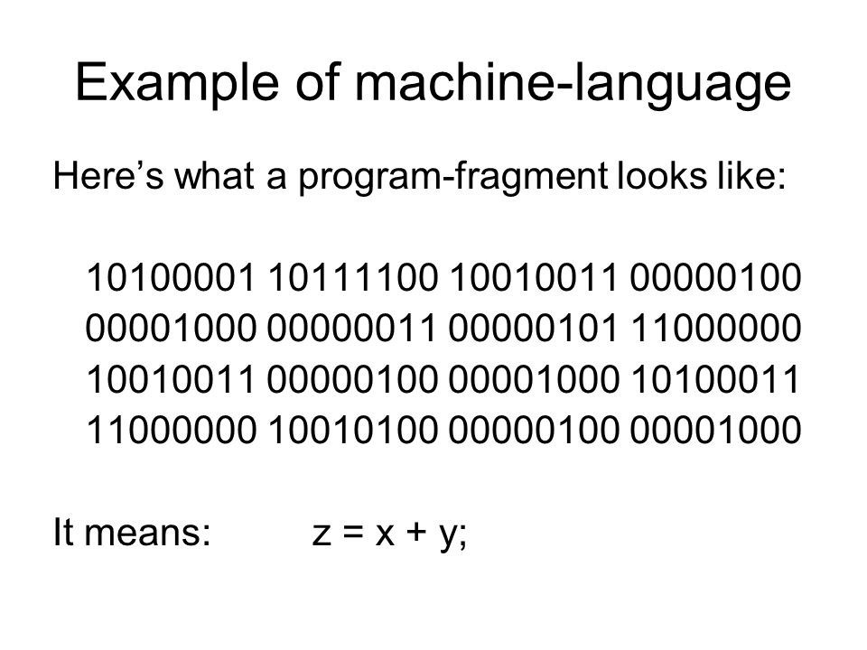
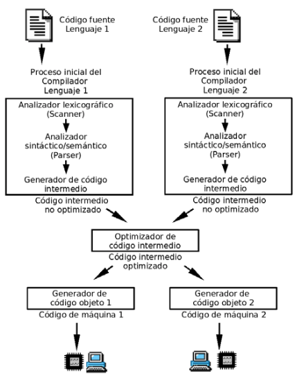

# Introducción a la Programación

??? abstract "Duración y criterios de evaluación"

```
Duración estimada: 4 sesiones

<hr />

Resultado de aprendizaje:

1. Comprende los conceptos fundamentales de la programación, sus paradigmas y fases de desarrollo.

Criterios de evaluación:

1. Se han identificado las acciones cotidianas que dependen de la programación.
2. Se han descrito los conceptos de programa, programación y algoritmo.
3. Se han caracterizado los principales paradigmas de programación.
4. Se han identificado las fases del ciclo de vida de un programa.
5. Se han diferenciado los tipos de lenguajes de programación y sus características.
6. Se ha explicado la compilación y ejecución de programas en Java.
7. Se han utilizado entornos de desarrollo integrados para crear programas sencillos.
```

---

## 1.1 Introducción

La programación está presente en nuestra vida diaria más de lo que pensamos. Ejemplos:

* La alarma del móvil que te despierta.
* El microondas que calienta tu desayuno.
* El ascensor que utilizas para salir de casa.
* Las noticias que ves en tu televisor o dispositivo digital.

Todos estos aparatos funcionan gracias a programas que ejecutan instrucciones.

---

## 1.2 Programas y Programación

Un **programa** es la implementación de un algoritmo en un lenguaje de programación. La **programación** es el proceso de crearlo.

<figure>
  
  <figcaption>Resolución de problemas mediante programación</figcaption>
</figure>

Conceptos clave para resolver problemas:

* **Abstracción**: centrarse en lo esencial, ignorando detalles innecesarios.
* **Divide y vencerás**: dividir un problema en partes más pequeñas.
* **Encapsulación**: proteger los datos y procedimientos en módulos independientes.
* **Modularidad**: organizar el código en partes reutilizables.

### Algoritmo y programa

* **Algoritmo**: Secuencia ordenada y no ambigua de pasos que llevan a la solución de un problema.
* **Programa**: Implementación de un algoritmo en un lenguaje de programación concreto.

### Representación de algoritmos

Existen varias técnicas:

* [Diagramas de flujo](https://www.lucidchart.com/pages/es/que-es-un-diagrama-de-flujo)
* [Pseudocódigo](https://es.wikipedia.org/wiki/Pseudoc%C3%B3digo)
* [Tablas de decisión](https://eve-ingsistemas-u.blogspot.com/2012/05/tablas-de-decision-parte-1.html)

---

## 1.3 Paradigmas de Programación

Los paradigmas son formas de clasificar lenguajes según sus características.

### Clasificación general

* **Programación imperativa**: Describe los pasos a seguir para resolver un problema (*cómo* hacerlo).
* **Programación declarativa**: Describe el resultado esperado (*qué* se quiere obtener).

<figure>
  
  <figcaption>Paradigmas de programación</figcaption>
</figure>

### Lenguajes multiparadigma

Muchos lenguajes modernos son multiparadigma. Ejemplo: **Java** combina programación estructurada, orientada a objetos y funcional.

---

## 1.4 Fases de la Programación

Un proyecto de programación se divide en varias fases:

1. **Resolución del problema**

   * Análisis
   * Diseño
2. **Implementación**

   * Codificación
   * Pruebas y validación
3. **Explotación y mantenimiento**

### Análisis

* Se estudia el contexto del problema.
* Se elabora la **especificación de requisitos** con el cliente.

**Ejemplo: "pares/impares"**

Requisitos:

* Si el número es 0 → “Valor introducido incorrecto”.
* Si está fuera de 1–100 → “Valor incorrecto, el rango es 1–100”.
* Si es par → “Es par”. Si es impar → “Es impar”.

### Diseño

Se esboza el algoritmo mediante:

* Diagramas de flujo → [Ejemplo](img/progt01-04.png)
* Pseudocódigo

<figure>
  
  <figcaption>Ejemplo diagrama de flujo</figcaption>
</figure>

<figure>
  
  <figcaption>Ejemplo pseudocódigo</figcaption>
</figure>

### Codificación

Se traduce el algoritmo a un lenguaje. Ejemplo en Java:

```java
import java.util.Scanner;

public class Main {
  public static void main(String[] args) {
    int modulo, numero;
    var scanner = new Scanner(System.in);
    System.out.println("Introduce un número");
    numero = Integer.parseInt(scanner.nextLine());

    if (numero == 0) {
      System.out.println("Valor incorrecto. El 0 no es válido");
    } else if (numero < 0 || numero > 100) {
      System.out.println("Número no válido, el rango es 1-100");
    } else {
      modulo = numero % 2;
      if (modulo == 0) {
        System.out.println("El número es par");
      } else {
        System.out.println("El número es impar");
      }
    }
  }
}
```

### Pruebas y validación

* Ejecutar el programa con diferentes entradas.
* Documentar instalación, uso y mantenimiento.

### Explotación y mantenimiento

* Se utiliza el programa en producción.
* Se realizan mejoras y correcciones.

---

## 1.5 Lenguajes de Programación

Existen diferentes niveles de lenguajes:

### 1. Lenguaje máquina

* Código binario.
* Dependiente del procesador.
* Difícil de aprender.

<figure>
  
  <figcaption>Ejemplo lenguaje máquina</figcaption>
</figure>

### 2. Lenguaje ensamblador

* Dependiente de la arquitectura.
* Uso complejo.
* Control de recursos del PC.

!!! info "Ejemplo en vídeo"
- [Lenguaje ensamblador (YouTube 1)](https://www.youtube.com/embed/GmtenWqfIaI)
- [Lenguaje ensamblador (YouTube 2)](https://www.youtube.com/embed/wQf0u8cTAcg)

### 3. Lenguajes compilados

* Código fuente traducido a ejecutable por un compilador.
* Independientes del hardware.
* Ejemplos: C, C++, Pascal, C#.

<figure>
  
  <figcaption>Proceso de compilación</figcaption>
</figure>

### 4. Lenguajes interpretados

* Un intérprete analiza y ejecuta cada instrucción.
* Más lentos que los compilados.
* Ejemplos: Python, PHP, Perl, JavaScript.

```python
numero1 = int(input("Ingresa un número: "))
numero2 = int(input("Ingresa otro número: "))
operacion = input("suma, resta, división, multiplicación: ")

if operacion == "suma":
    print(numero1 + numero2)
elif operacion == "resta":
    print(numero1 - numero2)
elif operacion == "división":
    print(numero1 / numero2)
elif operacion == "multiplicación":
    print(numero1 * numero2)
```

### Caso particular: Java

* Pseudo-compilado / interpretado.
* Código → Bytecode → Interpretado por la Máquina Virtual de Java (JVM).

<figure>
  
  <figcaption>Proceso de compilación y ejecución en Java</figcaption>
</figure>

---

## 1.6 Programas en Java

Características:

* Código independiente de la arquitectura.
* Totalmente orientado a objetos.
* Sintaxis similar a C/C++.
* Amplia biblioteca de clases.
* Seguro, robusto y preparado para redes.

### Compilación y ejecución

* **JDK** (Java Development Kit): compilación.
* **JRE** (Java Runtime Environment): ejecución.

Existen dos versiones de JDK:

* [OpenJDK](https://jdk.java.net/): libre y gratuito.
* [Oracle JDK](https://www.oracle.com/java/technologies/downloads/): con soporte comercial.

### Estructura de un programa en Java

```java
public class Clase_Principal {
  // Atributos de clase
  // Métodos de clase

  public static void main(String[] args) {
    // Variables e instrucciones
  }
}
```

Ejemplo Hola Mundo:

```java
public class HolaMundo {
  public static void main(String[] args) {
    System.out.println("Hola Mundo!");
  }
}
```

Tipos de programas en Java:

* De consola
* Aplicaciones gráficas
* Applets
* Servlets
* Midlets

---

## 1.7 Entornos de Desarrollo Integrado (IDE)

Un IDE facilita la creación de programas. Ejemplos:

* [IntelliJ IDEA](https://www.jetbrains.com/es-es/idea/)
* [NetBeans](https://netbeans.apache.org/)

Actividades comunes:

* Crear un proyecto.
* Escribir el código fuente.
* Compilar y ejecutar el programa.

<figure>
  
  <figcaption>Opciones de instalación de IntelliJ</figcaption>
</figure>

---

## 1.8 Actividades

101. Enumera 3 ejemplos de tu vida diaria que dependen de la programación.

102. Explica con tus palabras qué es un algoritmo y qué es un programa.

103. Representa en **pseudocódigo** un algoritmo que determine si un número es divisible por 3.

104. Busca en Internet 2 ejemplos de lenguajes **compilados** y 2 de **interpretados**. Describe sus diferencias.

105. Descarga e instala un IDE de Java (IntelliJ o NetBeans). Crea un programa “Hola Mundo” y anota los pasos realizados.

106. Dibuja un diagrama de flujo que represente el algoritmo del ejemplo "pares/impares".

107. Busca una oferta de trabajo en programación y analiza: lenguaje solicitado, paradigma, y herramientas asociadas.
