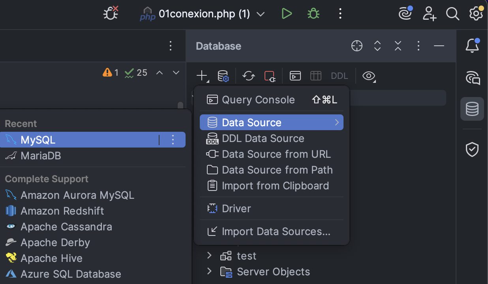
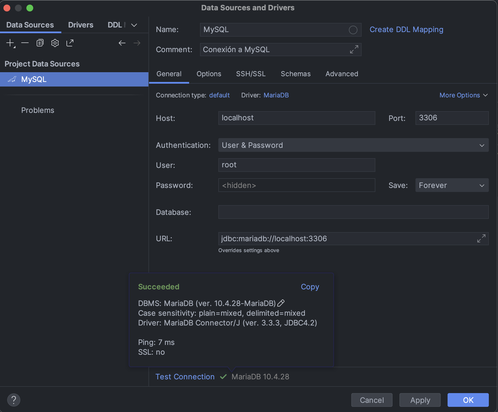
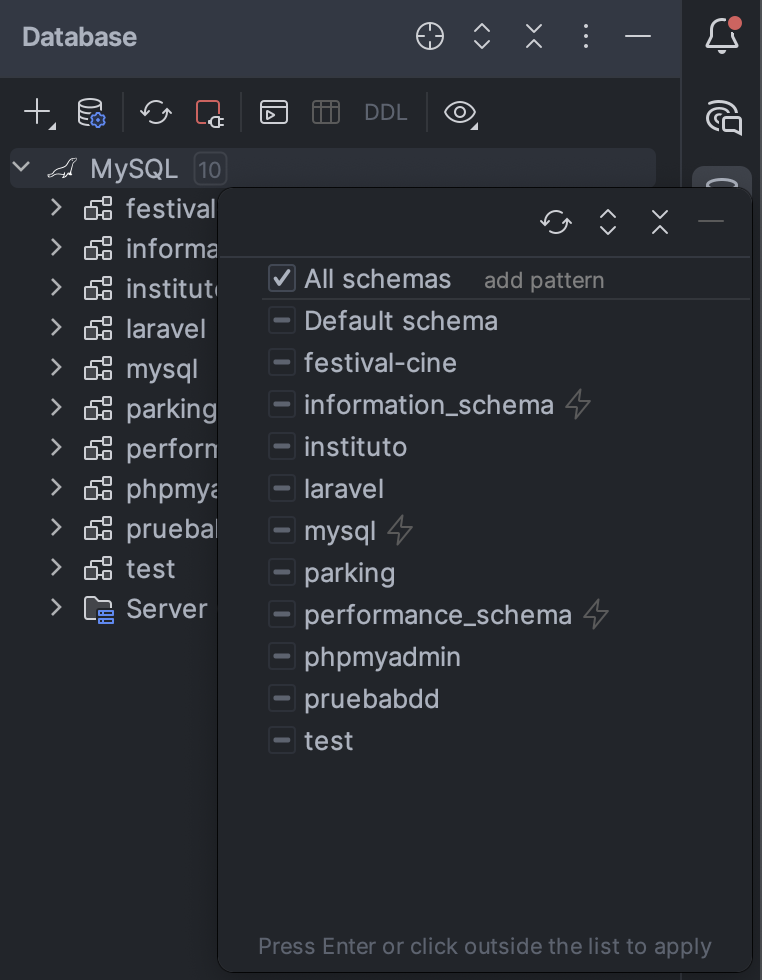
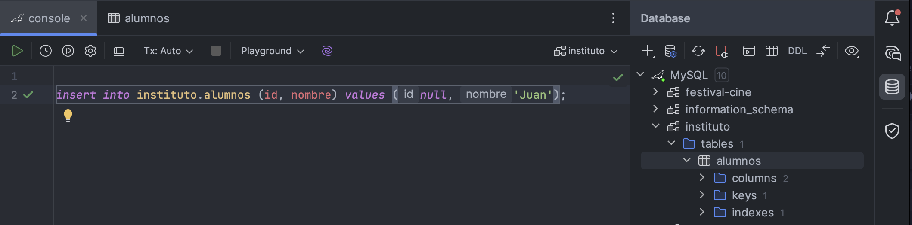
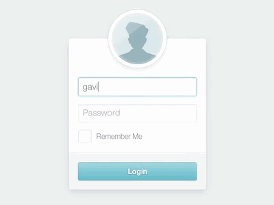
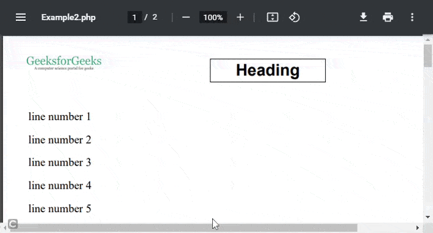

<style>
    img { margin: 20px 0; border-radius: 8px; }

    .alert { color: #BD1550; }
    .warning { color: #E97F02; }
    .success { color: #8A9B0F; }

    .center { text-align: center; }
    .right { text-align: right; }

    .img-small { max-width: 200px; margin: auto; }
    .img-medium { max-width: 400px; margin: auto; }
    .img-large { max-width: 800px; margin: auto; }

    .leyenda {
        font-size: small;
        margin: 10px 0;
    }
</style>

# Acceso a datos
<!-- 
> Duración estimada: 26 sesiones
 -->
En esta unidad vamos a aprender a acceder a datos que se encuentran en un servidor; recuperando, editando y creando dichos datos a través de una base de datos.

A través de las distintas capas o niveles, de las cuales 2 de ellas ya conocemos (*Apache*, *PHP*) y *MySQL* la que vamos a estudiar en este tema.

<div class="center img-large">
    
</div>

## 6.1 Instalación
A través de ***XAMPP*** es muy sencillo, simplemente nos descargaríamos el programa y lo activaríamos. Para descargar XAMPP [pulsa aquí](https://www.apachefriends.org/es/download.html).

Con ***Docker*** nos descargaremos [esta imagen de docker](recursos/plantilla-APCM.zip) y lanzamos 

``` bash
docker compose up -d
```

Si todo ha salido bien y el contenedor está en marcha, podremos visitar la página de phpMyAdmin de la siguiente manera

``` html
http://localhost:8000
```

<div class="center img-medium">
    
</div>

Para acceder debemos utilizar las siguientes credenciales que vienen configuradas en el alrchivo `docker-compose.yml` 

```
usuario: root
contraseña: 1234
```

## 6.2 Estructura de una base de datos

Sabemos que una base de datos tiene muchos campos con sus nombres y valores, pero además sabemos que la base de datos debe tener un nombre. por tanto tendríamos la siguiente estructura para una base de datos:

    NombreBaseDeDatos
        |__Tabla-#1
        |       |__DatosTabla-#1
        |
        |__Tabla-#2
        |       |__DatosTabla-#2
        |
        |__Tabla-#3
        |       |__DatosTabla-#3
        [...]


Veámoslo en un ejemplo real

    Ryanair
        |__pasajero
        |    |__id[*]
        |    |__nombre
        |    |__apellidos
        |    |__edad
        |    |__id_vuelo[^]
        |
        |__vuelo
        |    |__id[*]
        |    |__n_plazas
        |    |__disponible
        |    |__id_pais[^]
        |
        |__pais
             |__id[*]
             |__nombre

<div class="leyenda">
    [*] Clave primaria [^] Clave Foránea
</div>

<div class="center img-large">
    
</div>

## 6.3 SQL

Este lenguaje de consulta estructurada (*Structured Query Language*) es el que vamos a utilizar para realizar las consultas a nuestras bases de datos para mostrar el contenido en las distintas interfaces web que creemos a lo largo de la unidad. Si quieres saber más detalles visita [Wiki SQL](https://es.wikipedia.org/wiki/SQL).

Ejemplo de una sentencia SQL donde seleccionamos todas las filas y columnas de nuestra tabla llamada **'pais'**.

``` sql
SELECT * FROM pais
```

Estas sentencias pueden invocarse desde la consola de comandos mediante el intérprete *mysql* (previamente instalado en el sistema) o a través de la herramienta phpMyAdmin.

Las sentencias SQL también las podemos usar dentro de nuestro código php, de tal manera que cuando se cargue nuestra interfaz web, lance una sentecia SQL para mostrar los datos que queramos.

``` php
<?php
    // Listado de clientes, ordenados por DNI de manera ASCendente
    $clientesOrdenadosPorDNI = "SELECT * FROM `pasajero` ORDER BY `dni`" ASC;
?>
```

## 6.4 phpMyAdmin

<div class="center img-medium">
    
</div>

Este software funciona bajo Apache y PHP y es más que nada una interfaz web para gestionar las bases de datos que tengamos disponibles en nuestro servidor local. Muchos *hostings* ofrecen esta herramienta por defecto para poder gestionar las BBDD que tengamos configuradas bajo nuestra cuenta.

### Creando una base de datos dentro de phpMyAdmin

<div class="center img-large">
    
</div>

1.  Para crear una nueva base de datos debemos entrar en phpMyAdmin como **usuario root** y pinchar en la opción <span class="warning">***Nueva***</span> del menú de la izquierda.

2.  En la nueva ventana de creación pondremos un **nombre** a nuestra bbdd.

3.  También estableceremos el **cotejamiento** <span class="warning">***utf8m4_unicode_ci***</span> para que nuestra bbdd soporte todo tipo de caracteres (como los asiáticos) e incluso emojis ;)

4.  Le damos al botón de **Crear** para crear la bbdd y empezar a escribir las distintas tablas que vayamos a introducir en ella.

El sistema generará el código SQL para crear todo lo que le hemos puesto y creará la base de datos con las tablas que le hayamos metido.

``` sql
CREATE TABLE `persona` ( `id` INT NOT NULL AUTO_INCREMENT , `nombre` TINYTEXT NOT NULL , `apellidos` TEXT NOT NULL , `telefono` TINYTEXT NOT NULL , PRIMARY KEY (`id`)) ENGINE = InnoDB;
```

### Opciones en phpMyAdmin

Cuando seleccionamos una base de datos de la lista, el sistema nos muestra varias pestañas con las cuales interactuar con la base de datos en cuestión:

- `Estructura`: Podemos ver las distintas tablas que consolidan nuestra base de datos

- `SQL`: Por si queremos inyectar código SQL para que el sistema lo interprete

- `Buscar`: Sirve para buscar por términos, en nuestra base de datos, aplicando distintos filtros de búsqueda

- `Generar consulta`: parecido a SQL pero de una manera más gráfica, sin tener que saber nada del lenguaje

- `Exportar e importar`: Como su nombre indica, para hacer cualquiera de las 2 operaciones sobre la base de datos

- `Operaciones`: Distintas opciones avanzadas para realizar en nuestra base de datos, de la cual destacaremos la opción ***Cotejamiento*** donde podremos cambiar el cotejamiento de nuestra tabla pero <span class="alert">***OJO CON ÉSTO*** porque podemos eliminar datos sin querer, ya que al cambiar el cotejamiento podemos suprimir caracteres no soportados por el nuevo cotejamiento</span>

No vamos a profundizar en el resto de opciones pero, en la pestaña **Más** existe la opción ***Diseñador*** para poder editar las relaciones entre tablas de una manera gráfica (pinchando y arrastrando) que veremos más adelante.

### BBDD en PhpStorm

Se puede añadir la conexión a nuestras bases de datos en PhpStorm para gestionarlas directamente desde el propio IDE.

#### Añadir BD

=== "Añadir Data Source"
    
    <div class="center img-large">
        
    </div>

=== "Configurar Data Source"

    <div class="center img-large">
        
    </div>

=== "Seleccionar esquemas de la BD"

    <div class="center img-large">
        
    </div>

#### Ejecutar consultas

=== "Abrir Query Console"

    <div class="center img-large">
        
    </div>

=== "Lanzar consultas"

    <div class="center img-large">
        
    </div>

## 6.5 PHP Data Objects (PDO)

La clase **PDO** de PHP se utiliza para conectarse a una base de datos y ejecutar consultas SQL de forma segura. Cuando construyes una instancia de PDO, puedes pasarle distintos atributos en el constructor y opciones para configurar el comportamiento de la conexión. 

### Constructor de la clase PDO

El constructor de la clase PDO acepta tres parámetros obligatorios y un array de opciones opcional:


``` php
<?php
    $pdo = new PDO(string $dsn, string $username, string $password, array $options);
```

- **$dsn (Data Source Name)**: Es una cadena que especifica el tipo de base de datos y la información necesaria para conectarse a ella. Formado por el tipo de la base de datos y configuración. Ejemplos:
    - "mysql:host=localhost;dbname=testdb" (para MySQL).
    - "pgsql:host=localhost;port=5432;dbname=testdb" (para PostgreSQL).
    - "sqlite:/path/to/database.db" (para SQLite).
- **$username**: El nombre de usuario para la conexión a la base de datos.
- **$password**: La contraseña asociada al nombre de usuario.
- **$options** (opcional): Un array de opciones para definir el comportamiento de la conexión. Éstos son algunos de los valores más comunes que se pueden definir en este array:
    - *PDO::ATTR_ERRMODE*: Controla cómo se gestionan los errores. Algunos valores comunes son:
        - *PDO::ERRMODE_SILENT*: Los errores no generan ningún mensaje.
        - *PDO::ERRMODE_WARNING*: Los errores generan un aviso.
        - *PDO::ERRMODE_EXCEPTION*: Los errores generan una excepción, que es lo más recomendable para controlar errores.
    - *PDO::ATTR_DEFAULT_FETCH_MODE*: Define el modo de recuperación de datos por defecto, como:
        - *PDO::FETCH_ASSOC*: Devuelve los datos como un array asociativo.
        - *PDO::FETCH_OBJ*: Devuelve los datos como un objeto.
        - *PDO::FETCH_BOTH*: Devuelve los datos como un array asociativo y numérico.
    - *PDO::ATTR_EMULATE_PREPARES*: Desactiva las consultas preparadas emuladas (previene inyecciones SQL).
    - *PDO::ATTR_PERSISTENT*: Habilita conexiones persistentes. Una conexión persistente puede mejorar el rendimiento manteniendo la conexión activa por múltiples peticiones en lugar de crear una nueva cada vez.
    - *PDO::ATTR_TIMEOUT*: Define un tiempo límite para la conexión en segundos.

Con PDO podemos capturar las excepciones <span class="alert">**PDOException**</span> con try catch para gestionar los errores que se produzcan por la conexión.

#### Ejemplos para pruebas

Para las siguientes pruebas rápidas crea la base de datos *instituto* con la tabla *alumnos* y campos:

- *id*: INT primary key y autoincrement.
- *nombre*: VARCHAR de 40 caracteres.

=== "Conexión a BDD"

    ``` php
    <?php

        $dsn = 'mysql:host=127.0.0.1;port=3306;dbname=instituto';
        $usuario = 'root';
        $contraseña = '';
        $opciones = [
            PDO::ATTR_ERRMODE            => PDO::ERRMODE_EXCEPTION, // Le indicamos que en caso de errores lance excepciones
            PDO::ATTR_DEFAULT_FETCH_MODE => PDO::FETCH_ASSOC,       // Configurar el modo de obtención de resultados (mediante arrays asociativos)
            PDO::ATTR_EMULATE_PREPARES   => false,                  // Desactiva las consultas preparadas emuladas, haciendo las consultas más seguras contra inyecciones SQL.
        ];

        try {
            $mbd = new PDO($dsn, $usuario, $contraseña, $opciones);
            echo "Conexión exitosa a la base de datos.";
        } catch (PDOException $e) {
            echo 'Falló la conexión: ' . $e->getMessage();
        }
    ```

=== "Insertar registros"

    De igual forma para UPDATE y DELETE.

    ``` php
    <?php
        try {
            $mbd = new PDO($dsn, $usuario, $password, $opciones);
            echo "Conexión exitosa a la base de datos.";

            $sql = "INSERT INTO alumnos (id, nombre) VALUES (NULL, 'Eladio');";
            $sentencia = $mbd->prepare($sql);

            $isOk = $sentencia->execute();
            $cantidadAfectada = $sentencia->rowCount();

            echo "<p>Registros insertados: " . $cantidadAfectada ."</p>\n";
        } catch (PDOException $e) {
            echo 'Falló la conexión: ' . $e->getMessage();
        }
    ```

=== "Consultar registros"

    ``` php
    <?php
        try {
            $mbd = new PDO($dsn, $usuario, $password, $opciones);
            echo "Conexión exitosa a la base de datos.";

            $query = "SELECT * FROM alumnos";

            $registros = $mbd->query($query);

            foreach($registros as $registro){
                echo "<p>Id: " . $registro["id"] . ", Nombre: " . $registro["nombre"] . "</p>\n";
            }

        } catch (PDOException $e) {
            echo 'Falló la conexión: ' . $e->getMessage();
        }
    ```

### Fichero de configuración de la BD

De la misma forma que podemos tener un archivo de funciones `funciones.php` con todas las funciones que se usan de manera global en la aplicación, podemos crear un archivo de constantes donde definamos los parámetros de conexión con la base de datos.

```php
<?php
    //  ▒▒▒▒▒▒▒▒ config/database.inc.php ▒▒▒▒▒▒▒▒

    const DSN = "mysql:host=localhost;dbname=dwes";
    const USUARIO = "dwes";
    const PASSWORD = "abc123";

    /*  ▒▒▒▒▒▒▒▒▒▒▒▒▒▒▒▒▒▒▒▒▒▒▒▒▒▒▒▒▒▒▒▒▒▒▒▒▒▒▒▒▒▒▒▒▒

        ▒▒▒▒▒▒▒▒ NO SUBAS ESTE ARCHIVO A git ▒▒▒▒▒▒▒▒

        ▒▒▒▒▒▒▒▒▒▒▒▒▒▒▒▒▒▒▒▒▒▒▒▒▒▒▒▒▒▒▒▒▒▒▒▒▒▒▒▒▒▒▒▒▒ */

```

Este archivo contiene información <span class="alert">**muy sensible**</span> así que no es recomendable que subas este archivo a git.

### Sentencias preparadas

Se trata de sentencias que se establecen como si fueran plantillas de SQL que vamos a lanzar, aceptando parámetros que son establecidos a posteriori de la declaración de la sentencia preparada.

Las sentencias preparadas **evitan la injección de SQL** (SQL Injection) y mejoran el rendimiento de nuestras aplicaciónes o páginas web.

``` php
<?php
    // Sentencia preparada
    $sql = "INSERT INTO Clientes VALUES (?, ?, ?, ?)";
```

Cada interrogante es un parámetro que estableceremos después, unas cuantas líneas más abajo.

Una vez tenemos la plantilla de nuestra consulta, debemos seguir con la preparación junto con 3 métodos más de PHP para su completa ejecución:

- `prepare:` prepara la sentencián antes de ser ejecutada
- `bind`: el tipo de unión (bind) de dato que puede ser mediante ' ? ' o ' :parametro '
- `execute` se ejecuta la consulta uniendo la plantilla con las variables o parámetros que hemos establecido.

### Ejemplo parámetros

=== "En orden con ?"  

    ```php hl_lines="19 22"
    <?php
        //  ▒▒▒▒▒▒▒▒ Borrando con parámetros ▒▒▒▒▒▒▒▒

        include "config/database.inc.php"; // Aquí están las constantes DSN, USUARIO y PASSWORD
    
        $opciones = [
            PDO::ATTR_ERRMODE            => PDO::ERRMODE_EXCEPTION, 
            PDO::ATTR_DEFAULT_FETCH_MODE => PDO::FETCH_ASSOC,       
            PDO::ATTR_EMULATE_PREPARES   => false,                  
        ];

        $conexion = null;

        try { 
            $id = $_GET["id_alumno"];

            $conexion = new PDO(DSN, USUARIO, PASSWORD, $opciones);

            $sql = "DELETE FROM alumnos WHERE id = ?";    
            $sentencia = $conexion->prepare($sql);

            $isOk = $sentencia->execute([$id]);
            
            $cantidadAfectada = $sentencia->rowCount();
            echo $cantidadAfectada;
        } catch (PDOException $e) {
            echo $e -> getMessage();
        }

        $conexion = null;
    ```

=== "Con nombre mediante :parametro"

    ```php hl_lines="19 22"
        <?php
            //  ▒▒▒▒▒▒▒▒ Borrando con parámetros ▒▒▒▒▒▒▒▒

            include "config/database.inc.php"; // Aquí están las constantes DSN, USUARIO y PASSWORD
        
            $opciones = [
                PDO::ATTR_ERRMODE            => PDO::ERRMODE_EXCEPTION, 
                PDO::ATTR_DEFAULT_FETCH_MODE => PDO::FETCH_ASSOC,       
                PDO::ATTR_EMULATE_PREPARES   => false,                  
            ];

            $conexion = null;

            try { 
                $id = $_GET["id_alumno"];

                $conexion = new PDO(DSN, USUARIO, PASSWORD, $opciones);

                $sql = "DELETE FROM alumnos WHERE id = :id";    
                $sentencia = $conexion->prepare($sql);

                $isOk = $sentencia->execute([':id' => $id]);
                
                $cantidadAfectada = $sentencia->rowCount();
                echo $cantidadAfectada;
            } catch (PDOException $e) {
                echo $e -> getMessage();
            }

            $conexion = null;
    ```

### Ejemplo bindParam

Muy parecido a utilizar parámetros pero esta vez la variable está dentro de la sentencia SQL, en este caso la hemos llamado `:id`

```php
<?php
    include "config/database.inc.php";

    $conexion=null;

    try {
        $id = $_GET["id_alumno"];

        $conexion = new PDO(DSN, USUARIO, PASSWORD, $opciones);

        $sql = "DELETE FROM alumnos WHERE id = :id";  
        $sentencia = $conexion->prepare($sql);

        $sentencia->bindParam(":id", $id);
        $isOk = $sentencia->execute();
 
        $cantidadAfectada = $sentencia->rowCount();        
        echo $cantidadAfectada;
    } catch (PDOException $e) {
        echo $e -> getMessage();
    }

    $conexion = null;
```

### bindParam VS bindValue

Utilizaremos `bindValue()` cuando tengamos que insertar datos sólo una vez, en cambio, deberemos usar `bindParam()` cuando tengamos que pasar datos múltiples, como por ejemplo, un array.

```php
<?php
    // se asignan nombre a los parámetros
    $sql = "DELETE FROM alumnos WHERE id = :id";
    $sentencia = $conexion->prepare($sql);

    // bindParam enlaza por REFERENCIA
    $id = 0;
    $sentencia -> bindParam(":id", $id);
    $id = 1;
    // se elimina con id = 1
    $isOk = $sentencia->execute();

    // bindValue enlaza por VALOR
    $id = 0;
    $sentencia -> bindValue(":id", $id);
    $id = 1;
    // se elimina con id = 0
    $isOk = $sentencia->execute();
```

Para más información y uso de las variables PDO [consulta el manual de PHP](https://www.php.net/manual/es/pdo.constants.php).

### Insertar registros

A la hora de insertar registros en una base de datos, debemos tener en cuenta que en la tabla puede haber valores autoincrementados. En ese caso, dejaremos ese campo autoincrementado vacío y si necesitamos recuperarlo después del a inserción, lo haremos con el método de la conexión `lastInsertId()`.

``` php
<?php
    $nombre = $_GET["nombre"] ?? "SUCURSAL X";
    $telefono = $_GET["telefono"] ?? "636123456";

    // No indicamos el campo id por que es autoincrement
    $sql="INSERT INTO tienda(nombre, tlf) VALUES (:nombre, :telefono)";

    $sentencia = $conexion -> prepare($sql);
    $sentencia -> bindParam(":nombre", $nombre);
    $sentencia -> bindParam(":telefono", $telefono);

    $isOk = $sentencia->execute();
    $idGenerado = $conexion->lastInsertId();

    echo $idGenerado;
```

### Consultar registros

A la hora de recuperar los resultados de una consulta, bastará con invocar al método `PDOStatement::fetch` para listar las filas generadas por la consulta.

Pero debemos elegir el tipo de dato que queremos recibir entre los 3 que hay disponibles:

- `PDO::FETCH_ASSOC:` array indexado cuyos keys son el nombre de las columnas.
- `PDO::FETCH_NUM:` array indexado cuyos keys son números.
- `PDO::FETCH_BOTH:` valor por defecto. Devuelve un array indexado cuyos keys son tanto el nombre de las columnas como números.

<div class="center img-large">
    
</div>

``` php
<?php
    //  ▒▒▒▒▒▒▒▒ consulta con array asociativo.php ▒▒▒▒▒▒▒▒

    include "config/database.inc.php";

    $opciones = [
        PDO::ATTR_ERRMODE            => PDO::ERRMODE_EXCEPTION, 
        PDO::ATTR_DEFAULT_FETCH_MODE => PDO::FETCH_ASSOC
    ];

    $conexion = null;

    try{
        $conexion = new PDO(DSN, USUARIO, PASSWORD, $opciones);

        $sql = "SELECT * FROM tienda";

        $sentencia = $conexion -> prepare($sql);
        $sentencia->execute();
        
        while($fila = $sentencia->fetch()){
            echo "<p>Codigo: " . $fila["cod"] . ", Nombre: " . $fila["nombre"] . ", teléfono: " . $fila["tlf"] . "</p>";
        }

    }catch(PDOException $e) {
        echo $e -> getMessage();
    }

    $conexion = null;
```

Recuperando datos con una matriz mediante `fetchAll()` como resultado de nuestra consulta:

``` php
<?php
    //  ▒▒▒▒▒▒▒▒ consulta con array asociativo ▒▒▒▒▒▒▒▒

    $sql="SELECT * FROM tienda";

    $sentencia = $conexion->prepare($sql);
    $sentencia->execute();

    $tiendas = $sentencia->fetchAll();

    foreach($tiendas as $tienda) {
         echo "<p>Codigo: " . $tienda["cod"] . ", Nombre: " . $tienda["nombre"] . ", teléfono: " . $tienda["tlf"] . "</p>";
    }
```
Pero si lo que queremos es leer datos con forma de objeto utilizaremos `PDO::FETCH_OBJ`. 

``` php
<?php
    //  ▒▒▒▒▒▒▒▒ consulta con formato de objeto ▒▒▒▒▒▒▒▒

    $opciones = [
        PDO::ATTR_ERRMODE            => PDO::ERRMODE_EXCEPTION, 
        PDO::ATTR_DEFAULT_FETCH_MODE => PDO::FETCH_OBJ
    ];

    // ...

    $sql = "SELECT * FROM tienda";

    $sentencia = $conexion->prepare($sql);
    $sentencia -> execute();

    while($t = $sentencia->fetch()) {
        echo"Codigo:" . $t->cod . "<br />";
        echo"Nombre:" . $t->nombre . "<br />";
        echo"Teléfono:" . $t->tlf . "<br />";
    }
```

### Consultas con modelos

Llevamos tiempo creando clases en PHP y las consultas también admiten este tipo de datos mediante el uso de `PDO::FETCH_CLASS`.

Si usamos este método, debemos tener en cuenta que los nombres de los atributos privados deben coincidir con los nombres de las columnas de la tabla que vayamos a manejar.

Así pues, si por lo que sea cambiamos la estructura de la tabla <span class="alert">**DEBEMOS CAMBIAR**</span> nuestra clase para que todo siga funcionando.

``` php
<?php
    //  ▒▒▒▒▒▒▒▒ clase Tienda ▒▒▒▒▒▒▒▒

    class Tienda {
        private int $cod;
        private string $nombre;
        private string $tlf;
        
        public function getCodigo() : int {
            return $this -> cod;
        }
        
        public function getNombre() : string {
            return $this -> nombre;
        }
        
        public function getTelefono() : ?string {
            return $this -> tlf;
        }
    }
```

``` php
<?php
    //  ▒▒▒▒▒▒▒▒ Consultando a través de la clase Tienda ▒▒▒▒▒▒▒▒

    $sql = "SELECT * FROM tienda";
    $sentencia = $conexion -> prepare($sql);

    // Aquí 'Tienda' es el nombre de nuestra clase y esta opción no se puede 
    // establecer en el array de opciones, se tiene que hacer aquí en la sentencia
    $sentencia->setFetchMode(PDO::FETCH_CLASS, Tienda::class); 
    $sentencia->execute();

    while($t = $sentencia->fetch()) {
        echo "Codigo: " . $t->getCodigo() . "<br />";
        echo "Nombre: " . $t->getNombre() . "<br />";
        echo "Teléfono: " . $t->getTelefono() . "<br />";
        
        var_dump($t);
    }
```

!!! info "Uso de ::class"
    En el ejemplo anterior `Tienda::class` es la manera sencilla y segura de obtener el nombre completamente cualificado de la clase como una cadena de texto. En el ejemplo, también funcionaría con la cadena "Tienda".

Pero ¿qué pasa si nuestras clases tienen constructor? pues que debemos indicarle, al método FECTH, que rellene las propiedades después de llamar al constructor y para ello hacemos uso de `PDO::FETCH_PROPS_LATE` indicando la clase y los atributos por defecto con los que se llamará al constructor antes de que se sobreescriban con los que vengan de la base de datos.

``` php
<?php
    //  ▒▒▒▒▒▒▒▒ Consulta para una clase con constructor ▒▒▒▒▒▒▒▒

    $sql = "SELECT * FROM tienda";

    $sentencia = $conexion -> prepare($sql);
    $sentencia -> setFetchMode(PDO::FETCH_CLASS | PDO::FETCH_PROPS_LATE, Tienda::class, [5, 'DefaultName', 'DefaultTlf']);
    $sentencia -> execute();

    $tiendas = $sentencia->fetchAll();
```

!!! info "Clase con constructor personalizado"
    Como acabamos de ver, con la opción `PDO::FETCH_PROPS_LATE` debemos indicar un array con los argumentos con los que se llamará al constructor. Si en el constructor definimos parámetros opcionales, no será necesario pasarlos en el array. E incluso si todos fueran opcionales, nos ahorraríamos pasar por completo el array.

    ``` php
    <?php
    //  ▒▒▒▒▒▒▒▒ clase Tienda ▒▒▒▒▒▒▒▒

    class Tienda {
        // Constructor con parámetros opcionales
        public function __construct(
            private int $id=0,
            private string $nombre='aa',
            private string $tlf='dd'
        ){} 
        
        // ...
    }
    ```

### Consultas con LIKE

Para utilizar el comodín LIKE u otros comodines, debemos asociarlo al dato y NUNCA en la propia consulta.

``` php
<?php
    //  ▒▒▒▒▒▒▒▒ Utilizando comodines :: LIKE ▒▒▒▒▒▒▒▒

    $sql = "SELECT * FROM tienda WHERE nombre LIKE :nombre OR tlf LIKE :tlf";

    $sentencia = $conexion->prepare($sql);
    $sentencia->setFetchMode(PDO::FETCH_CLASS | PDO::FETCH_PROPS_LATE, Tienda::class);

    // Suponemos que 'busqueda' es lo que recibimos de un input de texto del formulario
    $cadBuscar = "%" . $_POST['busqueda'] . "%";

    $sentencia->execute(["nombre" => $cadBuscar, "tlf" => $cadBuscar]);

    $result = $sentencia->fetchAll();
```

Tenéis una lista de ejemplos muy completa en la [documentación oficial](https://phpdelusions.net/pdo/objects).

## 6.6 Login & Password

<div class="center img-medium">
    
</div>

Para manejar un sistema completo de login y password con contraseñas cifradas, necesitamos un método que cifre esos strings que el usuario introduce como contraseña; tanto en el formulario de registro como en el del login, ya que al codificar una contraseña, después tenemos que comprobar que coincide con la que tenemos almacenada en la base de datos.

Necesitamos pues:

- `password_hash()` se utiliza para crear un hash de la contraseña que se pueda almacenar de manera segura en la base de datos (al hacer el INSERT).
    - `PASSWORD_DEFAULT` opción flexible que utiliza el algoritmo de hashing recomendado por PHP en ese momento. A día de hoy con PHP 8.4 es `bcrypt`.

    - `PASSWORD_BCRYPT` utiliza explícitamente el algoritmo de hashing `bcrypt`.

- `password_verify()` permite verificar el hash comparándolo con la contraseña pasada.

``` php
<?php
    //  ▒▒▒▒▒▒▒▒ Almacenando usuario y password en BD ▒▒▒▒▒▒▒▒

    $usu = $_POST["usuario"];
    $pas = $_POST["password"];

    $sql = "INSERT INTO usuarios(usuario, password) VALUES (:usuario, :password)";

    $sentencia = $conexion -> prepare($sql);

    $isOk = $sentencia -> execute([
        "usuario" => $usu,
        "password" => password_hash($pas, PASSWORD_DEFAULT)
    ]);
```

Ahora que tenemos el hash del password guardado en la base de datos, vamos a recuperarlo para poder loguearlo correctamente.

``` php
<?php
    //  ▒▒▒▒▒▒▒▒ Recuperando usuario y password en BD ▒▒▒▒▒▒▒▒

    $usu = $_POST["login"] ?? "";

    $sql = "select * from usuarios where usuario = ?";

    $sentencia = $conexion -> prepare($sql);
    $sentencia -> execute([$usu]);

    $usuario = $sentencia -> fetch();

    if($usuario && password_verify($_POST['pass'], $usuario['password'])) {
        echo"OK!";
    } else {
        echo"KO";
    }
```

!!! warning "Almacenar el password"
    Nunca almacenes el password del usuario en claro en la base de datos. Utiliza siempre resúmenes hash. Guardar las contraseñas completas podría violar regulaciones específicas sobre la protección de datos personales y exponerte a sanciones legales si ocurre una brecha de seguridad.


## 6.7 Acceso a ficheros

Gracias a la funcion fopen() desde PHP podemos abrir archivos que se encuentren en nuestros servidor o una URL.

A esta función hay que pasarle 2 parámetros; el nombre del archivo que queremos abrir y el modo en el que se abrirá

``` php
$fp = fopen("miarchivo.txt", "r");
```

Muchas veces no podemos abrir el archivo porque éste no se encuentra o no tenemos acceso a él, por eso es recomendable comprobar que podemos hacerlo

``` php
if (!$fp = fopen("miarchivo.txt", "r")){
    echo "No se ha podido abrir el archivo";
}
```

### Modos de apertura de ficheros

- `r`:  Modo lectura. Puntero al principio del archivo.
- `r+`: Apertura para lectura y escritura. Puntero al principio del archivo
- `w`: Apertura para escritura. Puntero al principio del archivo y lo sobreescribe. Si no existe se intenta crear.
- `w+`: Apertura para lectura y escritura. Puntero al principio del archivo y lo sobreescribe. Si no existe se intenta crear.
- `a`: Apertura para escritura. Puntero al final del archivo. Si no existe se intenta crear.
- `a+`: Apertura para lectura y escritura. Puntero al final del archivo. Si no existe se intenta crear.
- `x`: Creación y apertura para sólo escritura. Puntero al principio del archivo. Si el archivo ya existe dará error E_WARNING. Si no existe se intenta crear.
- `x+`: Creación y apertura para lectura y escritura. Mismo comportamiento que x.
- `c`: Apertura para escritura. Si no existe se crea. Si existe no se sobreescribe ni da ningún error. Puntero al principio del archivo.
- `c+`: Apertura para lectura y escritura. Mismo comportamiento que C.
- `b`: Cuando se trabaja con archivos binarios como jpg, pdf, png y demás. Se suele colocar al final del modo, es decir rb, r+b, x+b, wb...

### Operaciones con archivos

Para poder **leer** un archivo necesitamos usar la función fread() de PHP

```php
//  ▒▒▒▒▒▒▒▒ Abriendo un archivo y leyendo su contenido ▒▒▒▒▒▒▒▒

$file = "miarchivo.txt";
$fp = fopen($file, "r");

// Leemos el contenido del fichero a la cadena $contens
// filesize() nos devuelve el tamaño del archivo en cuestión
$contents = fread($fp, filesize($file));

// Hacemos split a array de las cadenas por el salto de línea final
$lineas = explode("\n", $contents);
foreach($lineas as $linea){
    echo "<p>$linea</p>";
}

// Cerramos la conexión con el archivo
fclose($fp);
```

Si lo que queremos es **escribir** en un archivo, deberemos hacer uso de la función fwrite()

```php
//  ▒▒▒▒▒▒▒▒ Escribiendo en un archivo ▒▒▒▒▒▒▒▒

$file = "miarchivo.txt";
$texto = "Hola que tal";

$fp = fopen($file, "w");

fwrite($fp, $texto);
fclose($fp);
```

### Información de un fichero

Con PHP y su método stat() podemos obtener información sobre los archivos que le indiquemos. Este método devuelve hasta un total de 12 elementos con información acerca de nuestro archivo.

    0	dev	        número de dispositivo
    1	ino	        número de i-nodo
    2	mode	    modo de protección del i-nodo
    3	nlink	    número de enlaces
    4	uid	        ID de usuario del propietario
    5	gid	        ID de grupo del propietario
    6	rdev	    tipo de dispositivo, si es un dispositivo i-nodo
    7	size	    tamaño en bytes
    8	atime	    momento del último acceso (tiempo Unix)
    9	mtime	    momento de la última modificación (tiempo Unix)
    10	ctime	    momento de la última modificación del i-nodo (tiempo Unix)
    11	blksize	    tamaño del bloque E/S del sistema de ficheros
    12	blocks	    número de bloques de 512 bytes asignados

Unos ejemplos...

``` php
<?php

//  ▒▒▒▒▒▒▒▒ Información del archivo ▒▒▒▒▒▒▒▒

$file = "miarchivo.txt";
$texto = "Todos somos muy ignorantes, lo que ocurre es que no todos ignoramos las mismas cosas.";

$fp = fopen($file, "w");
fwrite($fp, $texto);

$datos = stat($file);

echo $datos[3] . "<br>"; // Número de enlaces, 1
echo $datos[7] . "<br>"; // Tamaño en bytes, 85
echo $datos[8] . "<br>"; // Momento de último acceso, 1444138104
echo $datos[9] . "<br>"; // Momento de última modificación, 1444138251

?>
```

Echa un vistazo a [las funciones de directorios](https://www.php.net/manual/es/book.dir.php) que tiene PHP, es muy interesante.

### Archivos PDF


Con PHP podemos manejar todo tipo de archivos como ya hemos visto pero, ¿qué pasa si queremos generar ficheros PDF con datos sacados de una base de datos?

<div class="center img-small">
    
</div>


Gracias a una clase escrita en PHP, podemos generar archivos PDF sin necesidad de instalar librerías adicionales en nuestro servidor.

Para ello, como tenemos composer dentro de nuestra imagen de Docker, usaremos composer para instalar esta dependencia.

Acuérdate que debemes haber hecho `composer init` para empezar un proyecto con composer, de lo contrario no podrás añadir ningún paquete.

Veamos un ejemplo de Hello World convertido a PDF

```php
<?php

ob_end_clean(); // Elimina el contenido del búfer de salida que se enviará al navegador
require('fpdf/fpdf.php');
  
// Instanciamos la clase
// P = Portrait | mm = unidades en milímetros | A4 = formato
$pdf = new FPDF('P','mm','A4');
  
// Añadimos una página
$pdf->AddPage();
  
// Establecemos la fuente y el tamaño de letra
$pdf->SetFont('Arial', 'B', 18);
  
// Imprimimos una celda con el texto que nosotros queramos
$pdf->Cell(60,20,'Hello World!');
  
// Terminamos el PDF
$pdf->Output();
  
?>
```
Hay muchos ejemplos y tutoriales, así como documentación de la clase FPDF en la página oficial.

Visita [la sección de tutoriales y el manual](http://www.fpdf.org/) para sacar mayor partido a esta clase.

```php
<?php
  
require('fpdf/fpdf.php');
  
class PDF extends FPDF {
  
    // Cabecera
    function Header() {
          
        // Añadimos un logotipo
        $this->Image('logo.png',10,8,33);
          
        // establecemos la fuente y el tamaño
        $this->SetFont('Arial','B',20);
          
        // Movemos el contenido un poco a la derecha
        $this->Cell(80);
          
        // Pintamos la celda
        $this->Cell(50,10,'Cabecera',1,0,'C');
          
        // Pasamos a la siguiente línea
        $this->Ln(20);
    }
  
    // Pie de página
    function Footer() {
          
        // Nos posicionamos a 1.5 cm  desde abajo del todo de la página
        $this->SetY(-15);
          
        // Arial italic 8
        $this->SetFont('Arial','I',8);
          
        // Número de página
        $this->Cell(0,10,'Página ' . 
            $this->PageNo() . '/{nb}',0,0,'C');
    }
}
  
// Instanciamos la clase
$pdf = new PDF();
  
// Definimos un alias para la numeración de páginas
$pdf->AliasNbPages();

$pdf->AddPage();
$pdf->SetFont('Times','',14);
  
for($i = 1; $i <= 30; $i++)
    $pdf->Cell(0, 10, 'Número de línea ' 
            . $i, 0, 1);
$pdf->Output();
  
?>
```

<div class="center img-large">
    
</div>


## 6.8 Actividades

### CRUD campeones

601. Crea una nueva base de datos con el nombre `lol` y cotejamiento de datos `utf8mb4_unicode_ci`.

602. En nuestra base de datos `lol` que acabamos de crear,  vamos a crear la tabla `campeon` con los siguientes campos.

- id [*]
- nombre
- rol
- dificultad
- descripcion

    Acuérdate que [*] significa que es clave primaria y no olvides poner el tipo de datos de cada uno de los campos.

603. Vas a añadir la funcionalidad de insertar un nuevo campeon. Crea un botón Añadir que redirigirá usuario al archivo `603insertando.php` donde se mostrará un formulario con los datos a rellenar y con los que se creará el registro correspondiente en la tabla `campeon`. Crea al menos 5 registros de prueba, con los datos que tú quieras o si lo prefieres, puedes basarte en la [página oficial del juego](https://www.leagueoflegends.com/es-es/champions) pero <span class="alert">**¡¡ NO TE PONGAS A JUGAR !!**</span>

604. Crea el archivo `604campeones.php` donde listes todos los campeones del LOL que has metido en tu base de datos. Acuérdate que para ello deberas hacer una conexión con la base de datos y un `foreach` para cada campeón que tengas albergado en la tabla `campeon`. Modifica el formulario de insertar anterior, para que una vez se inserte el nuevo registro, se rediriga al listado para ver los cambios.

605. Modifica el archivo `604campeones.php` y guárdalo como `605campeones.php` pero pon al lado de cada uno de los campeones listados un botón para `editar` y otro para `borrar`. Cada uno de esos botones hará la correspondiente función dependiendo del id del campeón seleccionado.

- Al pinchar en editar, el usuario será redirigido al archivo `605editando.php` donde mostrará un formulario con los campos rellenos por los datos del campeón seleccionado. Al darle al botón de `guardar` los datos se guardarán en la base de datos y el usuario será redirigido a la lista de campeones para poder ver los cambios.

- Al pinchar en borrar, al usuario se le preguntará a través de un mensaje de JavaScript (prompt) si está seguro de que quiere borrar al campeón seleccionado. En el mensaje de confirmación debe aparecer el **nombre del campeón seleccionado**. Si el usuario pincha en `Aceptar` el campeón será eliminado de la base de datos y el usuario será redirigido nuevamente al listado de campeones para comprobar que, efectivamente dicho campeón se ha eliminado de la lista.

### Filtros y comodines

606. modifica el archivo `604campeones.php` y guárdalo como `606campeones.php` para que se muestre como una tabla con las columnas de la propia tabla de la base de datos, es decir; id, nombre, rol, dificultad, descripción. Al lado de cada nombre de cada columna, pon 2 iconos que sean ˄ ˅ y que cada uno de ellos ordene el listado en función de cuál se haya pinchado.

- Si se ha pulsado en Nombre el icono de ˄, el listado debe aparecer ordenado por nombre ascendente. Si por el contrario se ha pulsado ˅ tendrá que ordenarse por nombre descendente.

- Ten en cuenta que cada icono debe llevar consigo un enlace al listado que contenga parámetros en la URL que satisfagan las opciones seleccionadas así que haced uso de $_GET para poder capturarlos y escribid las consultas SQL que sean necesarias para hacer cada uno de los filtros.

- Puedes usar [Font Awesome](https://fontawesome.com) para los iconos pero es algo opcional.


### Login

607. Aprovecha lo que hiciste de los ejercicios 601 al 604 pero esta vez utilizando `PDO::FETCH_ASSOC`.

608. Crea una tabla nueva dentro de la base de datos `lol` que ya tienes y crea un sistema de login con usuarios. Introduce en la base de datos al menos 3 usuarios diferentes con sus contraseñas distintas. Recuerda que:

- La tabla nueva ha de llamarse `usuario`

- Los campos a crear en la nueva tabla deben ser

    - `id` [*]
    - `nombre`
    - `usuario`
    - `password`
    - `email`

- Las contraseñas deben ser cifradas antes de guardar el datos en la base de datos.

- Crea el formulario `608registro.php` donde el usuario introduzca los datos de registro y vincúlalo con `608nuevoUsuario.php` para que recoja los datos mediante POST y los inserte en la base de datos si todo ha ido bien.

- Queda <span class="alert">**PROHIBIDÍSIMO**</span> acceder a `608nuevoUsuario.php` sin el formulario rellenado.

- La sentencia de INSERT debe estar controlada para que no pueda introducirse ningún dato en blanco. Ten en cuenta que estás modificando la base de datos y no queremos campos mal rellenados.

- Si todo ha ido bien, muestra un mensaje por pantalla diciendo `El usuario XXX ha sido introducido en el sistema con la contraseña YYY`.

609. Haz las modificaciones necesarias para que cada usuario registrado en el sistema pueda tener su propio listado de campeones y con la misma funcionalidad de añadir, editar y eliminar los que considere. Deberás empezar por un sistema de login en el que se pida el usuario y la contraseña...

### Ficheros

610. Métete en [loremipsum.com](https://www.lipsum.com/) y genera un texto de 3 párrafos. Copia el texto generado y guárdalo en un archivo nuevo llamado `610loremIpsum.txt`. Genera un archivo php llamado `610loremIpsum.php` y muestra por pantalla el texto del archivo txt que acabas de crear, su tamaño en **Kilobytes** , la fecha de su última modificación y el ID de usuario que creó el archivo.

611. Vuelve a cargar el archivo `606campeones.php` y renómbralo a `611campeones.php` pero en vez de mostrar la tabla por pantalla, genera un archivo CSV `611campeones.csv` y otro `611campeonesCSV.php` donde saques por pantalla el contenido del archivo `611campeones.csv`.


### Proyecto FernanChollo

Desarrolla una app al estilo de ***[Chollometro](https://www.chollometro.com)*** en la que los usuarios publican chollos que encuentran por internet y se listan en función de varios filtros: nuevos, más votados, más vistos, más comentados...

<div class="center img-large">
    
</div>

620. Estructura el proyecto y piensa en las tablas y bases de datos que necesitéis para crear el proyecto. Crea los diagramas E/R necesarios con nombres como `620ERnombreTabla` metiendo todos los campos que se necesiten así como las relaciones que creas necesarias. Establece un sistema de archivos para el proyecto, teniendo en cuenta que van a haber imágenes, css, funciones php, constantes e incluso javaScript (pero algo básico) para controlar los eventos del usuario a lo largo de la interfaz.

621. Crea un sistema de login/password con los roles `administrador` y `usuario`. De momento que se validen los usuarios correctamente utilizando encriptación en la contraseña.

- `Administrador`: Puede ver todos los usuarios registrados así como los administradores y los chollos creados en la base de datos.

- `Usuario`: Puede ver sus propios chollos, editarlos y borrarlos, además de crear nuevos.

622. Crea la vista para poner nuevos chollos y recuerda <span class="alert">***sólo pueden entrar a esta vista usuarios registrados o administradores***</span>.

623. Crea la vista donde se muestren todos los chollos creados. Esta vista puede verla cualquier usuario, registrado o no en el sistema. Ten en cuenta que esta vista será la vista general de la web así que puedes llamarla `index.php` donde después aplicaremos filtros por $_GET.


### Videoclub 6.0 

Por fin vamos a darle persistencia al videoclub mediante bases de datos.

630. Crea desde phpMyAdmin una base de datos con nombre `videoclub` y un usuario con nombre `videoclub_user` con permisos únicamente sobre esta base de datos, ya sabes, por temas de seguridad. Como mínimo, necesitarás las tablas `cliente` y `soportes`. Revisa el diagrama UML del final del tema 3 para tener claro el esquema. Es posible que necesites añadir algún campo a alguna de las clases...

631. Implementa las clase `ClienteDataAccess` encapsulando en ella todo lo relativo a la comunicación con la BDD (conexión y CRUD con bindParam).

632. En la parte que ya tienes desarrollada relativa a la gestión de clientes, utiliza la clase anterior para dar persistencia con la BDD. Ya no necesitarás los datos de prueba que utilizabas en el index.php al principio. 

633. Implementa las clase `SoporteDataAccess` encapsulando en ella todo lo relativo a la comunicación con la BDD (conexión y CRUD con bindParam).

634. Ahora toca desarrollar todo lo nuevo relativo a la gestión de alquileres. Utiliza la clase anterior para dar persistencia con la BDD. Piensa muy bien cómo hacerlo antes de empezar a programar: cómo se almacenarán los soportes que son de diferente tipo, cómo marcarás los soportes que estén alquilados a un determinado cliente (en la propia tabla o en otra)...


<!--

## Eloquent

### Mapeo ORM

#### Modelo

``` console
php artisan make:model Pregunta
```
 -->