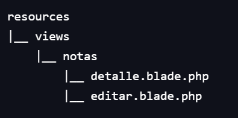

<style>
    img { margin: 20px 0; border-radius: 8px; }

    .alert { color: #BD1550; }
    .warning { color: #E97F02; }
    .success { color: #8A9B0F; }

    .center { text-align: center; }
    .right { text-align: right; }

    .img-small { max-width: 200px; margin: auto; }
    .img-medium { max-width: 400px; margin: auto; }
    .img-large { max-width: 800px; margin: auto; }

    .leyenda {
        font-size: small;
        margin: 10px 0;
    }
</style>

# Uso avanzado de Laravel

> Duración estimada: 10 sesiones

## 9.1 Manejo de ficheros

Laravel proporciona una API sencilla y potente para trabajar con ficheros mediante el uso del sistema de almacenamiento basado en **Flysystem**. Esto permite interactuar con el sistema de archivos local y servicios en la nube como Amazon S3 o Dropbox de manera uniforme.

### Configuración del almacenamiento

Laravel usa la configuración del sistema de archivos en `config/filesystems.php`. El driver por defecto es `local`, pero se pueden configurar otros como `s3` o `public`.

```php
<?php
// Configuración del disco local privado, público y o s3
return [
    'default' => env('FILESYSTEM_DISK', 'local'), // local | public | s3

    'disks' => [

        'local' => [
            'driver' => 'local',
            'root' => storage_path('app/private'),
            'serve' => true,
            'throw' => false,
            'report' => false,
        ],

        'public' => [
            'driver' => 'local',
            'root' => storage_path('app/public'),
            'url' => env('APP_URL').'/storage',
            'visibility' => 'public',
            'throw' => false,
            'report' => false,
        ],

        's3' => [
            'driver' => 's3',
            'key' => env('AWS_ACCESS_KEY_ID'), // Definidas en .env
            'secret' => env('AWS_SECRET_ACCESS_KEY'),
            'region' => env('AWS_DEFAULT_REGION'),
            'bucket' => env('AWS_BUCKET'),
            'url' => env('AWS_URL'),
            'endpoint' => env('AWS_ENDPOINT'),
            'use_path_style_endpoint' => env('AWS_USE_PATH_STYLE_ENDPOINT', false),
            'throw' => false,
            'report' => false,
        ],
    ],
];
```

### Almacenar archivos

Para subir y guardar archivos en Laravel, se utiliza la clase `Illuminate\Support\Facades\Storage`. A sus métodos se les pasa el *path* y *nombre* del archivo con el que operar. Hay que tener en cuenta que el *path* se indica a partir del disco configurado en el punto anterior, así que, si por ejemplo queremos almacenar un archivo en `/storage/app/private/archivos` únicamente habría que indicar como path `archivos`.

```php
<?php
// Función 'storage' en controlador que recibe los datos del formulario
use Illuminate\Support\Facades\Storage;

// 'imagen' es el atributo name del input type file del formulario
$request->validate([
    'imagen' => 'required|image|mimes:jpeg,png,jpg,gif|max:2048',
]);

// Opción 1.1 Guardar un archivo en el disco 'local' ('storage/app/private/archivos/')
$path = Storage::put('archivos', $request->file('imagen')); // Storage siempre a `local` por defecto 
$path = Storage::disk('public')->put('archivos', $request->file('imagen')); // Elegir el disco al que guardar 

// Opción 1.2: Guardar archivo con nombre específico
$path = Storage::putFileAs('archivos', $request->file('imagen'), 'mi_imagen.jpg');

 // Opción 2.1: Guardar desde $request
$path = $request->file('imagen')->store('archivos'); // 'local' por defecto --> Guarda en 'storage/app/private/archivos/'
$path = $request->file('imagen')->store('archivos', 'public'); // 'public' --> Guarda en 'storage/app/public/archivos/'

// Opción 2.2: Guardar desde $request con nombre específico
$path = $request->file('archivo')->storeAs('archivos', 'nuevonombre.jpg', 'public');

return back()->with('success', 'Imagen subida con éxito a la ruta:' . $path); // Vuelve atrás pasando la variable 'success' por la sesión  
```

### Obtener archivos

Cuando accedamos al **storage** siempre va a buscar a partir del directorio correspondiente al disco configurado en filesystem.

```php
<?php
// Obtener el contenido de un archivo (con ficheros de texto, no imágenes)
$contenido = Storage::get('archivos/mi_archivo.pdf');
echo $contenido;

// Verificar si un archivo existe del disco 'local' o del 'public'
if (Storage::exists('archivos/mi_archivo.pdf')) echo "El archivo existe.";
if (Storage::disk('public')->exists('archivos/mi_archivo.pdf')) echo "El archivo existe.";

// Descargar un archivo
return Storage::download('archivos/mi_archivo.pdf');
```

### Eliminar archivos

```php
<?php
// Eliminar un archivo del disco 'local' o del 'public'
Storage::delete('archivos/mi_archivo.pdf');
Storage::disk('public')->delete('archivos/mi_archivo.pdf');
// Eliminar múltiples archivos
Storage::delete(['archivos/archivo1.pdf', 'archivos/archivo2.pdf']);
```

### Listar archivos y directorios

```php
<?php
// Obtener todos los archivos de un directorio del disco 'local' o del 'public'
$archivos = Storage::files('archivos');
$archivos = Storage::disk('public')->files('archivos');
print_r($archivos);
// Obtener todos los archivos de un directorio incluyendo subdirectorios
$archivos = Storage::allFiles('archivos');
print_r($archivos);
// Obtener sólo los directorios
$directorios = Storage::directories('archivos');
print_r($directorios);
```

### Crear enlace simbólico

Para acceder a archivos desde el navegador mediante su ruta y poder incluirlos en las vistas, es necesario crear un enlace simbólico en `/public` que apunte a  `/storage/app/public` (o donde mande el disco configurado). Para ello, desde la raíz del proyecto ejecuta:

```console
php artisan storage:link
```

En `/public` se habrá creado el enlace símbolico **storage**, que en la práctica es como si tuviésemos ahí los archivos. 

### Ejemplo subir archivo

En la vista:

```html
<form action="{{ route('subir.archivo') }}" method="POST" enctype="multipart/form-data">
    @csrf
    <input type="file" name="archivo">
    <button type="submit">Subir</button>
</form>
```

En el controlador:

```php
<?php
use Illuminate\Http\Request;
use Illuminate\Support\Facades\Storage;

public function subirArchivo(Request $request) {
    $request->validate([
        'archivo' => 'required|file|max:2048',
    ]);
    
    $path = $request->file('archivo')->store('archivos');
    return "Archivo subido a: " . $path;
}
```

### Ejemplo archivos en vistas

En el controlador:

```php
<?php
public function muestraArchivos(){
      $paths = Storage::disk('public')->allFiles('archivos');
      return view('archivos.muestra', compact('paths')); 
  }
```

En la vista:

```html
<div>
  <h1>Listado de imágenes</h1>
  @foreach ($paths as $path)
      <p></p>
  @endforeach
</div>
```

## 9.2 Request y Response

Las peticiones y respuestas permiten interactuar con la solicitud HTTP que llega y que se devuelve, por lo que se suelen utilizar en alguna función del controlador al que dirige una ruta determinada. Más info en la [documentación oficial](https://laravel.com/docs/11.x/requests).

### Request

La clase `Illuminate\Http\Request` de Laravel proporciona una forma orientada a objetos de interactuar con la solicitud HTTP actual que maneja la aplicación, así como también de recuperar la entrada, las cookies y los archivos que se enviaron con la solicitud.

#### Acceso a los datos de la petición

Se pueden obtener los elementos enviados a la petición de diferentes formas. Recuerda que se recuperan por el campo `name` que hayas especificado en el formulario.

```php
<?php
$input = $request->all(); //Acceder a todos los inputs
$name = $request->input('name'); //Obtener un input específico
$name = $request->name; //Obtener un input específico
$age = $request->input('age', 18); //Especificar valores por defecto
$id = $request->route('id'); //Acceder a parámetros de ruta
```

También es posible comprobar si en la petición se han recibido ciertos elementos, si vienen rellenos, excluirlos...

```php
<?php
if ($request->has('email')) {
    // Input 'email' se ha recibido
}
if ($request->filled('name')) {
    // Input 'name' no está vacío
}
$filtered = $request->only(['name', 'email']); // Filtrar inputs específicos
$excluded = $request->except(['password']); // Excluir ciertos inputs
```

#### Tratamiento de archivos

Los archivos se tratan de forma similar.

```php
<?php
// Comprobar si se ha recibido el archivo con name 'photo'
if ($request->hasFile('photo')) { 
    $file = $request->file('photo');
}
// Almacenar el archivo en el storage configurado
$path = $request->file('photo')->store('photos'); 
```

### Response

Una instancia de Response hereda de la clase `Symfony\Component\HttpFoundation\Response` y proporciona una variedad de métodos para personalizar el código de estado HTTP y los encabezados de la respuesta.

#### Crear respuestas

```php
<?php
// Respuesta básica
return response('Hello World', 200); 
// Respuesta en formato JSON
return response()->json([
    'name' => 'John',
    'status' => 'success'
]); 
 // Redirección
return redirect('dashboard');
// Redirección pasando la variable 'status'
return redirect('login')->with('status', 'Sesión iniciada'); 
```

#### Manipular cabeceras

```php
<?php
// Respuesta añadiendo 1 cabecera
return response('Hello')->header('Content-Type', 'text/plain');
// Respuesta añadiendo múltiples cabeceras
return response('Hello')
  ->header('Content-Type', 'application/json')
  ->header('Cache-Control', 'no-cache');
```

#### Respuestas de archivos

```php
<?php
return response()->download($pathToFile); // Descarga archivo
return response()->file($pathToFile); // Mostrar archivo
```

## 9.3 Eloquent: Relaciones

A través de Eloquent vamos a poder gestionar las relaciones entre nuestras tablas de la base de datos de una manera muy sencilla y sin sentencias SQL. Más info sobre relaciones, como siempre, en la [documentación oficial](https://laravel.com/docs/11.x/eloquent-relationships).

### Relaciones en BBDD

En una base de datos relacional, las relaciones son las conexiones entre las tablas, que se establecen a través de las claves primarias y foráneas. Para obtener datos de varias tablas, podemos hacerlo de 2 formas:

- *JOIN*: Unir las tablas a través de las claves primarias y foráneas.
- *Relaciones*: Definir las relaciones en los modelos, y acceder a los datos a través de las relaciones.

Las relaciones que existen en una base de datos relacional son:

- **Uno a Uno**: Un registro de una tabla se relaciona con un único registro de otra tabla.
- **Uno a Muchos**: Un registro de una tabla se relaciona con varios registros de otra tabla.
- **Muchos a Muchos**: Varios registros de una tabla se relacionan con varios registros de otra tabla.
- **Uno a Uno Polimórfica**: Un registro de una tabla puede relacionarse con un único registro de varias tablas.
- **Uno a Muchos Polimórfica**: Un registro de una tabla puede relacionarse con varios registros de varias tablas.
- **Muchos a Muchos Polimórfica**: Varios registros de una tabla pueden relacionarse con varios registros de varias tablas.

Nota: Relaciones polimórficas son aquellas en las que una tabla se relaciona con varias tablas.

### Relaciones en Eloquent

Eloquent nos permite definir las relaciones entre los modelos, y acceder a los datos a través de ellas. Tipos:

- **Uno a Uno**: `hasOne()`, `belongsTo()`
- **Uno a Muchos**: `hasMany()`, `belongsTo()`
- **Muchos a Muchos**: `belongsToMany()`
- **Uno a Uno Polimórfica**: `morphOne()`, `morphTo()`
- **Uno a Muchos Polimórfica**: `morphMany()`, `morphTo()`
- **Muchos a Muchos Polimórfica**: `morphToMany()`, `morphedByMany()`

!!! tip "Dónde situar los métodos"
   
    Los métodos `hasOne()/hasMany()` irán en el modelo del lado fuerte de la relación (el que propaga su clave primaria).
    
    El método `belongsTo()` irá en el modelo de la parte débil de la relación, la que tiene la **clave foránea**. 
    
    Ejemplo: En un esquema en el que un usuario tiene muchas notas, en el modelo **Usuario** irá el `hasMany()` y en **Nota** irá el `belongsTo()`. Su tabla correspondiente *notas* tiene la clave foránea ´usuario_id´.

### Relación Uno a uno (1 a 1)

Para crear este tipo de relaciones en Eloquent y Laravel, debemos tener creadas las tablas que vayamos a relacionar y establecer la relación entre ellas a través del método `hasOne()` y `belongsTo()`.

Supongamos que tenemos una tabla `usuario` que está relacionada con la tabla `telefono` (en la migración de teléfono se indica mediante la clave foránea: ```$table->foreignId('usuario_id')->constrained('usuarios');```). 

```php
<?php
namespace App\Models;

use Illuminate\Database\Eloquent\Model;

class Usuario extends Model
{
  // Obtener el Teléfono asocioado con el Usuario
  public function telefono()
  {
      return $this->hasOne(Telefono::class);
  }
}

```

Una vez hecho ésto, para poder recuperar el dato relacionado, debemos utilizar las propiedades dinámicas de Eloquent. Con estas propiedades dinámicas podremos obtener dicho dato.

```php
<?php
$telefono = Usuario::find(1)->telefono;
```

En este caso, Eloquent asume que en `Telefono` existe la clave ajena `usuario_id` pero ¿qué pasa si tenemos otro nombre? pues se lo pasamos como parámetro.

```php
<?php
return $this->hasOne(Telefono::class, 'clave_ajena');
```

### Relación Uno a Uno ***INVERSA***

Ahora que podemos acceder al modelo teléfono desde el modelo usuario, vamos a ver cómo hacerlo de manera inversa, es decir, cómo acceder desde el modelo `telefono` al modelo `usuario` mediante el método `belongsTo()`.

```php
<?php
namespace App\Models;

use Illuminate\Database\Eloquent\Model;

class Telefono extends Model
{
  public function usuario()
  {
      return $this->belongsTo(Usuario::class);
  }
}
```

Al llamar el método de `usuario`, Eloquent intentará encontrar un modelo Usuario que tenga un `id` que coincida con la columna de `usuario_id` en el modelo de `telefono`.

Eloquent determina el nombre de la clave externa examinando el nombre del método de relación y agregando el sufijo `_id` al nombre del método. Entonces, asume que el modelo `Telefono` tiene una columna `usuario_id`. Sin embargo, si no se llama de esa manera, puedes pasarle como argumento el nombre de la clave.

```php
<?php
public function usuario()
{
    return $this->belongsTo(Usuario::class, 'clave_ajena');
}
```

!!! info "Lado fuerte y débil de la relación 1 a 1"
    
    En las relaciones 1 a 1 también hay un lado fuerte y otro débil. En el ejemplo anterior, `Usuario` sería el fuerte y `Telefono` el débil, porque un un usuario puede existir sin un télefono, pero un teléfono sólo tiene sentido si pertenece a un usuario.

### Relación Uno a Muchos (1 a M)

Por ejemplo, las entradas de un blog o un post tienen muchos comentarios.

Pero antes, ya sabemos que debemos crear ambas clases del modelo con sus migraciones indicando en la tabla "débil" la clave foránea, igual que se ha hecho antes.  

Ahora, en el modelo "fuerte" usaremos el método `hasMany()` para obtener los datos relacionados con ese post o entrada en el blog.

```php
<?php
namespace App\Models;

use Illuminate\Database\Eloquent\Model;

class Post extends Model
{
  public function comentarios()
  {
      return $this->hasMany(Comentario::class);
  }
}
```

Cuidado con las claves ajenas, que aquí pasa lo mismo... Eloquent establece por defecto el sufijo `_id` por lo tanto, en este ejemplo buscaría por `post_id`. Si nuestra clave ajena tiene otro nombre, se lo pasamos por parámetro en el método `hasMany` como hacíamos más arriba.

Hay que tener en cuenta que `hasMany` devuelve un array de elemento.

```php
<?php
use App\Models\Post;

$comentarios = Post::find(1)->comentarios;

foreach ($comentarios as $comentario) {
    // Lo que sea que hagamos con esos datos o pasar el array directamente a la vista
}
```

Además, como todas las relaciones son sentencias SQL, podemos anidar varios filtros en función de lo que queramos sacar.

```php
$comentario = Post::find(1)->comentarios()
    ->where('titulo', 'lo que sea')
    ->first();
```

### Relación Uno a Muchos ***INVERSA***

Ahora que podemos acceder a todos los comentarios de una publicación, definamos una relación para permitir que un comentario acceda a su publicación principal.

```php
<?php
namespace App\Models;

use Illuminate\Database\Eloquent\Model;

class Comentario extends Model
{
  public function post()
  {
      return $this->belongsTo(Post::class);
  }
}
```

Y ahora, a través de la propiedad de relación dinámica...

```php
<?php
use App\Models\Comentario;

$comentario = Comentario::find(1);

return $comentario->post()->titulo;
```

Pasaría lo mismo con el nombre de la clave ajena, si no se llama de la misma manera que Eloquent establece con el sufijo `_id` podemos pasarle como parámetro el nombre de la clave donde debe buscar.

### Añadir/eliminar elementos relacionados

En las relaciones de 1 a muchos hay varias formas de añadir elementos relacionados:

1. Asignación manual mediante clave ajena.
2. Asignar un un objeto existente.
3. Asignar un objeto creándolo.

En el siguiente ejemplo de 1 post que tiene muchos comentarios se ven las 3 formas:

```php
<?php
$post = new Post();
$post->titulo = "Fundamentos de programación en Laravel";
$post->save();

// Forma 1 de asignar 1 comentario a 1 post (directamente mediante su clave ajena)
$comentario = new Comentario();
$comentario->texto = "Me parecen muy interesantes los conceptos tratados en el post.";
$comentario->autor = "John Doe";
$comentario->post_id = $post->id; // Clave ajena 'post_id'
$comentario->save();

// Forma 2 de asignar 1 comentario a 1 post (si ya EXISTE el comentario)
$post->comentarios()->save($comentario);

// Forma 3 de asignar 1 comentario a 1 post (CREANDO del tirón el comentario) --> fillable en Comentario.php
$post->comentarios()->create([
    'texto' => 'Me parecen muy interesantes los conceptos tratados en el post.',
    'autor' => 'John Doe',
]);

```

??? notice "Nota sobre la forma 2"

    La 2ª forma está pensada para objetos ya creados y que por tanto ya tienen la clave ajena rellena (pertenecen a un post). En el ejemplo, al asignar el comenario ya creado a otro post, simplemente cambiará su `post_id`. 

    Pero también es posible crear un nuevo comentario de la 2ª forma sin necesidad de vincular manualmente la clave ajena. Se hace, sin llegar a guardarlo desde comentario, pero sí desde post:

    ```php hl_lines="6 9"
    <?php
    $comentario2 = new Comentario();
    $comentario2->texto = "A mi también me parecen muy interesantes.";
    $comentario2->autor = "Mary Jane";
    $post->comentarios()->save($comentario2); // Aquí se vincula la clave ajena y se buarda el comentario
    ```
    
### Relación Muchos a Muchos (MM a MM)

Este tipo de relaciones son las más complicadas. Por ejemplo, en un blog como Wordpress, un usuario puede tener muchos roles (lector, autor, administrador) pero un rol pueden tenerlo varios usuarios, es decir, puede haber muchos usuarios administradores, otros lectores y demás.

Para realizar este tipo de relaciones necesitaríamos 3 tablas diferentes.

  - usuarios [id, nombre]
  - roles [id, nombre]
  - rol_usuario [usuario_id, rol_id] (Tabla Pivote)

Lo primero de todo, vamos a crear las tablas con sus modelos <span class="alert">***a excepción de la tabla pivote "rol_usuario"***</span>, de la que <span class="warning">***sólo crearemos la tabla, sin su modelo***</span>

```console
php artisan make:migration create_rol_usuario_table --create=rol_usuario
```

Y la estructura de dicha tabla quedaría:

```php
<?php

public function up()
{
    Schema::create('rol_usuario', function (Blueprint $table) {
        $table->bigIncrements('id'); // creates an auto-incrementing UNSIGNED BIGINT (primary key) equivalent column
        $table->unsignedInteger('usuario_id');
        $table->unsignedInteger('rol_id');
        $table->timestamps();

        // También se podían haber definido como cláves foráneas
        // $table->foreignId('usuario_id')->constrained('usuarios');
        // $table->foreignId('rol_id')->constrained('rols'); // Ojo con el nombre
    });
}
```

Ahora que ya tenemos todo listo, las relaciones de Muchos a Muchos vienen definidas por un método que devuelve el resultado de usar el método `belongsToMany()`

```php
<?php
namespace App\Models;

use Illuminate\Database\Eloquent\Model;

class Usuario extends Model
{
    public function roles()
    {
        return $this->belongsToMany(Rol::class, 'rol_usuario'); // se indica la tabla pivote
    }
}
```

Como 2º parámetro de `belongsToMany` se puede indicar la tabla intermedia (pivote) de la relación `rol_usuario`. Útil, si se utiliza un nombre que Laravel no puede deducir a partir de los modelos.

Una vez que tengamos las relaciones definidas, accederemos a ellas mediante las propiedades dinámicas de `roles`.

```php
<?php

use App\Models\Usuario;

$usuario = Usuario::find(1);

foreach ($usuario->roles as $rol) {
    // nuestro código
}
```

Acordaros que podemos encadenar comandos sql a través de los métodos de Eloquent

```php
<?php
$roles = Usuario::find(1)->roles()->orderBy('nombre')->get();
```

### Relación Muchos a Muchos ***INVERSA***

Para definir la parte "inversa" de una relación de muchos a muchos, debemos establecer un método en el modelo relacionado que también devuelva el resultado del método `belongsToMany`. En este caso, se hace exactamente igual en ambas partes de la relación. Según el ejemplo que estamos siguiendo:

```php
<?php

namespace App\Models;

use Illuminate\Database\Eloquent\Model;

class Rol extends Model
{
  public function usuarios()
  {
      return $this->belongsToMany(Usuario::class, 'rol_usuario'); // se indica la tabla pivote
  }
}
```

### Añadir/eliminar elementos a la tabla pivote

Laravel proporciona una serie de métodos para añadir/eliminar elementos a la tabla pivote en las relaciones de Muchos a Muchos. Estos son:

- `attach()`: Añade a la tabla pivote los elementos pasados.
- `detach()`: Elimina de la tabla pivote los elementos pasados.
- `toggle()`: Añade un elemento si no existe, y lo elimina si ya existe.
- `sync()`: Deja en la tabla pivote sólo los elementos que se le pasen.

Los métodos anteriores admiten un único **id**, un **array de ids** o el propio **objeto**. Ejemplos:

```php
<?php
  use App\Models\Usuario;
  use App\Models\Rol;

  // Recuperar usuario con id 1
  $usuario = Usuario::find(1);

  // Añadirle roles por sus ids
  $usuario->roles()->attach([1, 2, 3]);

  // Quitarle roles por sus ids
  $usuario->roles()->detach(2);

  // Elimina el 1 (ya existía) y añade el 2 (no existía)
  $usuario->roles()->toggle([1, 2]);
  
  // Sincroniza con los elementos pasados (sólo deja estos en la tabla pivote)
  $usuario->roles()->sync([1, 3]);

  // También se pueden releacionar mediante el propio objeto
  $rol = Rol::find(1);
  $usuario->roles()->attach($rol); // En este caso da error porque ya tiene dicho rol (1)
```

### Relaciones transitivas

Las relaciones transitivas **Has One Through** y **Has Many Through** nos permiten una forma de acceder a tablas lejanas, que no están directamente relacionadas entre sí. Por ejemplo, Un Editor tiene muchos Post, y un Post tiene muchos Comment. Si queremos acceder a los Comment de un Editor, podemos hacerlo a través de la relación Has Many Through.

```php
<?php

namespace App\Models;

use Illuminate\Database\Eloquent\Model;

class Editor extends Model
{
  public function comments()
  {
      return $this->hasManyThrough(Comment::class, Post::Class);
  }
}
```

### Ejemplo completo

Vamos a hacer un ejemplo con una APP que gestione alumnos y asignaturas, de tal manera que **muchos alumnos pueden cursar muchas asignaturas**.

¿Qué necesitamos para este ejemplo?

  - 2 **modelos**:  `Alumno` y `Materia`.
  - 3 migraciones para crear las tablas: `alumnos`, `materias` y `alumno_materia` (tabla pivote).
  - Modificar los archivos de las migraciones `create_alumnos_table` y `create_materias_table` añadiendo los campos que se necesiten.
  - Ejecutar las migraciones.
  - Rellenar la base de datos con alguna información de prueba.
  - Método dentro de `Alumno` para crear la relación Alumno->Materia.
  - Método dentro de `Materia` para crear la relación Materia->Alumno. 
  - Crear las rutas necesarias para ambas peticiones.
  - Crear las funciones necesarias en los controladores que redirijan a la vistas.
  - Crear las vistas.

#### 1. Crear los modelos
```console
php artisan make:model Alumno
php artisan make:model Materia
```

#### 2. Crear las 3 migraciones

```console
php artisan make:migration create_alumnos_table --create=alumnos
php artisan make:migration create_materias_table --create=materias
php artisan make:migration create_alumno_materia_table --create=alumno_materia
```

#### 3. Modificar las migraciones

=== "create_alumnos_table.php"

    ``` php
    <?php

    public function up()
    {
      Schema::create('alumnos', function (Blueprint $table) {
        $table->id();
        $table->string('nombre');
        $table->timestamps();
      });
    }
    ```
=== "create_materias_table.php"

    ``` php
    <?php

    public function up()
    {
      Schema::create('materias', function (Blueprint $table) {
        $table->id();
        $table->string('nombre');
        $table->timestamps();
      });
    }
    ```

=== "create_alumno_materia_table.php"

    ``` php
    <?php

    public function up()
    {
      Schema::create('alumno_materia', function (Blueprint $table) {
        $table->id();

        $table->foreignId('alumno_id')
          ->nullable()
          ->constrained('alumnos')
          ->cascadeOnUpdate()
          ->nullOnDelete();

        $table->foreignId('materia_id')
          ->nullable()
          ->constrained('materias')
          ->cascadeOnUpdate()
          ->nullOnDelete();

        $table->timestamps();
      });
    }
    ```

#### 4. Ejecutar las migraciones

Lanzar las migraciones para que se creen las tablas en la BDD. Rellenar con alguna información de prueba.

``` console
php artisan migrate
```

#### 5. Rellenar la BDD con datos de prueba

Crear varios datos de prueba insertando por ejemplo, los siguientes registros mediante sentencias SQL.

=== "Tabla Alumnos"

    ``` sql
      INSERT INTO alumnos (`nombre`) VALUES
        ('Antonio'),
        ('Laura'),
        ('Marta'),
        ('Pedro');
    ```

=== "Tabla Materias"

    ``` sql
      INSERT INTO materias (`nombre`) VALUES
        ('Programacion'),
        ('Interfaces'),
        ('JavaScript'),
        ('Sistemas');
    ```

=== "Tabla Alumno_Materia"

    ``` sql
      INSERT INTO alumno_materia (`alumno_id`, `materia_id`) VALUES
        (1, 2),
        (1, 4),
        (3, 2),
        (3, 1),
        (2, 3),
        (2, 4),
        (4, 4),
        (4, 1);
    ```

#### 6. Relación Alumno<->Materia

En otro tipo de relaciones se podía indicar la clave ajena, en esta se indica la tabla intermedia de la relación `alumno_materia`.

=== "Alumno.php"

    ``` php
    <?php
    public function materias() {
      return $this->belongsToMany(Materia::class, 'alumno_materia');
    }
    ```

=== "Materia.php"

    ``` php
    <?php
    public function alumnos() {
      return $this->belongsToMany(Alumno::class, 'alumno_materia');
    }
    ```

#### 7. Crear las rutas

Vamos a crear las rutas para que dado el id de un alumno pasado por parámetro, devuelva un listado de sus asignaturas y viceversa.

=== "web.php"

    ``` php
    <?php
      use App\Http\Controllers\RelacionController;
      use Illuminate\Support\Facades\Route;

      Route::get('alumnos/{id}/materias', [AlumnoController::class, 'materias']);
    ```

Haz tú la ruta, para que dado el id de una asignatura pasada por parámetro, devuelva un listado de los alumnos que la cursan.

#### 8. Crear el controlador

Necesitamos controladores para redireccionar las rutas a las vistas que nosotros queramos, para ello empezamos creando el controlador `AlumnoController`.

```console
php artisan make:controller AlumnoController
```

=== "AlumnoController.php"

    ``` php
    <?php
      namespace App\Http\Controllers;

      use App\Models\Alumno;
      use Illuminate\Http\Request;

      class AlumnoController extends Controller
      {
        public function materias(string $id) {
          $materias = Alumno::find($id)->materias;

          return view('alumnos.materias', compact('materias'));
        }
      }
    ```
  
Haz tú ahora el controlador `MateriaController` con su función correspondiente para devolver a los alumnos que cursen una materia determinada.

#### 9. Crear la vista

Vamos a crar la vista que liste las materias de un usuario. Para ello creamos el archivo `alumnos/materias.blade.php`.

    ```html
    <div class="row justify-content-center">
      <div class="col-auto">
        <h3>Las materias que está cursando el alumno son:</h3>

        <table class="table table-striped table-hover">
          <thead class="bg-primary text-white">
            <th>MATERIAS</th>
          </thead>

          <tbody>
            @foreach ($materias as $materia)
              <tr>
                <td>
                    {{ $materia->nombre }}
                 </td>
              </tr>
            @endforeach
          </tbody>
        </table>
      </div>
    </div>
    ```

¿Y si quisiéramos además dar información del propio alumno? Como su nombre por ejemplo, ¿qué más tendrías que pasar a la vista?

Haz tú ahora la vista correspondiente a los alumnos que cursan una determinada materia en el archivo `materias/alumnos.blade.php`.

## 9.4 Mutadores y accesores

Los **mutatores** permiten transformar datos antes de guardarlos y los **accesores** los transforman al recuperarlos.

Ejemplo sobre el atributo `password` definido como `string` en la migración:

- El mutador (set) encripta la contraseña con bcrypt().
- El accesor (get) devuelve "********" para ocultar la contraseña al acceder al modelo.

Y otro ejemplo más útil sobre el atributo `preferencias`, un array asociativo con el listado de preferencias del usuario. Como el tipo de dato `array` no existe, se define como `json` en la migración (también valdría `text`) y mediante el mutador y accesor lo transformamos:

- El mutador (set) trata el array asociativo de PHP como un objeto JSON que codifica a un string (listo para almacenar en la BDD).
- El accesor (get) decodifica el string a un objeto JSON accesible como array asociativo de PHP.

```php
<?php
use Illuminate\Database\Eloquent\Casts\Attribute;
use Illuminate\Database\Eloquent\Model;

class User extends Model
{
    // Atributo 'password' para usar con mutador (set) y accesor (get)
    protected function password(): Attribute
    {
        return Attribute::make(
            get: fn ($value) => '********', // Oculta la contraseña al acceder
            set: fn ($value) => bcrypt($value), // Encripta al guardar
        );
    }

    // Atributo 'preferencias' para usar con mutador (set) y accesor (get)
    protected function preferencias(): Attribute{

      return Attribute::make(
          get: fn ($value) => json_decode($value, true), // Accesor: Devuelve preferencias como array PHP (true para indicar que es asociativo)
          set: fn ($value) => json_encode($value, JSON_UNESCAPED_UNICODE),  // Mutador: Transforma el array de preferencias a objeto JSON que almacena como string
      );
    }
}
```

Uso:

```php
<?php
$user = new User();

// Establecemos la contraseña (Laravel la encripta automáticamente)
$user->password = 'mi_contraseña_segura';
echo $user->password; // Salida: ******** (accesor oculta el valor)

// Internamente 'preferencias' guarda un JSON o string, pero se le asigna o recupera un array asociativo
$user->preferencias = ["tema" => "claro", "idioma" => "ES", "mobile" => true, "size" => 12];
dd($user->preferencias); 
/* Salida: array:4 [▼ 
  "tema" => "claro"
  "idioma" => "ES"
  "mobile" => true
  "size" => 12
]
*/

$user->save();

// Verificamos en la base de datos
echo $user->getAttributes()['password']; // Salida del hash sin modificar: $2y$10$...
dd($alumno->getAttributes()['preferencias']); // Salida como texto sin transformar: "{"tema":"claro","idioma":"ES","mobile":true,"size":12}" 
```

Más info en [mutadores y accesores](https://laravel.com/docs/11.x/eloquent-mutators#defining-an-accessor).

## 9.5 Seeders y factorías

Los seeders y factorías permiten generar datos de prueba de forma fácil y rápida, útiles durante el desarrollo para simular datos iniciales en una aplicación.

### Seeders

Los seeders son clases especiales que permiten "sembrar" datos en la base de datos.

#### Crear un seeder

Mediante el siguiente comando crearmos un seeder con nombre `BooksSeeder` en el directorio *database/seeders*:

```console
php artisan make:seeder BooksSeeder
```

En el método `run` añadimos los elementos que queremos crear:

```php
<?php
class BooksSeeder extends Seeder
{
    public function run()
    {
        // Ejemplo: Crear un libro
        $book = new Book();
        $book->title = "Laravel for Beginners";
        $book->author = "John Doe";
        $book->save();
    }
}
```

#### Añadir el seeder a DatabaseSeeder

El seeder recién creado hay que añadirlo al `DatabaseSeeder`. Por ejemplo:

```php
<?php
class DatabaseSeeder extends Seeder
{
    public function run()
    {
        $this->call([
            BooksSeeder::class,
            AuthorsSeeder::class,
            // ...
        ]);
    }
}
```

#### Ejecutar el seeder

Podemos hacer varias cosas, según nos interese:

- `php artisan db:seed` : Ejecutar todos los seeders.
- `php artisan db:seed --class=BooksSeeder` : Ejecutar un seeder escífico.
- `php artisan migrate:fresh --seed` : Reiniciar las migraciones y ejecutar todos los seeders.

### Factorías

Las factorías permiten crear grandes cantidades de datos "fake" de forma rápida y dinámica. Utiliza la librería [Faker](https://fakerphp.org/) para ello.

#### Crear una factoría

Mediante el siguiente comando creamos una factoría con nombre `AuthorFactory` asociada al modelo `Author` en el directorio *database/factories*:

```console
php artisan make:factory AuthorFactory -m Author
```

En el método `definition` devolvemos un array asociativo con los campos del objeto que queremos crear. Cada campo lo creamos mediante `fake()` o también `$this->faker`.

```php
<?php
namespace Database\Factories;

use App\Models\Author;
use Illuminate\Database\Eloquent\Factories\Factory;

class AuthorFactory extends Factory
{
    // Asociación de la factoría con el modelo (en este caso se podría omitir porque Laravel la deduce por el nombre)
    protected $model = Author::class; 

    public function definition()
    {
        return [
            'name' => fake()->name,
            'birth_year' => fake()->year,
            // 'name' => $this->faker->name, // equivalente a fake()
            // 'birth_year' => $this->faker->year, // equivalente a fake()
        ];
    }
}
```

En modelos relacionados (*1a1* o *1aM*) lo más sencillo es llamar a la factoría directamente en el campo de la relación (en los *MaM* se utiliza has*Model* y se ve más abajo):

```php
<?php
namespace Database\Factories;

use App\Models\Author;
use Illuminate\Database\Eloquent\Factories\Factory;

class BookFactory extends Factory
{
    public function definition(): array
    {
        return [
            'isbn' => fake()->isbn13(), // Crea un ISBN de 13 dígitos (formato actual)
            'titulo' => fake()->sentence(5), // Genera un título de 5 palabras
            'author_id' => Author::factory() // Crea un autor y lo relaciona con el libro por el campo author_id que existe en book
        ];
    }
}
```

#### Asociar factoría al modelo

Hay que asociar la factoría con el modelo tanto en la factoría como en el modelo.

- En la **parte de la factoría** se realiza con convención, por lo que si la factoría se llama AuthorFactory, el modelo asociado será Author. Y en caso de que queramos indicar esta asociación de forma explícita, lo podemos hacer a través de la propiedad `$model` como en el ejemplo anterior.
- En la **parte del modelo**, si lo hemos creamos a mano, hay que indicar que usa una factoría mediante el [trait](https://www.php.net/manual/en/language.oop5.traits.php) `HasFactory`:

```php
<?php
use Illuminate\Database\Eloquent\Factories\HasFactory;
use Illuminate\Database\Eloquent\Model;

class Author extends Model
{
    use HasFactory;
    //...  
}
```

#### Utilizar una factoría

```php
<?php
// Donde nos interese, por ejemplo en el controlador, modelo... pero lo ideal es en un seeder
use App\Models\Author;

// Crear un autor
Author::factory()->create();

// Crear 10 autores
Author::factory()->count(10)->create();
// También crea 10 autores
Author::factory(10)->create();

// Crea 10 autores con 3 libros para cada uno (también para relaciones M a M)
Author::factory()
    ->count(10) 
    ->hasBooks(3) 
    ->create();
```

#### Integración con seeders

Combinando factorías con seeders se pueden crear datos dinámicos de forma sencilla. No olvidar incluir los seeders en `DatabaseSeeder`.

```php
<?php
class AuthorsSeeder extends Seeder
{
    public function run()
    {
        Author::factory()->count(10)->create();
    }
}

// Utilizar factorías con datos relacionados
class BooksSeeder extends Seeder
{
    public function run()
    {
        $authors = Author::factory()->count(5)->create();

        $authors->each(function ($author) {
            Book::factory()->count(2)->create(['author_id' => $author->id]);
        });
    }
}
```

Opción más sencilla para **crear en el mismo seeder autores y libros relacionados**:

```php
<?php
class AuthorsSeeder extends Seeder
{
    public function run()
    {
        Author::factory()
            ->count(10) // Crea 10 autores
            ->hasBooks(3) // Para cada autor crea 3 libros relacionados
            ->create();
    }
}
```

## 9.6 Resumen

En este tema de **Laravel Avanzado**, se profundiza en las capacidades del *framework* para el manejo de archivos, relaciones complejas y automatización de datos. 

### I. Manejo de Ficheros (9.1)

*   **Sistema Flysystem:** Laravel utiliza una API uniforme para interactuar con archivos locales o en la nube (Amazon S3) a través de la configuración en `config/filesystems.php`.
*   **Almacenamiento:** Se utiliza la fachada **`Storage`** para operaciones como `put`, `get`, `delete` y `download`. 
*   **Enlace Simbólico:** Para que los archivos en `storage/app/public` sean accesibles desde el navegador, es imprescindible ejecutar **`php artisan storage:link`**, lo que crea un acceso en la carpeta `public`.

### II. Request y Response (9.2)

*   **Request:** La clase `Illuminate\Http\Request` permite interactuar con la solicitud HTTP de forma orientada a objetos, facilitando el acceso a inputs (`all()`, `input()`), parámetros de ruta y archivos enviados (`hasFile()`, `file()`).
*   **Response:** Permite personalizar la respuesta al cliente, incluyendo códigos de estado, **respuestas JSON** (comunes en APIs), redirecciones con datos de sesión (`with()`) y manipulación de cabeceras HTTP.

### III. Eloquent: Relaciones (9.3)

Eloquent permite gestionar las conexiones entre tablas mediante métodos en los modelos, evitando escribir SQL manual.

*   **Tipos de Relaciones:** 
    *   **Uno a Uno:** `hasOne()` y su inversa `belongsTo()`.
    *   **Uno a Muchos:** `hasMany()` y su inversa `belongsTo()`.
    *   **Muchos a Muchos:** Requiere una **tabla pivote**. Se define con `belongsToMany()` en ambos modelos.
    *   **Transitivas:** `hasManyThrough()` permite acceder a tablas lejanas a través de una intermedia.
*   **Gestión de Pivotes:** Para relaciones muchos a muchos, existen métodos para gestionar la tabla intermedia: **`attach()`** (añadir), **`detach()`** (quitar), **`sync()`** (sincronizar una lista exacta) y **`toggle()`** (alternar existencia).

### IV. Mutadores y Accesores (9.4)

*   **Mutadores (set):** Permiten transformar o formatear los datos automáticamente *antes* de guardarlos en la base de datos (ej. encriptar una contraseña o convertir un array a JSON).
*   **Accesores (get):** Transforman los datos al ser recuperados del modelo (ej. mostrar una fecha en un formato específico o decodificar un JSON). Se implementan mediante la clase `Attribute::make()`.

### V. Seeders y Factorías (9.5)

*   **Seeders:** Clases para "sembrar" la base de datos con registros iniciales o de prueba. Se ejecutan con `php artisan db:seed`.
*   **Factorías:** Utilizan la librería **Faker** para generar grandes volúmenes de datos aleatorios de forma dinámica.
*   **Integración:** Lo ideal es llamar a las factorías dentro de los *seeders* para automatizar la creación de modelos relacionados (ej. crear un Autor que automáticamente tenga 3 Libros asociados).

## 9.7 Actividades

A continuación, vas a realizar una serie de ejercicios sobre cada uno de los apartados vistos en el tema. Puedes crear un proyecto nuevo o reutilizar uno existente.

### Manejo de ficheros

Para practicar con los ficheros vas a crear una galería de imágenes con posibilidad de subir nuevas, eliminar y acceder a su vista en detalle. También vas a implementar un "Mini Drive" para gestionar archivos. En ambos casos, vas a trabajar sin modelos para centrarte exclusivamente en el manejo de ficheros, pero en una app real, además sería recomendable trabajar con una BDD que almacene la información necesaria de los archivos.

901. **Formulario de subida**: Crea un formulario para subir una imagen. La ruta que lleva al formulario por GET será `imagen/create` y la vista del mismo será `imagen/create.blade.php`. El formulario se enviará por POST a la ruta `imagen/storage`. Además del propio input de la imagen, el formulario tendrá un radio button para seleccionar si la imagen se almacenará de forma privada o pública en el storage.

902. **Almacenar archivos**: Crea la función correspondiente en el controlador para recibir la imagen del formulario anterior validando que sea del tipo imagen, requerida y con un tamaño máximo de 2MB. Y según la opción del formulario, almacena la imagen de forma privada o pública en el storage. Después redirecciona a la página anterior enviando un mensaje del tipo "Imagen NOMBRE almacenada correctamente en el storage privado|público" que mostrarás justo encima del formulario.

903. **Mostrar archivos**: Mediante la ruta por GET `imagen` que lleva a la vista `imagen/index.blade.php` muestra una galería con todas las imágenes en miniatura. Puedes utilizar flexbox o grid layout para posicionarlas unas al lado de las otras. **Importante**: No olvides crear el enlace simbólico para poder acceder a las imágenes. Crea un enlace "Subir imagen" que lleve al formulario del primer punto y en dicho formulario, un enlace para volver aquí, al listado.

904. **Mostrar imagen completa**: Mediante la ruta por GET `imagen/{name}` que lleva a la vista `imagen/show.blade.php` muestra la vista en tamaño completo de la imagen. Muestra un párrafo con su ruta completa y un enlace para volver al listado.
    
905. **Eliminar archivos**: Mediante la ruta por GET `imagen/{name}/destroy` elimina la imagen que corresponda. A esta ruta podrás llegar mediante un enlace de la vista en detalle de la imagen. Una vez eliminada, se redirige automáticamente al listado enviando con 'with' un mensaje del tipo "Imagen NOMBRE eliminada correctamente del storage público". Si lo prefieres, en lugar del enlace a eliminar, puedes hacerlo mediante un formulario que lleve a una ruta DELETE `imagen/{name}`.

906. **Almacenamiento en S3** (opcional): Con tu cuenta de estudiante de AWS, crea un bucket S3 con acceso público. Configura el proyecto actual para utilizar el disco 's3' por defecto o bien utilízalo de forma explícita en cada interacciíon que realices con el Storage.

907. **Mini Drive**: De forma similar a lo que acabas de hacer con la galería, crea un sistema de almecenamiento de archivos que admita archivos de diferente tipo (imágenes, videos, documentos...). Deberás mostrar un listado con un icono según el tipo de archivo, su nombre, tamaño y opciones (eliminar), un formulario para subirlo con un campo en el que recojas el nombre con el que almacenarlo. Y en vez de la vista en detalle, al pulsar sobre el archivo en la vista del listado, se descargará directamente. Sigue las recomendaciones de los puntos anteriores. Recuerda que cada archivo no va a tener un modelo asociado, por lo que el nombre, tamaño... deberás obtenerlo de la información del propio archivo.

908. **Mini Drive con directorios** (opcional): Investiga cómo crear directorios y mover archivos entre ellos. Ofrece en la interfaz que has creado, las opciones correspondientes para crear un nuevo directorio, para cambiar el nobmre a un archivo (si no existe uno ya con dicho nombre) y moverlo a un directorio determinado. 

### Request y response

En los siguientes ejercicios vas a trabajar con `Request`y `Response` en las funciones de los controladores. El primero ya lo has utilizado para recoger los datos recibidos de un formulario. Vas a repasar su uso y sobre todo, vas a conocer el segundo.

910. **Obtener y validar datos con Request**: Crea un pequeño formulario para recoger "Nombre" y "Email" del usuario. Recoge sus datos en una función del controlador y valídalos. Si pasan la validación, símplemente devuelve un mensaje "Se ha pasado la validación" y si no, captura los errores en la vista del formulario.

911. **Redireccionar la respuesta**: Modifica el ejercicio anterior para redireccionar la respuesta a otra ruta.

912. **Respuesta JSON**: Crea una ruta GET `/api/usuarios` que devuelva un array de usuarios (id, nombre, email) en formato JSON.

913. **Respuesta JSON error**: Crea una ruta GET `/api/error` que devuelva un array (error y mensaje) en formato JSON y además, el código de estado 400 para indicar al cliente que ha enviado una petición inválida.

914. **Modificar cabeceras de la respuesta**: Crea una ruta GET `/archivo/descargar` que devuelva un archivo descargable y modifique los encabezados de la respuesta. En el controlador, usa *response()->download()* para devolver el archivo estableciendo un encabezado personalizado.

915. **Ejercicio completo: API Rest**: Con lo visto hasta ahora, implementa una API RESTful para manejar usuarios:

- **C**: Crear un usuario mediante POST `/api/usuarios`.
- **R**: Listar usuarios con GET `/api/usuarios`.
- **U**: Actualizar un usuario con PUT `/api/usuarios/{id}`.
- **D**: Eliminar un usuario con DELETE `/api/usuarios/{id}`.

Asegúrate de devolver respuestas adecuadas en JSON y manejar los errores correctamente.

### Eloquent: Relaciones

En este apartado vas a crear diferentes relaciones entre modelos.

920. **Relación 1 a 1**. 

- Crea los modelos `Usuario` y `Perfil`. Cada usuario tiene un perfil, y cada perfil pertenece a un único usuario.
- En las migraciones asegúrate que las tablas tienen los siguientes campos:
  - `usuarios`: campos `id`, `nombre`, `email`.
  - `perfiles`: campos `id`, `usuario_id` (clave foránea), `telefono`, `direccion`.
- Define la relación en los modelos.
- Rellena con 2 ó 3 registros manualmente o mediante Eloquent en ambas tablas/modelos.
- Consulta los datos de un usuario y muestra su perfil. Para ello, crea una ruta `usuario/{id}` que redirija a la función `show` del controlador y llame a la vista `usuario.show.blade.php` para los datos del usuario con su perfil.

921. **Relación 1 a Muchos**. 

- Crea los modelos `Categoria` y `Producto`. Cada categoría tiene muchos productos, pero un producto sólo perteneca una determinada categoría.
- En las migraciones asegúrate que las tablas tienen los siguientes campos:
  - `categorias`: campos `id`, `nombre`.
  - `productos`: campos `id`, `nombre`, `categoria_id` (clave foránea).
- Define la relación en los modelos.
- Rellena con 2 ó 3 registros manualmente o mediante Eloquent en ambas tablas/modelos.
- Consulta el nombre de una categoría mostrando sus productos. Para ello, crea una ruta `categoria/{id}` que redirija a la función `show` del controlador y llame a la vista `categoria.show.blade.php`.
- Mediante Eloquent agrega un nuevo producto a la categoría con id pasado por parámetro. Para ello, crea una ruta `categoria/{id}/addproduct/{nombre}` que redirija a la función `addProduct` del controlador y redirija a la ruta `show` anterior que llama a la vista `categoria.show.blade.php`.

922. **Relación Muchos a Muchos**. 

- Crea los modelos `Estudiante` y `Asignatura`. Cada estudiante puede estár matriculado en muchas asignaturas y una asignatura la cursan muchos estudiantes.
- En las migraciones asegúrate que las tablas tienen los siguientes campos:
  - `estudiantes`: campos `id`, `nombre`.
  - `asignaturas`: campos `id`, `nombre`.
  - `asignatura_estudiante` (tabla pivote): `estudiante_id`, `asignatura_id`.
- Define la relación en los modelos.
- Rellena con 2 ó 3 registros manualmente o mediante Eloquent en ambas tablas/modelos.
- Consulta todas las asignaturas de un estudiante por su id. Para ello, crea una ruta `estudiante/{id}` que redirija a la función `show` del controlador y llame a la vista `estudiante.show.blade.php`.
- Consulta ahora todos los estudiantes que cursen una asignatura por su id. Para ello, crea una ruta `asignatura/{id}` que redirija a la función `show` del controlador y llame a la vista `asignatura.show.blade.php`.
- Mediante Eloquent matricula a un estudiante en un curso determinado. Para ello, crea una ruta `estudiante/{id}/matricula/{idCurso}` que redirija a la función `matricula` del controlador y redirija a la ruta `show` de estudiante que llama a la vista `estudiante.show.blade.php`.
- Mediante Eloquent desmatricula a un estudiante en un curso determinado. Para ello, crea una ruta `estudiante/{id}/desmatricula/{idCurso}` que redirija a la función `desmatricula` del controlador y redirija a la ruta `show` de estudiante que llama a la vista `estudiante.show.blade.php`.

923. **Ejercicio completo**: CRUD con varias relaciones y formularios.

- Implementa un sistema de gestión de posts con sus respectivos comentarios mediante los modelos `Autor`, `Post` y `Comentario`.
- Piensa bien las relaciones a utilizar. Un autor puede escribir muchos posts y comentarios. Un post puede tener muchos comentarios. Un comentario sólo pertenece a un post y está escrito por un autor.
- De un *autor* interesa saber su imagen, nombre y email.
- De un *post* interesa saber su título, fecha y descripción.
- De un *comentario* interesa saber su texto y fecha.
- Crea los CRUDs necesarios para cada modelo con sus rutas específicas, controladores, vistas (con formularios)...

### Mutadores y accesores

930. **Formatear nombres y convertir números**: En el modelo `Producto` del ejercicio anterior, crea:

- Un mutador que almacene el nombre en minúsculas y un accesor que los devuelva con la primera letra en mayúscula.
- Un mutador que almacene el precio convertido a céntimos y un accesor que lo devuelva de nuevo en euros.

931. **Slug automático**: Un slug es una versión formateada de un texto, generalmente usada en URLs por gestores de contenidos. Un slug se crea eliminando caracteres especiales, convirtiendo espacios en guiones y pasando a minúsculas el texto. Por ejemplo: "Hola Mundo Laravel" tendría de slug "hola-mundo-laravel".

En el modelo `Post` del ejercicio anterior:

- Crea la migración correspondiente para añadir el campo `slug` de tipo string.
- Investiga cómo usar `Str::slug` para generar slugs.
- Crea un mutador que convierta el título a slug y lo almacene en el campo `slug`.

932. **Formatear fechas de creación**: En el modelo `Estudiante` del ejercicio anterior:

- Investiga cómo usar la biblioteca `Carbon` para trabajar con fechas incluida en Laravel.
- Crea un accesor que formatee la fecha de creación (created_at) en formato "d/m/Y - H:i".

### Seeders y factories

940. **Seeder básico**: Crea un nuevo modelo `Usuario` con campos `nombre`, `email` y `password` (en su migración) y crea un seeder `UsuarioSeeder` que inserte 3 usuarios de prueba en la base de datos.

941. **Factoría con seeder**: Crea una factoría `UsuarioFactory` con datos fake y en el seeder `UsuarioSeeder` crea 10 usuarios mediante la factoría.

942. **Seeders con modelos relacionados**: Crea el modelo `Publicacion` con los campos `titulo`, `contenido` y `usuario_id` (en su migración) y modifica los modelos para que un usuario se relacione con muchas publicaciones. Crea las factorías `UsuarioFactory` (ya la tienes) y `PublicacionFactory` con datos fake para utilizar en el seeder `UsuarioPublicacionSeeder` para crear 10 usuarios que tentan entre 1 y 5 publicaciones cada uno.

### Práctica: Directorio trabajadores

Desarrolla una app que muestre a los trabajadores de una empresa con sus datos de contacto. Se incorporará un buscador que filtrará por varios de los campos y se darán opciones de ordenación.

A continuación se detallan los requisitos. Deberás hacer las migraciones correspondientes, rutas, controlador, vistas... que necesites para su implementación.

#### Requisitos

1.	Modelo Trabajador con los siguientes campos:

- *nombre* (string): Nombre del trabajador.
- *apellidos* (string): Apellidos del trabajador.
- *telefono* (string): Teléfono profesional.
- *email* (string): Correo electrónico.
- *foto* (string): Nombre de la imagen del trabajador.
- *departamento* (string): Departamento al que pertenece (Ejemplo: Copmras, Ventas, RRHH, I+D...).
- *cargos* (array): Array de strings con los cargos del empleado (Ejemplo: Jefe departamento, coordinador área, director...).
- *fecha_nacimiento* (date): Fecha nacimiento.
- *sustituto* (boolean): Indica si está sustituyendo a otro trabajador.
- *mayor55* (boolean): Indica si es mayor de 55 años.

2.	Funciones CRUD:

- Crear nuevos trabajadores.
- Editar y actualizar trabajadores existentes.
- Eliminar trabajadores.
- Listar todos los trabajadores con opciones de búsqueda filtrado.

3.	Vistas con Blade:

- Listado de trabajadores, con búsqueda y filtros por nombre, apellidos, departamento, cargos y si son o no sustitutos o mayortes de 55 años.
- Formulario para añadir trabajadores.
- Formulario para editar trabajadores.
- Vista de detalle de un trabajador con toda su información.

4.	Extras opcionales:

- Ordenar los trabajadores por fecha de nacimiento (más recientes primero).
- Destacar el trabajador que cumpla años en el día de hoy poniéndole por ejemplo un icono de churros al lado del nombre para la invitación... 😜
  
### Práctica guiada: Guía de equipos de fútbol femenino

El objetivo de este ejercicio es extender la Guía de Equipos de Fútbol Femenino para utilizar una base de datos relacional. Crearás tablas con migraciones, modelos para gestionar los datos y a integrarlos con controladores y vistas.

#### Paso 1: Migración

Mediante una migración se va a crear la tabla `equipos` con la siguiente estructura:

- `id`: Clave primaria, autoincremental.
- `nombre`: Nombre del equipo (cadena, único, obligatorio).
- `estadio`: Nombre del estadio del equipo (cadena, obligatorio).
- `titulos`: Número de títulos ganados (entero, predeterminado 0).
- `created_at` y `updated_at`: Campos de timestamps generados automáticamente.

1. Ejecuta:

```bash
php artisan make:migration create_equipos_table --create=equipos
```

2. Modifica el archivo de la migración para incluir la estructura pedida:

```php
<?php
public function up()
{
    Schema::create('equipos', function (Blueprint $table) {
        $table->id();
        $table->string('nombre')->unique();
        $table->string('estadio');
        $table->integer('titulos')->default(0);
        $table->timestamps();
    });
}
```

3. Ejecuta la migración para crear la tabla:

```bash
php artisan migrate
```

#### Paso 2: Modelo y seeder

Seguimos con la creación del modelo `Equipo` y el seeder `EquiposSeeder`. 

1. Crear el modelo asociado a la tabla anterior.

```bash
php artisan make:model Equipo
```

2. Modifica el modelo `Equipo` en `app/Models/Equipo.php` para definir en `$fillable` los campos que se pueden rellenar mediante asignación masiva y opcionalmente la tabla a la que hace referencia el modelo (no es necesario, pero así repasas):

```php
<?php
protected $fillable = ['nombre', 'estadio', 'titulos'];
protected $table = 'equipos'; // Aquí no es necesario porque Laravel la deduce por el nombre del modelo y la tabla
```

3. Crea un seeder para la tabla `equipos`:

```bash
php artisan make:seeder EquiposSeeder
```

4. Modifica el seeder `EquiposSeeder` para generar los datos de ejemplo:

```php
<?php
public function run()
{
    DB::table('equipos')->insert([
        ['nombre' => 'Barcelona', 'estadio' => 'Camp Nou', 'titulos' => 30],
        ['nombre' => 'Real Madrid', 'estadio' => 'Santiago Bernabeu', 'titulos' => 10],
        ['nombre' => 'Sevilla', 'estadio' => 'Ramón Sánchez Pizjuán', 'titulos' => 8],
        ['nombre' => 'Valencia', 'estadio' => 'Mestalla', 'titulos' => 6],
        ['nombre' => 'Atlético de Madrid', 'estadio' => 'Wanda Metropolitano', 'titulos' => 5],
    ]);
}
```

5. Añade el seeder `EquiposSeeder` a la función `run` de `DatabaseSeeder`:

```php
<?php
public function run()
{
    $this->call([
        EquiposSeeder::class,
    ]);
}
```

6. Ejecuta los seeders para rellenar la tabla `equipos` con los datos de ejemplo:

```bash
php artisan db:seed
```

#### Paso 3: Controladores y CRUD

1. En el controlador `EquipoController` ya creado, modifica los métodos `index`, `show`, `create`, `edit` y `destroy` para obtener los equipos desde la base de datos:

```php
<?php
public function index() {
     $equipos = Equipo::all();
     return view('equipos.index', compact('equipos'));
 }

 public function show($id) {
     $equipo = Equipo::find($id);
     return view('equipos.show', compact('equipo'));
 }

 public function create() {
     return view('equipos.create');
 }

 public function edit(Equipo $equipo) {
     return view('equipos.edit', compact('equipo'));
 }

 public function destroy($id) {
     $equipo = Equipo::find($id);
     $equipo->delete();
     return redirect()->route('equipos.index')->with('success', 'Equipo eliminado correctamente!');
 }
```

#### Paso 4: Relaciones entre modelos

En este punto vamos a crear la tabla `estadios` mediante una migración, con un seeder la rellenaremos y crearemos el modelo `Estadio` que lo relacionaremos con `Equipo`.

1. Crear la migración para crear la tabla `estadios`:

```bash
php artisan make:migration create_estadios_table
```

2. Rellenarla con los siguientes datos:

```php
<?php
 public function up(): void
    {
        Schema::create('estadios', function (Blueprint $table) {
            $table->id();
            $table->string('nombre')->unique();
            $table->string('ciudad');
            $table->integer('capacidad');
            $table->timestamps();
        });
    }
```

3. Crear la migración para añadir la clave foránea `estadio_id` a la tabla `equipos`:

```bash
php artisan make:migration add_estadio_id_to_equipos_table
```

4. Rellenarla con los siguientes datos:

```php
<?php
public function up(): void
  {
      Schema::table('equipos', function (Blueprint $table) {
          $table->dropColumn('estadio'); // Elimina el campo estadio
          $table->foreignId('estadio_id')->constrained(); // Añade la clave foránea
      });
  }
  
public function down(): void
  {
      Schema::table('equipos', function (Blueprint $table) {
          $table->string('estadio');
          $table->dropForeign(['estadio_id']);
          $table->dropColumn('estadio_id');
      });
  }
```

5. Crear el modelo `Estadio`:

```bash
php artisan make:model Estadio
```

6. Añade en el modelo la relación con `Equipo` teniendo en cuenta que en 1 estadio pueden jugar muchos equipos y un equipo sólo juega en 1 estadio:

```php
<?php
    protected $fillable = ['nombre', 'ciudad', 'capacidad'];

    public function equipos(){
        return $this->hasMany(Equipo::class);
    }
```

7. En el modelo `Equipo` añade la relación:

```php
<?php
    public function estadio(){
        return $this->belongsTo(Estadio::class);
    }
```

8. Crea el seeder `EstadiosSeeder`:

```bash
php artisan make:seeder EstadiosSeeder
```

9. Y rellénalo con los datos de prueba:

```php
<?php
public function run(): void
  {
      DB::table('estadios')->insert([
          ['nombre' => 'Camp Nou', 'ciudad' => 'Barcelona', 'capacidad' => 99000],
          ['nombre' => 'Wanda Metropolitano', 'ciudad' => 'Madrid', 'capacidad' => 68000],
          ['nombre' => 'Santiago Bernabéu', 'ciudad' => 'Madrid', 'capacidad' => 81000],
      ]);
  }
```

10.  En el archivo `DatabaseSeeder` llama también al seeder recién creado y **en primer lugar**:

```php
<?php
public function run()
{
    $this->call([
        EstadiosSeeder::class, // Ojo, llamar en primer lugar
        EquiposSeeder::class,
    ]);
}
```

11. Modifica el seeder `EquiposSeeder` para asginar equipos a estadios existentes:

```php
<?php
public function run()
{
    $estadio = Estadio::where('nombre', 'Camp Nou')->first();
    $estadio->equipos()->create([
        'nombre' => 'Barça Femenino',
        'titulos' => 30,
    ]);
    $estadio = Estadio::where('nombre', 'Wanda Metropolitano')->first();
    $estadio->equipos()->create([
        'nombre' => 'Atlético de Madrid',
        'titulos' => 10,
    ]);
    $estadio = Estadio::where('nombre', 'Santiago Bernabéu')->first();
    $estadio->equipos()->create([
        'nombre' => 'Real Madrid Femenino',
        'titulos' => 5,
    ]);
}
```

12. Ejecuta los seeders para llenar las tablas `estadios` y `equipos`:

```bash
php artisan migrate:fresh --seed
```

13. Modifica la vista `equipos.index` para mostrar correctamente el estadio de cada equipo:

```php
<?php
@foreach($equipos as $key => $equipo)
    <tr class="hover:bg-gray-100">
        <td class="border border-gray-300 p-2">
            <a href="{{ route('equipos.show', $equipo->id) }}" class="text-blue-700 hover:underline">{{ $equipo->nombre }}</a>
        </td>
        <td class="border border-gray-300 p-2">{{ $equipo->estadio->nombre }}</td>
        <td class="border border-gray-300 p-2">{{ $equipo->titulos }}</td>
    </tr>
@endforeach
```

14. Crea la vista `equipos.create` con el formulario para crear un equipo que incluya una lista desplegable con los estadios disponibles:

```html
@extends('layouts.app')
@section('title', "Guía de equipos")
@section('content')
<form action="{{ route('equipos.store') }}" method="POST" class="bg-white p-6 rounded-lg shadow-md max-w-md mx-auto">
    @csrf
    <div class="mb-4">
        <label for="nombre" class="block text-sm font-medium text-gray-700 mb-1">Nombre:</label>
        <input type="text" name="nombre" id="nombre" required
            class="w-full border-gray-300 rounded-lg shadow-sm focus:ring-blue-500 focus:border-blue-500">
    </div>

    <div class="mb-4">
        <label for="titulos" class="block text-sm font-medium text-gray-700 mb-1">Títulos:</label>
        <input type="number" name="titulos" id="titulos" required
            class="w-full border-gray-300 rounded-lg shadow-sm focus:ring-blue-500 focus:border-blue-500">
    </div>

    <div class="mb-4">
        <label for="estadio_id" class="block text-sm font-medium text-gray-700 mb-1">Estadio:</label>
        <select name="estadio_id" id="estadio_id" required
            class="w-full border-gray-300 rounded-lg shadow-sm focus:ring-blue-500 focus:border-blue-500">
            @foreach ($estadios as $estadio)
                <option value="{{ $estadio->id }}">{{ $estadio->nombre }}</option>
            @endforeach
        </select>
    </div>

    <button type="submit"
        class="w-full bg-blue-500 text-white font-medium py-2 px-4 rounded-lg shadow hover:bg-blue-600 focus:ring focus:ring-blue-300">
        Crear Equipo
    </button>
</form>
@endsection 
```

15. En la vista `equipos.index` incluir justo después de la tabla un botón que vaya a la ruta anterior:

```html
<p class="mt-10 text-center">
    <a href="/equipos/create" class="bg-blue-700 hover:bg-blue-500 text-white font-bold py-2 px-4 rounded-full">Crear equipo</a>
</p>
```

16. En el controlador `EquipoController` modificar la función `create` para recuperar y pasar a la vista los estadios. Y también la función `store` para recibir los datos del formulario y crear el equipo:


```php
<?php
public function create() {
    $estadios = Estadio::all();
    return view('equipos.create', compact('estadios'));
}

public function store(Request $request){
    $validated = $request->validate([
        'nombre' => 'required|unique:equipos',
        'titulos' => 'integer|min:0',
        'estadio_id' => 'required|exists:estadios,id',
    ]);
    Equipo::create($validated);
    return redirect()->route('equipos.index')->with('mensaje', 'Equipo creado correctamente!');
}
```

16. Para que la asignación másiva funcione, en el modelo `Equipo` hay que modificar el atributo `$fillable` cambiando el antiguo string `estadio` por el nuevo `estadio_id`:

```php
<?php
protected $fillable = ['nombre', 'estadio_id', 'titulos'];
```

17. Crea la vista `equipos.edit` con el formulario para editar un equipo que incluya una lista desplegable con los estadios disponibles:

```html
@extends('layouts.app')
@section('title', "Guía de equipos")
@section('content')
<form action="{{ route('equipos.update', $equipo->id) }}" method="POST" class="bg-white p-6 rounded-lg shadow-md max-w-md mx-auto">
    @csrf
    @method('PUT')

    <div class="mb-4">
        <label for="nombre" class="block text-sm font-medium text-gray-700 mb-1">Nombre:</label>
        <input type="text" name="nombre" id="nombre" value="{{ old('nombre', $equipo->nombre) }}" required
            class="w-full border-gray-300 rounded-lg shadow-sm focus:ring-blue-500 focus:border-blue-500 
            @error('nombre') border-red-500 @enderror" />
        @error('nombre')
            <p class="text-red-500 text-sm mt-1">{{ $message }}</p>
        @enderror
    </div>

    <div class="mb-4">
        <label for="titulos" class="block text-sm font-medium text-gray-700 mb-1">Títulos:</label>
        <input type="number" name="titulos" id="titulos" value="{{ old('titulos', $equipo->titulos) }}" required
            class="w-full border-gray-300 rounded-lg shadow-sm focus:ring-blue-500 focus:border-blue-500 
            @error('titulos') border-red-500 @enderror" />
        @error('titulos')
            <p class="text-red-500 text-sm mt-1">{{ $message }}</p>
        @enderror
    </div>

    <div class="mb-4">
        <label for="estadio_id" class="block text-sm font-medium text-gray-700 mb-1">Estadio:</label>
        <select name="estadio_id" id="estadio_id" required
            class="w-full border-gray-300 rounded-lg shadow-sm focus:ring-blue-500 focus:border-blue-500 
            @error('estadio_id') border-red-500 @enderror">
            @foreach ($estadios as $estadio)
                <option value="{{ $estadio->id }}" {{ $estadio->id == $equipo->estadio_id ? 'selected' : '' }}>
                    {{ $estadio->nombre }}
                </option>
            @endforeach
        </select>
        @error('estadio_id')
            <p class="text-red-500 text-sm mt-1">{{ $message }}</p>
        @enderror
    </div>

    <button type="submit"
        class="w-full bg-blue-500 text-white font-medium py-2 px-4 rounded-lg shadow hover:bg-blue-600 focus:ring focus:ring-blue-300">
        Actualizar Equipo
    </button>
</form>
@endsection 
```

18. Añade en la vista `equipos.index` los enlaces para eliminar un equipo y mostrar el formulario de actualizar anterior. Algo así:

```html
<td class="border border-gray-300 p-2 text-center">
    <a href="{{ route('equipos.edit', $equipo->id) }}" class="text-blue-700 hover:underline">📝</a>
    <form action="{{ route('equipos.destroy', $equipo->id) }}" method="POST" class="inline">
        @csrf
        @method('DELETE')
        <button type="submit" class="text-red-700 hover:underline">❌</button>
    </form>
</td>
```

19. En el controlador `EquipoController` modificar la función `edit` para recuperar y pasar a la vista los estadios. Y también la función `update` para recibir los datos del formulario y actualizar el equipo:

```php
<?php
  public function edit($id) {
      $equipo = Equipo::find($id);
      $estadios = Estadio::all();
      return view('equipos.edit', compact('equipo', 'estadios'));
  }

  public function update(Request $request, $id){
      $validated = $request->validate([
          'nombre' => 'required|unique:equipos,nombre,'.$id,
          'titulos' => 'integer|min:0',
          'estadio_id' => 'required|exists:estadios,id',
      ]);
      $equipo = Equipo::findOrFail($id);
      $equipo->update($validated);
      return redirect()->route('equipos.index')->with('mensaje', 'Equipo actualizado correctamente!');
  }

  public function destroy($id) {
      $equipo = Equipo::find($id);
      $equipo->delete();
      return redirect()->route('equipos.index')->with('mensaje', 'Equipo eliminado correctamente!');
  }
```

20. En la vista `equipos.index` podemos mejorar la experiencia de usuario añadiendo un "Toast" propio en el que se muestren los mensajes de confirmación cuando se añaden, modifican o eliminan equipos. Justo antes de la tabla de equipos, añade:

```html
@if (session('mensaje'))
<div id='toast' class="fixed bottom-5 right-5 flex items-center bg-green-600 text-white text-sm font-semibold px-6 py-3 rounded-lg shadow-lg animate-slide-in">
    <svg class="w-5 h-5 mr-2" fill="none" stroke="currentColor" stroke-width="2" viewBox="0 0 24 24" xmlns="http://www.w3.org/2000/svg">
        <path stroke-linecap="round" stroke-linejoin="round" d="M5 13l4 4L19 7"></path>
    </svg>
    {{ session('mensaje') }}
</div>

<!-- Script para desaparecer el toast después de 3 segundos -->
<script>
    setTimeout(() => {
        document.getElementById('toast').classList.add('opacity-0');
        setTimeout(() => document.getElementById('toast').remove(), 500);
    }, 3000); 
</script>
@endif
```

#### Paso 5: Añadir un escudo al equipo

A continuación vas a realizar los pasos necesarios para poder subir una imagen como escudo de cada equipo.

1. Crea la migración para añadir el campo `escudo` a la tabla `equipos`:

```bash
php artisan make:migraton add_escudo_to_equipos_table
```

2. En el archivo de migración creado, añade el campo `escudo`:

```php
<?php
public function up()
{
    Schema::table('equipos', function (Blueprint $table) {
        $table->string('escudo')->nullable();
    });
}
public function down()
{
    Schema::table('equipos', function (Blueprint $table) {
        $table->dropColumn('escudo');
    });
}
```

3. Ejecutar la migración:

```bash
php artisan migrate
```

4. Modifica el modelo `Equipo` para añadir el campo `escudo` a `$fillable`:

```php
<?php
protected $fillable = ['nombre', 'estadio_id', 'titulos', 'escudo'];
```

5. Modifica la vista `equipos.create` para incluir un campo de archivo para subir el escudo del equipo:

```html
<div class="mb-4">
    <label for="escudo" class="block text-sm font-medium text-gray-700 mb-1">Escudo:</label>
    <input type="file" name="escudo" id="escudo"
        class="w-full border-gray-300 rounded-lg shadow-sm focus:ring-blue-500 focus:border-blue-500">
</div>
```

6. Modifica la vista `equipos.edit` para incluir un campo de archivo para actualizar el escudo del equipo:

```html
<div class="mb-4">
    <label for="escudo" class="block text-sm font-medium text-gray-700 mb-1">Escudo:</label>
    <input type="file" name="escudo" id="escudo" 
        class="w-full border-gray-300 rounded-lg shadow-sm focus:ring-blue-500 focus:border-blue-500">
    @if ($equipo->escudo)
        <p class="mt-2 text-sm text-gray-500">Escudo actual:</p>
        escudo) }}" alt="Escudo de {{ $equipo->nombre }}" class="h-16 mt-2">
    @endif
</div>
```

7. Añade `enctype="multipart/form-data"` a los dos formularios:

```html
<form action="{{ route('equipos.store') }}" method="POST" enctype="multipart/form-data" class="bg-white p-6 rounded-lg shadow-md max-w-md mx-auto">

<form action="{{ route('equipos.update', $equipo->id) }}" method="POST" enctype="multipart/form-data" class="bg-white p-6 rounded-lg shadow-md max-w-md mx-auto">
```

8. Para acceder a archivos desde el navegador mediante su ruta y poder incluirlos en las vistas, es necesario crear un enlace simbólico en `/public` que apunte a `/storage/app/public` (o donde mande el disco configurado). Ejecuta:

```bash
php artisan storage:link
```

9. Actualiza el método `store` del controlador para guardar la imagen del escudo  en el subdirectorio `escudos` en el disco público `/storage/app/public`:

```php
<?php
public function store(Request $request){
    $validated = $request->validate([
        'nombre' => 'required|unique:equipos',
        'titulos' => 'integer|min:0',
        'estadio_id' => 'required|exists:estadios,id',
        'escudo' => 'nullable|image|mimes:jpeg,png,jpg|max:2048', // Validación del fichero
    ]);

    if ($request->hasFile('escudo')) {
        $path = $request->file('escudo')->store('escudos', 'public'); // Guardar en directorio 'escudos' en disco 'public'
        $validated['escudo'] = $path;
    }

    Equipo::create($validated);
    return redirect()->route('equipos.index')->with('mensaje', 'Equipo creado correctamente!');
}
```

10. Actualiza el método `update` del controlador para actualizar la imagen del escudo en el subdirectorio `escudos` en el disco público `/storage/app/public` eliminando el fichero anterior si existiera:

```php
<?php
public function update(Request $request, $id){
    $validated = $request->validate([
        'nombre' => 'required|unique:equipos,nombre,'.$id,
        'titulos' => 'integer|min:0',
        'estadio_id' => 'required|exists:estadios,id',
        'escudo' => 'nullable|image|mimes:jpeg,png,jpg|max:2048', // Validación del fichero
    ]);

    $equipo = Equipo::findOrFail($id);

    if ($request->hasFile('escudo')) {
        if ($equipo->escudo) {
            Storage::disk('public')->delete($equipo->escudo); // Borra el fichero anterior si lo tuviera
        }
        $path = $request->file('escudo')->store('escudos', 'public'); // Guardar en directorio 'escudos' en disco 'public'
        $validated['escudo'] = $path;
    }

    $equipo->update($validated);
    return redirect()->route('equipos.index')->with('mensaje', 'Equipo actualizado correctamente!');
}
```

11. Actualiza el método `destroy` para eliminar también de disco el escudo:

```php
<?php
public function destroy($id) {
    $equipo = Equipo::find($id);
    if ($equipo->escudo) {
        Storage::disk('public')->delete($equipo->escudo);
    }
    $equipo->delete();
    return redirect()->route('equipos.index')->with('mensaje', 'Equipo eliminado correctamente!');
}
```

#### Paso 6: Mostrar el escudo del equipo en la vista en detalle

Para mostrar la imagen del escudo en la vista en detalle del equipo hay que modificar el componente de la vista `Equipo` que se creó en su día. También se podría haber mostrado directamente en la vista sin necesidad de crear el componente. Paso a paso, realiza las siguientes acciones.

1. En el controlador `EquipoController` modfica la función `show` para pasar el nombre del estadio:

```php
<?php
public function show($id) {
    $equipo = Equipo::find($id);
    $estadio = $equipo->estadio->nombre;
    return view('equipos.show', compact('equipo', 'estadio'));
}
```

2.  Modifica el componente de la vista `equipos.show` para mostrar la imagen del escudo del equipo. En el caso de que un equipo no tenga escudo (null), se le pasa la cadena vacía '' para que se construya bien el componente porque requiere string y fallaría con null:

```html
<x-equipo
   :nombre="$equipo['nombre']"
   :estadio="$estadio"
   :titulos="$equipo['titulos']"
   :escudo="$equipo['escudo'] ?? ''" 
/>
```

Otra opción hubiera sido poner una imagen de escudo por defecto, quedando esa línea así: ` :escudo="$equipo['escudo'] ?? 'escudos/default.png'"`.

3. En el constructor del componente de la vista `Equipo`, añadir el campo escudo. Está en `app/View/Components/Equipo.php`:

```php
<?php
public function __construct(
    public string $nombre,
    public string $estadio,
    public int $titulos,
    public string $escudo ) { }
```

4. En la vista del componente de la vista `Equipo`, añadir la imagen. Está en `resources/views/components/equipo.blade.php`:

```html
<div class="equipo border rounded-lg shadow-md p-4 bg-white">
    @if ($escudo)
       <p>
            
        </p>
    @endif
    <h2 class="text-xl font-bold text-blue-800">{{ $nombre }}</h2>
    <p><strong>Estadio:</strong> {{ $estadio }}</p>
    <p><strong>Títulos:</strong> {{ $titulos }}</p>
</div>
```

#### Paso 7: Utilizar factorías para datos de ejemplo

1. Crea una factoría para el modelo `Estadio`:

```bash
php artisan make:factory EstadioFactory --model=Estadio
```

2. Modifica la factoría para crear datos aleatorios:

```php
<?php
public function definition(): array
{
    return [
        'nombre' => fake()->unique()->city.' Stadium',
        'ciudad' => fake()->unique()->city,
        'capacidad' => fake()->numberBetween(10000, 100000),
    ];
}
```

3. Actualiza el seeder `EstadiosSeeder` para utilizar la factoría:

```php
<?php
public function run()
{
    //...
    Estadio::factory()->count(5)->create();
}
```

4. Modifica el modelo `Estadio` para permitir factorías:

```php
<?php
use Illuminate\Database\Eloquent\Factories\HasFactory;
use Illuminate\Database\Eloquent\Model;

class Estadio extends Model
{
    use HasFactory;
    // ...
}
```

1. Repetimos el proceso, ahora para `Equipo`. Crea su factoría:

```bash
php artisan make:factory EquipoFactory --model=Equipo
```

6. Modifica la factoría para crear datos aleatorios:

```php
<?php
public function definition(): array
{
    return [
        'nombre' => fake()->unique()->company,
        'titulos' => fake()->numberBetween(0, 50),
        'estadio_id' => \App\Models\Estadio::factory(), // Crea un estadio mediante su factoría
        'escudo' => 'escudos/default.png', // Imagen por defecto
      ];
}
```

!!! info "Atención"
    Al llamar a la factoría de `Estadio` en el punto anterior, ya no es necesario llamar llamar en `DatabaseSeeder` al seeder `EstadiosSeeder` que a su vez llama a la factoría. Directamente se crearían los estadios al llamar al seeder `EquiposSeeder` siguiente.

7. Actualiza el seeder `EquiposSeeder` para utilizar la factoría:

```php
<?php
public function run()
{
    //...
    Equipo::factory()->count(10)->create();
}
```

8. Modifica el modelo `Equipo` para permitir factorías:

```php
<?php
use Illuminate\Database\Eloquent\Factories\HasFactory;
use Illuminate\Database\Eloquent\Model;

class Equipo extends Model
{
    use HasFactory;
    // ...
}
```

#### Resultado de la aplicación

<figure style="align: center;">
    
    <figcaption>Ejemplo de navegación por la app</figcaption>
</figure>

### Práctica: Guía de estadios de fútbol

El objetivo de esta práctica es crear una extensión de la guía de equipos de fútbol femenino para incluir la funcionalidad de estadios, jugadoras y partidos.

Pasos a Seguir:

1. **Completa el CRUD de estadios**

- Añade los métodos create, store, edit, update y destroy al controlador `EstadioController`.
- Modifica las vistas para la gestión del estadio (index, show, create, edit).
- Modifica el componente de estadio para mostrar los equipos que juegan.

2. **Jugadoras y partidos: Crear Migraciones y Modelos**

- Genera una migración para las jugadoras, asociándolas con un equipo y con la posibilidad de poner una foto cada una.
- Añade una migración para la tabla partidos, incluyendo equipos locales y visitantes, fecha del partido y resultado.
- Ejecuta todas las migraciones.

3. **Seeders y Factorías**

- Crea seeders para las tablas jugadoras y partidos.
- Usa factorías para generar datos de ejemplo para jugadoras y partidos.

4. **Modelos y Relaciones**

Define las relaciones en los modelos:

- Un equipo tiene muchas jugadoras.
- Un equipo puede tener muchos partidos como local o visitante.
- Un partido tiene un equipo local y un equipo visitante.
- Define las relaciones inversas y ajusta las configuraciones según sus necesidades.

5. **Implementa las funcionalidades CRUD de jugadoras y partidos**

- Implementa formularios para crear y editar jugadoras y partidos.
- Asegúrate de que los campos estén correctamente validados antes de guardar los datos.
- Cada jugador puede o no tener una foto.

6. **Vistas y Componentes**

- Modifica el componente de equipos para mostrar a las jugadoras.

---

#### Preguntas para reflexionar

1. **Migraciones**: ¿Qué ventajas tiene utilizar migraciones para gestionar el esquema de la base de datos?
2. **Relaciones**: ¿Cómo gestionarías las relaciones many-to-many (por ejemplo, entre equipos y partidos)?
3. **Blade y Componentes**: ¿Qué beneficios aporta el uso de componentes Blade en formularios complejos?

<!-- 
### Práctica: FernanChollo 

901. Crear el proyecto FernanChollo:

  - Crea un nuevo repositorio para el proyecto
  - Configura el `.gitignore` para no incluir en el repo los siguientes archivos y carpetas:
      - carpeta `vendor`
      - archivos `.env` y cualquier archivo que empiece por `.` excepto el `.gitignore`
  - La página principal del sitio debe ser un listado con todos los chollos disponibles
  - Configura la base de datos con Eloquent, olvídate de usar la consola mysql
  - Crea una vista para las siguientes acciones:
      - Crear un chollo
      - Editar un chollo
  - La tabla Chollo debe contener las siguientes columnas:
      - `id` único y autoincremental
      - `titulo` un título para el chollo
      - `descripcion` descripcion del chollo
      - `url` un campo para introducir la URL externa del chollo
      - `categoria` albergará la categoría de los chollos
      - `puntuacion` un número entero que indique la puntuación del chollo
      - `precio` para albergar el precio del chollo
      - `precio_descuento` para albergar el nuevo precio
      - `disponible` de tipo boolean
  - Por lo menos, el sitio debe contener un `controlador` de Laravel; puedes crear tantos como creas necesarios pero mínimo debe haber uno.

`::: Elementos estáticos`
Como ya hemos visto, hay ciertos elementos que siempre se muestran en todas las vistas del sitio web. A continuación se listan los elementos que deben estar si o si en todas las plantillas que creéis.

  - Logo del sitio y el título `Chollo ░▒▓ Severo`
  - `Inicio` | `Nuevos` | `Destacados`
  - Un footer con vuestro nombre y algún dato copyright del tipo `©FernanChollo 2025` donde el año debe ser calculado a través de la fecha del servidor.

`::: Pagína principal` <br>
Además del listado de todos los chollos de la base de datos debe contener el menú de navegación:

  - Cada chollo debe ser accesible desde este listado
  - Cada chollo debe contener una imagen que estará guardada en `public/img`
  - Cada chollo debe contener sus botones de `editar` y `borrar` que haga las funciones que tocan. Puedes utilizar iconos para cada uno de los botones.
  - El nombre de las imágenes debe estar compuesta por la siguiente fórmula `idChollo`-chollo-severo.`extension`
      - Por ejemplo: 25-chollo-severo.jpg
  - La imagen del chollo no se sube a través del formulario, la pones directamente en la carpeta. Si te animas a subirlo a través del formulario, puedes hacerlo.

`::: Página de Chollo` <br>
Cuando pinchemos en uno de los chollos del listados debemos ser redireccionados a esta vista donde podremos ver toda la información del tabla chollo. Puedes maquetarla como quieras e incluso puedes basarte en la web de [Chollo Metro](https://www.chollometro.com). El campo `disponible` no es necesario que lo muestres en esta vista

`::: Página de Crear un chollo` <br>
Un formulario con los campos necesarios para poder crear un chollo nuevo. Además, debes tener en cuenta que tienes que validar los campos, de tal manera que no se pueda enviar el formulario si se ha dejado algún campo en blanco; dichas validaciones, además de añadir la propiedad `required` de HTML5 debes hacerlo con Laravel.

En caso de que haya habido algún error en el formulario debes mostrar un mensaje en la parte de arriba del mismo con el mensaje de error (por ejemplo, si el campo está vacío).

`::: Página de Editar un chollo` <br>
Muy parecida a la de Crear un chollo pero que puedas editar un Chollo en función de su `id`. Acuérdate que no puedes dejar ningún campo vacío, para ello has de utilizar las validaciones de Laravel.

`░▒▓ COSAS A TENER EN CUENTA ░▒▓` <br>
- Tienes que usar `Bootstrap` o `Material Design`, aunque si lo prefieres puedes hacer tus propios archivos `.css`

- Los mensajes de error o de información deben estar estilizados para que el usuario pueda verlos con facilidad

- Los elementos estáticos deben estar presentes en todas las vistas; incluidas las de editar y crear.

- Las plantillas que formen parte de otra ya creada deben estar en una carpeta con el nombre de la plantilla madre, como hicimos con el ejercicio de `Notas`:

<div class="center img-large">
    
</div>

- Ve haciendo commits en función de las tareas que vayas acabando o que veas que el commit tiene sentido. No es buena práctica subir los camios de un archivo y el siguiente commit volver a subir más cambios del mismo archivo (a no ser que nos hayamos saltado o equivocado en algo).

- El proyecto es individual y después se presentará, uno por uno al profesor para que evalúe todos los aspectos del mismo. Se harán preguntas de cómo se ha hecho cierta cosa o por qué se ha determinado cierto flujo de trabajo así que, <span class="alert">***no os copiéis porque se evalúa también la presentación del proyecto***</span>

-->